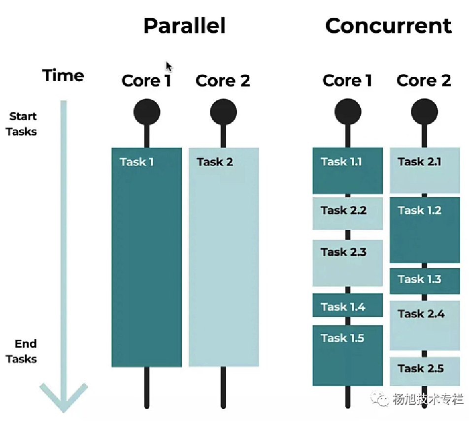
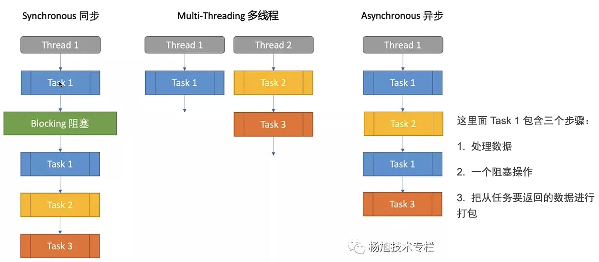
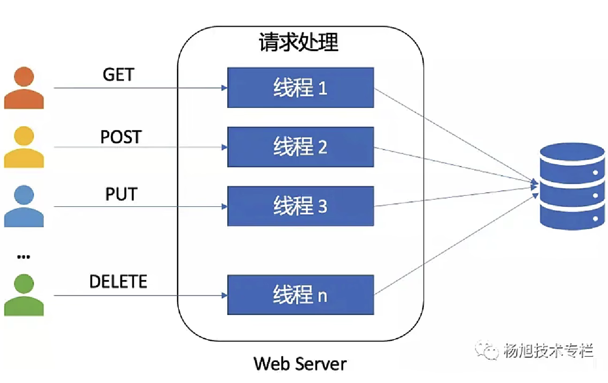
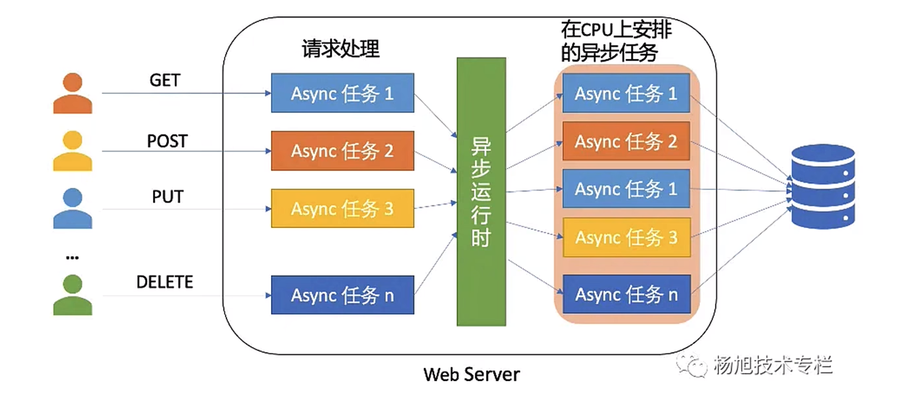
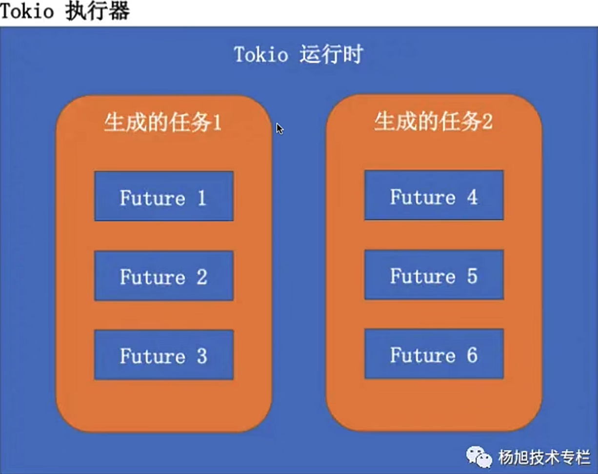
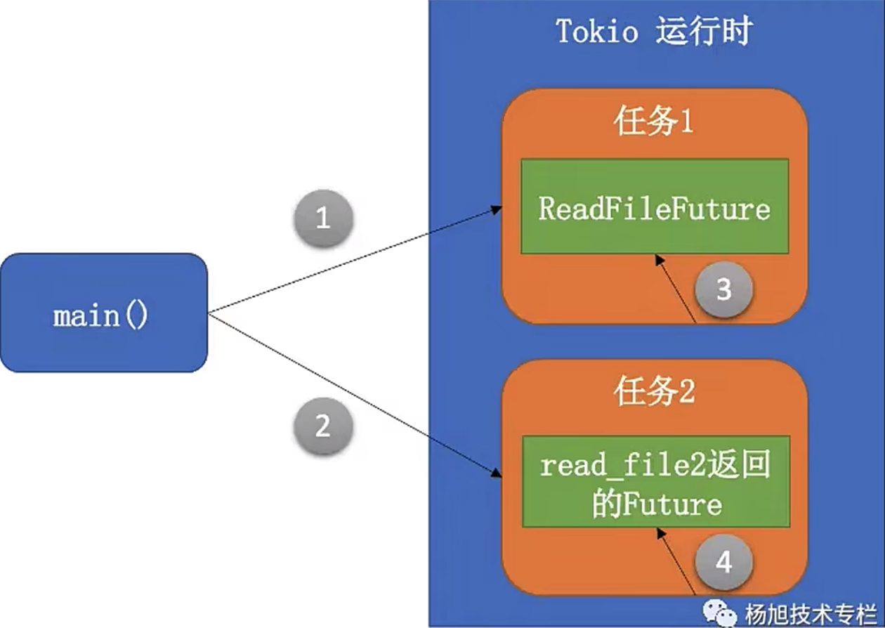
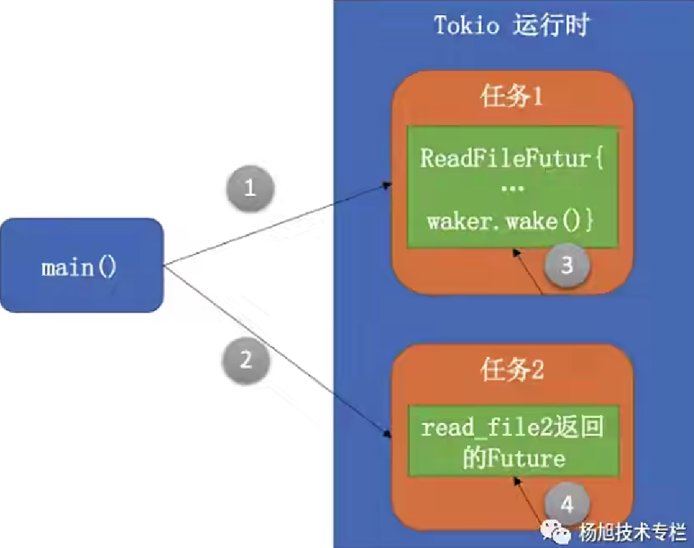
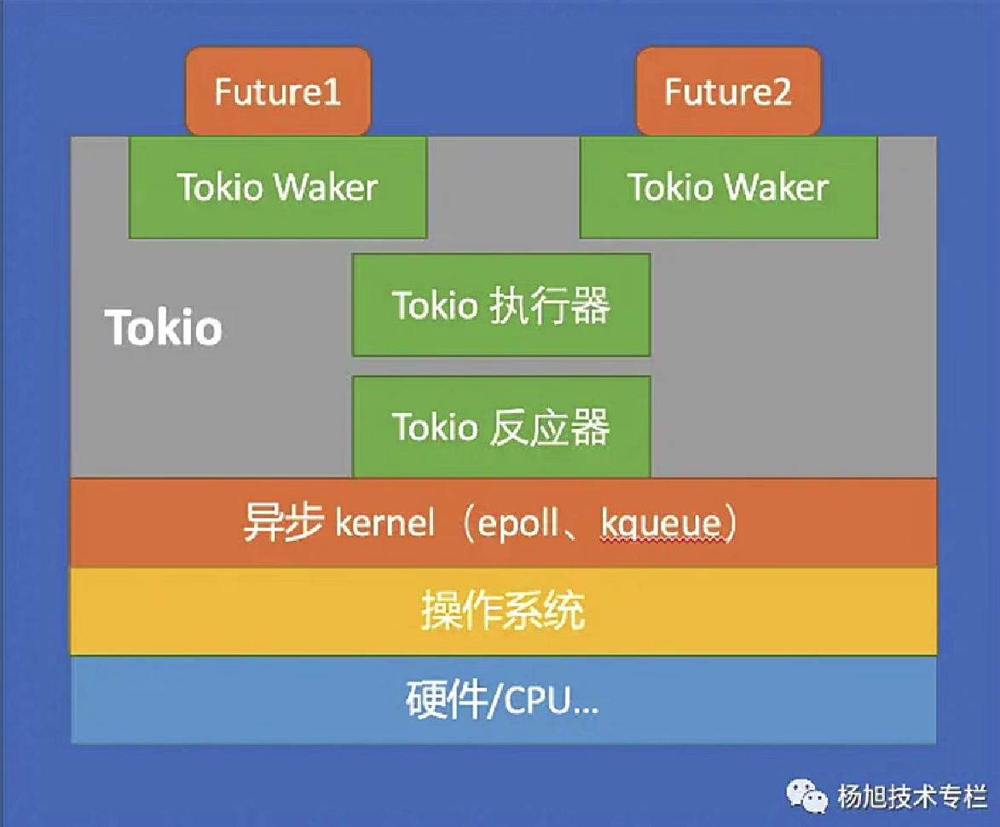
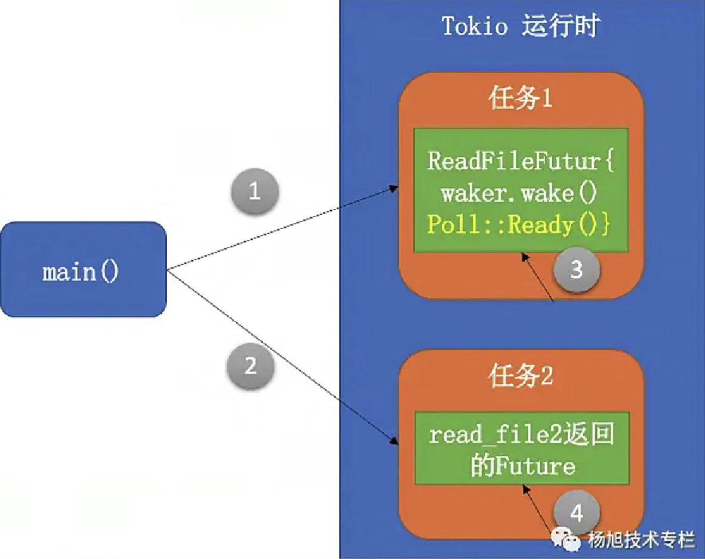

# Rust Async

## 1、异步编程的概念

### 1.1 并发与并行

+ 并发（concurrency）是指程序的不同部分可以同时不按顺序的执行且不影响最终的结果的能力
+ 并行（parallelism）是指多个任务同时执行

这里用并发一词代表 concurrency 和 parallelism



### 1.2 为什么要让程序不按顺序执行

+ 需要让软件运行的更快
+ 多 CPU 或多核 CPU 的计算机，让程序开发人员可以编写出整体性能更好的程序

#### 软件程序处理任务的两种类型

+ CPU 密集型：占用 CPU 资源的任务
  + 文件压缩、视频编码、图形处理和计算加密证明
+ IO密集型：占用 IO 资源的任务
  + 从文件系统或数据库访问数据，以及处理网络 TCP / HTTP 请求
+ CUP 密集型任务：通常可以利用多 CPU 或多核进行处理
+ IO 密集型任务：
  + 我们以Web项目中处理请求的任务为例。在Web项目中，我们通过 CRUD 操作把数据从数据库里传递过来，这就要求CPU等待数据写入到磁盘，但磁盘很慢。所以，如果程序从数据库请求10000笔数据，它会向操作系统请求磁盘的访问，而与此同时，CPU就是在干等。那么程序员应该怎么利用CPU的这段等待的时间？那就是让CPU执行其它的任务。
  + 另一个典型的例子就是网络请求的处理，客户端建立连接发送请求，服务器端处理请求返回响应并关闭连接。如果CPU还在处理前一个请求，而第二个的请求却已经到达，那么第二个的请求必须在队列中等待着第一个请求处理完成吗？或者我们可以把第二个请求安排到其他可用的CPU或内核上？

### 1.3 同步、多行程、异步的区别



这里面 Task1 包含三个步骤

1. 处理数据
2. 一个阻塞操作
3. 把从任务要返回的数据进行打包

### 1.4 Web服务器同时接收多个请求的例子



多线程，针对每个请求都开启一个原生的系统线程。提高性能，但却引入了新的复杂性：执行的顺序无法预测、死锁、竞态条件（race condition）。

多行程还有另外一个问题...

**多线程的两种模型**

+ 1:1 模型，一个语言线程对应一个系统线程
+ M:N 模型，M 个准（绿色）线程对应 N 个系统线程

而 Rust 标准库实现的是 1:1 模型，一般来说操作系统所能创建的线程是有限的，而在切换线程的过程中，也会一定的上下文切换成本，以及其它的资源成本。

### 1.5 并发方式的例子



每个 HTTP 请求被异步 Web Server 接收，Web Server 会生成一个任务来处理它，并由异步运行时安排各个异步任务在可用的 CPU 上执行


## 2、同步、多线程、异步的例子

### 2.1 单线程

```rust
use std::thread::sleep;
use std::time::Duration;

fn main() {
    println!("Hello before reading file!");
    let file1_contents = read_from_file1();
    println!("{:?}", file1_contents);
    println!("Hello after reading file1!");
    let file2_contents = read_from_file2();
    println!("{:?}", file2_contents);
    println!("Hello after reading file2!");
}

fn read_from_file1() -> String {
    sleep(Duration::new(4, 0));
    String::from("Hello, there from file 1")
}

fn read_from_file2() -> String {
    sleep(Duration::new(2, 0));
    String::from("Hello, there from file 2")
}
```

### 2.2 多线程

```rust
use std::thread::{ self, sleep };
use std::time::Duration;

fn main() {
    println!("Hello before reading file!");
    let handle1 = thread::spawn(|| {
        let file1_contents = read_from_file1();
        println!("{:?}", file1_contents);
    });
    let handle2 = thread::spawn(|| {
        let file2_contents = read_from_file2();
        println!("{:?}", file2_contents);
    });
    handle1.join().unwrap();
    handle2.join().unwrap();
}

fn read_from_file1() -> String {
    sleep(Duration::new(4, 0));
    String::from("Hello, there from file 1")
}

fn read_from_file2() -> String {
    sleep(Duration::new(2, 0));
    String::from("Hello, there from file 2")
}
```

### 2.3 异步

**Cargo.toml**

```toml
[dependencies]
tokio = { version = "1.25.0", features = ["full"] }
```

**src/main.sr**

```rust
use std::thread::sleep;
use std::time::Duration;

#[tokio::main]
async fn main() {
    println!("Hello before reading file!");
    
    let h1 = tokio::spawn(async {
        let _file1_contents = read_from_file1().await;
    });
    let h2 = tokio::spawn(async {
        let _file2_contents = read_from_file2().await;
    });
    let _ = tokio::join!(h1, h2);
}

async fn read_from_file1() -> String {
    sleep(Duration::new(4, 0));
    println!("{:?}", "Processing file 1");
    String::from("Hello, there from file 1")
}

async fn read_from_file2() -> String {
    sleep(Duration::new(2, 0));
    println!("{:?}", "Processing file 2");
    String::from("Hello, there from file 2")
}
```


## 3、理解 Async

异步编程，诀窍就是当 CPU 等待外部事件或动作时，异步运行时会安排其他可继续执行的任务在 CPU 上执行。而当从磁盘或 I/O 子系统的系统中断到达的时候，异步运行时会知道和识别这事，并安排原来的任务继续执行。

一般来说， I/O 受限（I/O Bound）的程序（程序执行的速度依赖于 l/O 子系统的速度）比起 CPU 受限（CPU Bound）的任务（程序执行的速度依赖于 CPU 的速度）可能更适合于异步任务的执行。

`async`、`.await`关键字是 Rust 标准库里用于异步编程的内置核心原语集的代表。就是语法糖。

### Future

+ Rust 异步的核心其实是 Future

+ Future 是由异步计算或函数产生的单一最终值

+ Rust 的异步函数都会返回 Future，Future 基本上就是代表着延迟的计算

  **再看之前的例子**

  ```rust
  use std::thread::sleep;
  use std::time::Duration;
  
  #[tokio::main]
  async fn main() {
      println!("Hello before reading file!");
      
      let h1 = tokio::spawn(async {
          let _file1_contents = read_from_file1().await;
      });
      let h2 = tokio::spawn(async {
          let _file2_contents = read_from_file2().await;
      });
      let _ = tokio::join!(h1, h2);
  }
  
  use std::future::Future;
  
  fn read_from_file1() -> impl Future<Output = String> {
      async  {
          sleep(Duration::new(4, 0));
          println!("{:?}", "Processing file 1");
          String::from("Hello, there from file 1")
      }
  }
  
  fn read_from_file2() -> impl Future<Output = String> {
      async  {
          sleep(Duration::new(3, 0));
          println!("{:?}", "Processing file 2");
          String::from("Hello, there from file 2")
      }
  }
  ```

  这段代码和上例中的代码是等价的，在函数前直接加`async`就是这种写法的语法糖。`Future`中有一个`poll`方法，它会在异步回调结束时返回一个`Poll`枚举，`Poll`枚举有两个变体：`Poll::Pending`表示`Future`没有完成；`Poll::Ready(val)`表示`Future`已经完成，`val`是异步回调返回的值。

  谁来调用`poll`方法呢？是异步执行器，它是异步运行时的一部分。异步执行器会管理一个`Future`的集合，并通过调用`Future`上的`poll`方法来驱动他们完成。所以函数或代码块在前面加上`async`关键字之后，就相当于告诉异步执行器他会返回`Future`，这个`Future`需要被驱动直到完成。

  但是异步执行器怎么知道异步已经准备好可以取得进展（可以产生值)了呢？他会持续不断的调用`poll`方法吗？


## 4、理解 Future

### 4.1 利用 Tokio 库来尝试理解 Future

Tokio 运行时就是管理异步任务并安排他们在 CPU 上执行的组件。

如图，一个程序可能生成多个任务，每个任务可能包含一个或多个 Future。



### 4.2 例子：自定义 Future



1. main 函数生成第一个异步任务
2. main 函数生成第二个异步任务
3. 第一个任务调用自定义的 Future，Future 会返回`Poll::Pending`
4. 第二个任务调用异步函数`read file2()`，2秒后函数返回

```rust
use std::future::Future;
use std::pin::Pin;
use std::task::{ Context, Poll };
use std::thread::sleep;
use std::time::Duration;

struct ReadFileFuture {}

impl Future for ReadFileFuture {
    type Output = String;

    fn poll(self: Pin<&mut Self>, _cx: &mut Context<'_>) -> Poll<Self::Output> {
        println!("Tokio! Stop polling me");
        Poll::Pending
    }
}

#[tokio::main]
async fn main() {
    println!("Hello before reading file!");
    
    let h1 = tokio::spawn(async {
        let future1 = ReadFileFuture {};
        future1.await;
    });

    let h2 = tokio::spawn(async {
        let file2_contents = read_from_file2().await;
        println!("{:?}", file2_contents);
    });
    let _ = tokio::join!(h1, h2);
}

fn read_from_file2() -> impl Future<Output = String> {
    async  {
        sleep(Duration::new(2, 0));
        println!("{:?}", "Processing file 2");
        String::from("Hello, there from file 2")
    }
}
```

### 4.3 Tokio 执行器如何知道何时再次 poll 第一个 Future 呢

它是一直不断的对他进行`poll`吗？肯定不会一直`poll`

Tokio（Rust的异步设计）是使用一个 Waker 组件来处理这件事的。

当被异步执行器po过的任务还没有准备好产生值的时候，这个任务就被注册到一个 Waker。Waker 会有一个处理程序（handle），它会被存储在任务关联的 Context 对象中。

Waker 有一个`wake()`方法，可以用来告诉异步执行器关联的任务应该被唤醒了。当`wake()`方法被调用了，Tokio执行器就会被通知是时候再次`poll`这个异步的任务了，具体方式就是调用任务上的`poll()`函数。

**修改一下例子**

```rust
use std::future::Future;
use std::pin::Pin;
use std::task::{ Context, Poll };
use std::thread::sleep;
use std::time::Duration;

struct ReadFileFuture {}

impl Future for ReadFileFuture {
    type Output = String;

    fn poll(self: Pin<&mut Self>, cx: &mut Context<'_>) -> Poll<Self::Output> {
        println!("Tokio! Stop polling me");
        cx.waker().wake_by_ref();
        Poll::Pending
    }
}

#[tokio::main]
async fn main() {
    println!("Hello before reading file!");
    
    let h1 = tokio::spawn(async {
        let future1 = ReadFileFuture {};
        future1.await;
    });

    let h2 = tokio::spawn(async {
        let file2_contents = read_from_file2().await;
        println!("{:?}", file2_contents);
    });
    let _ = tokio::join!(h1, h2);
}

fn read_from_file2() -> impl Future<Output = String> {
    async  {
        sleep(Duration::new(2, 0));
        println!("{:?}", "Processing file 2");
        String::from("Hello, there from file 2")
    }
}
```



1. main 函数生成第一个异步任务
2. main 函数生成第二个异步任务
3. 第一个任务调用自定义的 Future，它会调用 Waker 的`wake()`方法，这就会告诉异步运行时（Tokio）让其再次`poll`这个 Future。这个操纵一直循环进行
4. 第二个任务调用异步函数`read file2()`，2秒后函数返回

### 4.4 Tokio 的组件组成



Tokio 运行时需要理解操作系统（内核）的方法来开启 I/O 操作（读取网络数据，读写文件等）。

Tokio 运行时会注册异步的处理程序，以便在事件发生时作为 I/O 操作的一部分进行调用。而在 Tokio 运行时里面，从内核监听这些事件并与 Tokio 其他部分通信的组件就是反应器（reactor）。

Tokio 执行器，他会把一个 Future，当其可取得更多进展时，通过调用 Future 的`poll()`方法来驱动其完成。
那么 Future 是如何告诉执行器他们准备好取得进展了呢？

+ 就是Future调用 Waker 组件上的`wake()`方法。Waker 组件就会通知执行器，然后再把 Future 放回队列，并再次调用`poll()`方法，直到 Future 完成。

### 4.5 Tokio 组件的简化工作流程

1. Main 函数在 Tokio 运行时上生成任务1
2. 任务1有一个 Future，会从一个大文件读取内容
3. 从文件读取内容的请求交给到系统内核的文件子系统
4. 与此同时，任务2也被 Toko 运行时安排进行处理
5. 当任务 1 的文件操作结束时，文件子系统会触发一个系统中断，它会被翻译成 Tokio 响应器可识别的一个事件
6. Tokio 响应器会通知任务 1：文件操作的数据已经准备好
7. 任务 1 通知它注册的 Waker 组件：说明它可以产生一个值了
8. Waker 组件通知 Tokio 执行器来调用任务1关联的`poll()`方法
9. Tokio 执行器安排任务 1 进行处理，并调用`poll()`方法
10. 任务 1 产生一个值

### 4.6 再次修改后的执行顺序



1. main 函数生成第一个异步任务
2. main 函数生成第二个异步任务
3. 第一个任务调用自定义的 Future，它返回`Poll:Ready()`
4. 第二个任务调用异步函数`read file2()`，2秒后函数返回


## 5、最后的例子

创建一个自定义的 Future，它是一个定时器，具有以下功能：

+ 可设定超时时间；
+ 当它被异步运行时的执行器`poll`的时候，它会检查：
  + 如果当前时间 >= 超时时间，则返回`Poll:Ready`，里面带着一个 String 值
  + 如果当前时间 < 超时时间，则它会睡眠直至超时为止。然后它会触发 Waker 上的`wake()`方法，这就会通知异步运行时的执行器来安排并再次执行该任务

```rust
use std::future::Future;
use std::pin::Pin;
use std::task::{ Context, Poll };
use std::thread::{ sleep, spawn };
use std::time::{ Duration, Instant };

struct AsyncTimer {
    expiration_time: Instant,
}

impl Future for AsyncTimer {
    type Output = String;

    fn poll(self: Pin<&mut Self>, cx: &mut Context<'_>) -> Poll<Self::Output> {
        if Instant::now() >= self.expiration_time {
            println!("Hello, it's time for Future 1");
            Poll::Ready(String::from("Future 1 has completed"))
        } else {
            println!("Hello, it's not yet time for Future 1. Going to sleep");
            let waker = cx.waker().clone();
            let expiration_time = self.expiration_time;
            spawn(move || {
                let current_time = Instant::now();
                if current_time < expiration_time {
                    sleep(expiration_time - current_time);
                }
                waker.wake();
            });
            Poll::Pending
        }
    }
}

#[tokio::main]
async fn main() {
    let h1 = tokio::spawn(async {
        let future1 = AsyncTimer {
            expiration_time: Instant::now() + Duration::from_millis(4000),
        };
        println!("{:?}", future1.await);
    });

    let h2 = tokio::spawn(async {
        let file2_contents = read_from_file2().await;
        println!("{:?}", file2_contents);
    });
    let _ = tokio::join!(h1, h2);
}

fn read_from_file2() -> impl Future<Output = String> {
    async  {
        sleep(Duration::new(2, 0));
        String::from("Future2 has completed")
    }
}
```

