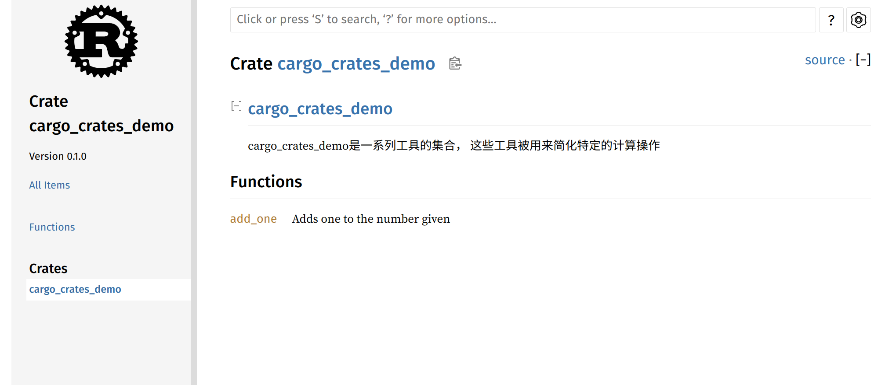
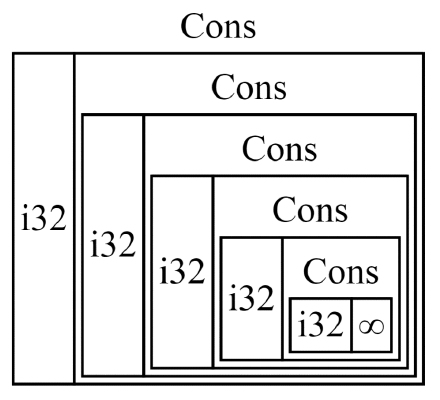
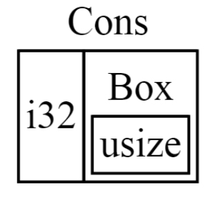

# Rust

## 1、入门指南

```rust
println!("hello world") // 打印文本
```

+ rust的缩进是4个空格，而不是tab
+ println!是一个rust macro，如果是函数的话，就没有!
+ rust文件命名规则为下划线命名法
+ cargo build [--release]
  + 编译rust源代码并生成可执行文件，--release会在编译时对代码进行优化
+ cargo check
  + 检查代码，确保代码可以通过编译，但是不生成可执行文件
+ cargo run
  + 编译rust源代码并执行可执行文件，如果已经对源代码进行过编译且没有对源代码进行修改，这会直接跳过编译，执行可执行文件

## 2、猜数游戏

```rust
use rand::Rng;
use std::io; // trait
             // use rand::thread_rng;
use std::cmp::Ordering;

fn main() {
    println!("猜数！");
    let secret_number = rand::thread_rng().gen_range(1..101); // i32 u32 i64 u64
    println!("神秘数字是：{}", secret_number);

    loop {
        println!("猜测一个数");

        let mut guess = String::new();

        io::stdin().read_line(&mut guess).expect("无法读取行");

        // shadow
        let guess: u32 = match guess.trim().parse() {
            Ok(num) => num,
            Err(_) => continue,
        };

        println!("你猜测的数是：{}", guess);

        match guess.cmp(&secret_number) {
            Ordering::Less => println!("Too small"), // arm
            Ordering::Greater => println!("Too large"),
            Ordering::Equal => {
                println!("You win");
                break;
            }
        }
    }
}

```


+ 一般情况下，rust会将prelude模块导入到每一个程序的作用域中
+ 使用use关键字导入需要的库，例如：`use std::io;`
+ let关键字用来声明一个变量，但是这个变量默认是不可变的，如果想要修改这个变量，需要在let后面加上`mut`（mutable）关键字，例如：`let mut a = 1;`
+ String::new()将返回一个空白的字符串，new()是String类型的关联函数，类似于Java中的静态方法
+ io::stdin()将返回一个Stdin类型的实例，该实例会被用作句柄（handle）用来处理终端中的输入
+ `&mut`表示获取guess的引用，rust中引用默认同样是不可变得，因此同样需要加上mut
+ read_line方法会返回io::Result\<usize\>类型，这个类型是一个enums类型，其共有两个值：Ok、Err，当程序发生异常时，会调用expect方法，并将其中的字符串显示给用户
+ rand::Rng是一个`trait`，类似于Java中的接口，通过rand::thread_rng()返回Rng的实现ThreadRng类型
+ match表达式可以通过guess.cmp()返回的Ordering类型（enums类型）的值来决定下一步执行的分支（arm），因此也常被用作处理可能会发生的异常的手段
+ loop表达式表示无限循环，不要使用while true来实现无限循环，while循环侧重于while condition，而不是直接的while true，这更符合while的语义
+ Err(\_)，\_为通配符，因为这里不需要错误信息，因此使用通配符表示

## 3、通用编程概念

### 3.1 变量与可变性

```rust
const MAX_POINTS: u32 = 100_000;
println!("The maximum number of {}", MAX_POINTS);

let mut x = 5;
println!("The value of x is {}", x);

x = 6;
println!("The value of x is {}", x);

let y = 5;
let y = y + 1;
let y = y * 2;
println!("The value of y is {}", y);

let spaces = "        ";
let spaces = spaces.len();
println!("{}", spaces);
```


#### 3.1.1 变量

+ 声明变量使用`let`关键字
+ 默认情况下，变量是不可变的（Immutable）
+ 声明变量时，在变量前加上`mut`（mutable）关键字，就可以使变量可变

#### 3.1.2 常量（constant）

+ 常量在绑定值之后也是不可变的，但是它与不可变的变量有很多区别：
  + 常量不可以使用`mut`关键字修饰，常量永远都是不可变的
  + 声明常量使用`const`关键字，其类型必须被标注
  + 常量可以在任何作用域内进行声明，包括全局作用域
  + 常量只可以绑定到常量表达式，无法绑定到函数的调用结果或只能在运行时才能计算出的值
+ 在程序运行期间，常量在其声明的作用域内一直有效
+ Rust中常量使用全大写字母，每个单词之间用下划线分开
+ 例子：`const MAX_POINTS : u32 = 100_000;`

#### 3.1.3 隐藏（shadowing）

+ 可以使用相同的名字声明新的变量，新的变量就会shadow（隐藏）之前声明的同名变量
+ shadow和把变量标记为`mut`是不一样的：
  + 如果不使用`let `关键字，那么重新给非`mut`的变量赋值会导致编译时错误
  + 而使用`let`声明的同名新变量，也是不可变的
  + 使用`let`声明的同名新变量，其类型可以与之前的不同


### 3.2 数据类型

#### 3.2.1 标量类型

> 一个标量类型代表一个单个的值

> Rust有四个主要的标量类型：
>
> + 整数类型
> + 浮点类型
> + 布尔类型
> + 字符类型

+ **整数类型**

  + 整数类型没有小数部分

  + 例如u32就是一个无符号的整数类型，占据32位的空间

  + 无符号整数类型以u开头

  + 有符号整数类型以i开头

  + Rust的整数类型列表如下：

    | Length  | Signed  | Unsigned |
    | ------- | ------- | -------- |
    | 8-bit   | `i8`    | `u8`     |
    | 16-bit  | `i16`   | `u16`    |
    | 32-bit  | `i32`   | `u32`    |
    | 64-bit  | `i64`   | `u64`    |
    | 128-bit | `i128`  | `u128`   |
    | arch    | `isize` | `usize`  |

  + isize和usize类型

    + isize和usize类型的位数由程序运行的计算机的架构所决定：如果是64位的计算机，那就是64位的
    + 使用isize和usize的主要场景是对某种集合进行索引操作

  + 整数字面值

    | Number Literals               | Example       |
    | ----------------------------- | ------------- |
    | Decimal (十进制)              | `98_222`      |
    | Hex (十六进制)                | `0xff`        |
    | Octal (八进制)                | `0o77`        |
    | Binary (二进制)               | `0b1111_0000` |
    | Byte (单字节字符)(仅限于`u8`) | `b'A'`        |

    + 除了byte类型外，所有的数值字面值都允许使用类型后缀：例如 57u8
    + 如果你不太清楚应该使用哪种类型，可以使用Rust响应的默认类型
    + 整数的默认类型就是i32：总体上来说i32的速度很快，即使在64位系统中

  + 整数溢出

    + 例如：u8的范围是0-255，如果把一个u8变量的值设为256，那么：
      + 调试模式下编译：Rust会检查整数溢出，如果发生溢出，程序在运行时就会panic
      + 发布模式下（--release）编译：Rust不会检查可能导致panic的整数溢出
        + 如果发生溢出：Rust会执行“环绕”操作：256变成0，257变成1...

  ```rust
  let guess: u32 = "42".parse().expect("Not a number");
  println!("{}", guess);
  ```

+ **浮点类型**
  + Rust有两种基础的浮点类型，也就是含有小数部分的类型
    + f32，32位，单精度
    + f64，64位，双精度
    
  + Rust的浮点类型使用了IEEE-754标准来表述
  
  + f64是默认类型，因为在现代CPU上f64和f32的速度差不多，而且精度更高
  
    ```rust
    let x = 2.0;
    let y: f32 = 3.0;
    ```

+ 数值操作
  + 加减乘除余

+ **布尔类型**
  + Rust布尔类型也有两个值：true和false
  
  + 一个字节大小
  
  + 符号是`bool`
  
    ```rust
    let t = true;
    let f: bool = false;
    ```

+ **字符类型**
  + Rust中国char类型被用来描述语言中最基础的单个字符
  
  + 字符类型的字面值使用单引号
  
  + 占用4个字节大小
  
  + 是Unicode标量值，可以表示比ASCII多得多的字符内容：拼音、中日韩文、零长度空白字符、emoji表情等
    + U+0000到U+D7FF
    + U+E000到U+10FFFF
    
  + 但是Unicode中并没有“字符”的概念，所以直接上认识的字符也许与Rust中的概念并不相符
  
    ```rust
    let x = 'x';
    let y: char = '卍';
    let z = '😂';
    ```

#### 3.2.2 复合类型

+ 复合类型可以将多个值放在一个类型里

+ Rust提供了两种基础的复合类型：元组（Tuple）、数组

+ **Tuple**
  + Tuple可以将多个类型的多个值放在同一个类型里
  
  + Tuple的长度是固定的：一旦声明就无法改变
  
  + 创建Tuple
    + 在小括号里，将值用逗号分开
    + Tuple中的每个位置都对应一个类型，Tuple中各元素的类型不必相同
    
  + 获取Tuple的元素值
    + 可以使用模式匹配来解构（*destructuring*）一个Tuple来获取元素的值
    
  + 访问Tuple的元素
    + 在Tuple变量使用点标记法，后接元素的索引号
    
  + 不带任何值的元组有个特殊的名称，叫做 **单元（unit）** 元组。这种值以及对应的类型都写作 `()`，表示空值或空的返回类型。如果表达式不返回任何其他值，则会隐式返回单元值
  
  ```rust
  let tup: (i32, f64, u8) = (500, 6.3, 1);
  
  let (x, y, z) = tup;
  println!("{}, {}, {}", x, y, z);
  
  println!("{}, {}, {}", tup.0, tup.1, tup.2);
  ```
  
+ **数组**
  + 数组也可以将多个值放在一个类型里
  
  + 数组中的每个元素的类型必须相同
  
  + 数组的长度也是固定的
  
  + 声明一个数组
    + 在中括号里，各值用逗号分开
    
  + 数组的用处
    + 如果想让你的数据存放在stack（栈）上而不是heap（堆）上，或者想保证有固定数量的元素，这时使用数组更有好处
    
  + 数组没有Vector灵活
    + Vector和数组类似，它由标准库提供
    + Vector的长度可以改变
    + 如果你不确定应该用数组还是Vector，那么估计你应该用Vector
    
  + 数组的类型
    + 数组的类型以这种形式表示：[类型; 长度]，例如： `let a: [i32; 5] = [1, 2, 3, 4, 5];`
    
  + 另一种声明数组的方法
    + 如果数组的每个元素值都相同，那么可以在：
      + 在中括号里指定初始值
      + 然后是一个 “ ; ”
      + 最后是数组的长度
      + 例如：`let a = [3; 5];`它就相当于：`let a = [3, 3, 3, 3, 3]`
    
  + 访问数组的元素
    + 数组是在Stack上分配的单个块的内存
    + 可以使用索引来访问数组的元素
    + 如果访问的索引超出了数组索引的范围，那么：
      + cargo check会通过
      + 编译运行时会报错（index out of bounds），Rust不会允许其继续访问相应地址的内存
    
    ```rust
    let a = [1, 2, 3, 4, 5];
    let b: [i32; 5] = [1, 2, 3, 4, 5];
    let c = [3; 5];
    
    let first = a[0];
    let second = a[1];
    let third = a[27]; // index out of bounds
    ```
    
    

### 3.3 函数与注释

#### 3.3.1 函数

+ 声明函数使用`fn`关键字

+ 针对函数和变量名，Rust使用snake case命名规范：所有的字母都是小写的，单词之间使用下划线分开

+ **函数的参数**
  + parameters、arguments
  
  + 在函数签名里，必须声明每个参数的类型
  
    ```rust
    fn another_function(x: i32, y: i32) {
        println!("Another function!");
        println!("the value of x and y is: {}, {}", x, y);
    }
    ```

+ **函数体中的语句与表达式**
  
  + 函数体由一系列语句组成，可选的有一个表达式结束
  
  + Rust是一个基于表达式的语言
  
  + 语句是执行一些动作的指令
  
  + 表达式会计算产生一个值
  
  + 函数的定义也是语句
  
  + 语句不返回值，所以不可以使用`let`将语句赋值 给一个变量
  
    ```rust
    // let x = (let y = 6); // expected expression, found statement (`let`)
    
    let y = {
        let x = 1;
        x + 3
    };
    ```
  
+ 函数的返回值
  + 在 `->`符号后面声明函数返回值的类型，但是不可以为返回值命名
  
  + 在Rust中，返回值就是函数体里面最后一个表达式的值
  
  + 若想提前返回，需使用return关键字，并指定一个值
    + 大多数函数都是默认使用最后一个表达式作为返回值
    
      ```rust
      fn five(x: i32) -> i32 {
          5 + x
      }
      let x = five(6);
      println!("The value of x is {}", x);
      ```

#### 3.3.2 注释

> 与C和Java一样


### 3.4 流程控制

#### 3.4.1 if表达式

+ `if`表达式允许你根据条件来执行不同的代码分支
  + 这个条件必须是bool类型
  
+ `if`表达式中，与条件相关联的代码块就叫做分支（arm）

+ 可选的，可以在后面加上一个`else`表达式

  ```rust
  let number = 3;
  
  if number < 5 {
      println!("condition was true");
  } else {
      println!("condition was false");
  }
  ```

+ 使用`else if`处理多重条件
  + 如果使用了多于一个`else if`，那么最好使用`match`来重构代码
  
+ 在`let`语句中使用`if`
  + 因为`if`是一个表达式，所以可以将它放在`let`语句中等号的右边
  
    ```rust
    let condition = true;
    let number = if condition {5} else {6};
    println!("The value of number is: {}", number);
    ```

#### 3.4.2 循环

+ Rust提供了3种循环：`loop`、`while`和`for`

+ **loop循环**
  + `loop`关键字告诉Rust反复执行一块代码，直到你喊停
  
  + 可以在`loop`循环中使用`break`关键字来告诉程序何时停止循环
  
    ```rust
    let mut counter = 0;
    
    let result = loop {
        counter += 1;
        if counter == 10 {
            break counter * 2
        }
    };
    
    println!("The result is: {}", result);
    ```

+ **while条件循环**
  + 另外的一种常见的循环模式是每次执行循环体之前都判断一次条件
  
    ```rust
    let mut number = 3;
    while number != 0 {
        println!("{}!", number);
    
        number = number - 1;
    }
    
    println!("LIFTOFF!!!")
    ```

+ **使用for循环遍历集合**
  + 可以使用`while`或`loop`来遍历集合，但是易错且低效
  
  + 使用`for`循环更简洁紧凑，它可以针对集合中的每个元素来执行一些代码
  
  + 由于`for`循环的安全、简洁性，所以它在Rust里用的最多
  
    ```rust
    let a = [10, 20, 30, 40, 50, 60];
    let mut index = 0;
    while index < a.len() {
        println!("The value is: {}", a[index]);
        index += 1;
    }
    
    for element in a.iter() {
        println!("The value is: {}", element);
    }
    ```

+ **Range**
  + 由标准库提供
  
  + 指定一个开始数字和一个结束数字，`Range`可以生成它们之间的数字（不含结束）
  
  + `rev`方法可以反转`Range`
  
    ```rust
    for number in (1 .. 4).rev() {
        println!("{}!", number);
    }
    println!("LIFTOFF!!!");
    ```
  
    

## 4、认识所有权

### 4.1 什么是所有权

> 所有权是Rust最独特的特性，它让Rust无需GC就可以保证内存安全

+ Rust的核心特性就是所有权
+ 所有的程序在运行时都必须管理它们使用计算机内存的方式
  + 有些语言有垃圾回收机制，在程序运行时，它们会不断地寻找不再使用的内存
  + 在其它语言中，程序员必须显式地分配和释放内存
+ Rust采用了第三种方式
  + 内存通过一个所有权系统来管理的，其中包含一组编译器在编译时检查的规则
  + 当内存运行时，所有权特性不会减慢程序的运行速度

#### 4.1.1 Stack vs Heap

+ 在像 Rust 这样的系统编程语言中，值是位于栈上还是堆上在更大程度上影响了语言的行为以及为何必须做出这样的抉择
+ 在你的代码运行的时候，栈和堆都是代码在运行时可供使用的内存，但是它们的结构不同
+ 栈以放入值的顺序存储值并以相反顺序取出值。这也被称作 **后进先出**（*last in, first out*）
  + 增加数据叫做 **进栈**（*pushing onto the stack*），而移出数据叫做 **出栈**（*popping off the stack*）
  + 栈中的所有数据都必须占用已知且固定的大小。
  + 在编译时大小未知或大小可能变化的数据，要改为存储在堆上。 
+ 堆是缺乏组织的
  + 当向堆放入数据时，你要请求一定大小的空间。
  + 内存分配器（memory allocator）在堆的某处找到一块足够大的空位，把它标记为已使用，并返回一个表示该位置地址的 **指针**（*pointer*）。这个过程称作 **在堆上分配内存**（*allocating on the heap*），有时简称为 “分配”（allocating）内存分配器（memory allocator）在堆的某处找到一块足够大的空位，把它标记为已使用，并返回一个表示该位置地址的 **指针**（*pointer*）。这个过程称作 **在堆上分配内存**（*allocating on the heap*），有时简称为 “分配”（allocating）
+ 把值压到stack上不叫分配，因为指针的大小是已知固定的，可以把指针存放在stack上
  + 但如果想要访问实际数据，则必须使用指针来定位
+ 入栈比在堆上分配内存要快
  + 因为（入栈时）分配器无需为存储新数据去搜索内存空间；其位置总是在栈顶
  + 相比之下，在堆上分配内存则需要更多的工作，这是因为分配器必须首先找到一块足够存放数据的内存空间，并接着做一些记录为下一次分配做准备。
+ 访问堆上的数据比访问栈上的数据慢，因为必须通过指针来访问
  + 对于现代的处理器来说，由于缓存的缘故，如果指令在内存中跳转的次数越少，那么速度就越快
+ 出于同样原因，处理器在处理的数据彼此较近的时候（比如在栈上）比较远的时候（比如可能在堆上）能更好的工作。
  + 在heap上分配大量的空间也是需要时间的
+ 当你的代码调用一个函数时，传递给函数的值（包括可能指向堆上数据的指针）和函数的局部变量被压入栈中。当函数结束时，这些值被移出栈。

#### 4.1.2 所有权存在的原因

+ 所有权解决的问题
  + 跟踪代码的哪些部分正在使用heap的哪些数据
  + 最小化heap上的重复数据量
  + 清理heap上未使用的数据以避免空间不足
+ 一旦理解了所有权，你就不需要经常考虑栈和堆了，不过明白了所有权的主要目的就是为了管理堆数据，这也能够帮助解释为什么所有权要以这种方式工作。

#### 4.1.3 所有权规则

+ 每个值都有一个变量，这个变量是该值的所有者（owner）
+ 每个值同时只能有一个所有者
+ 当所有者离开作用域（scope）时，该值将被删除

#### 4.1.4 变量作用域

+ `Scope`就是程序中一个项（item）在程序中的有效范围

  ```rust
  fn main() {
      // s 不可用
      let s = "hello"; // s 可用
      // 可以对 s 进行相关的操作
  } // 作用域到此结束，s 不再可用
  ```

#### 4.1.5 String类型

+ `String`比基础标量数据类型更复杂

+ 字符串字面值：程序里手写的那些字符串值。它们是不可变的

+ Rust还有第二种字符串类型：String

  + `String`类型管理被分配到堆上的数据，所以能够存储在编译时未知大小的文本

+ 创建`String`类型的值

  + 可以使用 `from` 函数基于字符串字面值来创建 `String`

  + `let s = String::from("hello")`

    + `::` 是运算符，允许将特定的 `from` 函数置于 `String` 类型的命名空间（namespace）下，而不需要使用类似 `string_from` 这样的名字，也就是`from`是`String`类型下的函数

    + 这类字符串是可以被修改的

      ```rust
      fn main() {
          let mut s = String::from("hello");
      
          s.push_str(", world");
      
          println!("{}", s);
      }
      ```

    + 为什么`String`类型的值可以修改，而字符串字面值却不能修改？
      + 因为它们处理内存的方式不同

#### 4.1.6 内存与分配

+ 就字符串字面值来说，我们在编译时就知道其内容，所以文本被直接硬编码进最终的可执行文件中

  + 这使得字符串字面值快速且高效，这些特性都只得益于字符串字面值的不可变性

+ 对于 `String` 类型，为了支持一个可变，可增长的文本片段，需要在堆上分配一块在编译时未知大小的内存来存放内容

  + 必须在运行时向内存分配器（memory allocator）请求内存

    + ​	这步通过调用`String::from`来实现

  + 当我们处理完 `String` 时，需要使用某种方式将内存返回给分配器

    + 在有 **垃圾回收**（*garbage collector*，*GC*）的语言中， GC 记录并清除不再使用的内存
    + 在大部分没有 GC 的语言中，识别出不再使用的内存并调用代码显式释放就是我们的责任了
      + 如果忘记回收了会浪费内存
      + 如果过早回收了，将会出现无效变量，变量就会非法
      + 如果重复回收，这也是个 bug。我们需要精确的为一个 `allocate` 配对一个 `free`

  + Rust 采取了一个不同的策略：内存在拥有它的变量离开作用域后就被自动释放。

    ```rust
    fn main() {
        {
            let s = String::from("hello"); // 从此处起，s 是有效的
            // 使用 s
        }                                  // 此作用域已结束       
    }                                      // s 不再有效
    ```
    
  + 当变量离开作用域，Rust 为我们调用一个特殊的函数。这个函数叫做 [`drop`](https://doc.rust-lang.org/std/ops/trait.Drop.html#tymethod.drop)，在这里 `String` 的作者可以放置释放内存的代码。Rust 在结尾的 `}` 处自动调用 `drop`

#### 4.1.7 变量与数据交互的方式

> 在Rust 中，多个变量可以采取不同的方式与同一数据进行交互

+ 移动

  ```rust
  fn main() {
      let x = 5;
      let y = x;
  }
  ```
  
  整数是有已知固定大小的简单值，所以这两个 5 被放入了栈中
  
  ```rust
  fn main() {
      let s1 = String::from("hello");
      let s2 = s1;
  }
  ```
  
  情况和前面的例子不同
  
  + `String` 由三部分组成，这一组数据存储在栈上
  
    + 一个指向存放字符串内容内存的指针
    + 一个长度
    + 一个容量
  
  + 存放字符串内容的部分在heap上
  
  + 长度len，就是存放字符串内容所需的字节数
  
  + 容量capacity是指`String`从内存分配器总共获得的内存的总字节数
  
  
  
  + 当我们将 `s1` 赋值给 `s2`，`String` 的数据被复制了，这意味着我们从栈上拷贝了它的指针、长度和容量。我们并没有复制指针指向的堆上数据。
  
    
  
  + 当变量离开作用域后，Rust 自动调用 `drop` 函数并清理变量的堆内存
  
  + 这就有了一个问题：当 `s2` 和 `s1` 离开作用域，他们都会尝试释放相同的内存
  
    + 这是一个叫做 **二次释放**（*double free*）的错误，也是之前提到过的内存安全性 bug 之一
    + 两次释放（相同）内存会导致内存污染，它可能会导致潜在的安全漏洞
  
  + 确保内存安全
  
    + Rust没有尝试复制被分配的内存
    + Rust 认为 `s1` 不再有效
      + Rust 不需要在 `s1` 离开作用域后清理任何东西
  
    ```rust
    fn main() {
        let s1 = String::from("hello");
        let s2 = s1;
    
        println!("{}, world!", s1);
    }
    ```
  
  + 你会得到一个类似如下的错误，因为 Rust 禁止你使用无效的引用
  
    ```rust
    error[E0382]: borrow of moved value: `s1`
     --> src\main.rs:5:28
      |
    2 |     let s1 = String::from("hello");
      |         -- move occurs because `s1` has type `String`, which does not implement the `Copy` trait
    3 |     let s2 = s1;
      |              -- value moved here
    4 |
    5 |     println!("{}, world!", s1);
      |                            ^^ value borrowed here after move
      |
      = note: this error originates in the macro `$crate::format_args_nl` which comes from the expansion of the macro `println` (in Nightly builds, run with -Z macro-backtrace for more info)
    
    For more information about this error, try `rustc --explain E0382`.
    warning: `owner` (bin "owner") generated 1 warning
    error: could not compile `owner` due to previous error; 1 warning emitted
    ```
  
  + 如果你在其他语言中听说过术语 **浅拷贝**（*shallow copy*）和 **深拷贝**（*deep copy*），那么拷贝指针、长度和容量而不拷贝数据可能听起来像浅拷贝。不过因为 Rust 同时使第一个变量无效了，这个操作被称为 **移动**（*move*），而不是浅拷贝。上面的例子可以解读为 `s1` 被 **移动** 到了 `s2` 中。
  
    
  
  + 这里还隐含了一个设计选择：Rust 永远也不会自动创建数据的 “深拷贝”。因此，任何 **自动** 的复制可以被认为对运行时性能影响较小
  
+ 克隆

  + 如果我们 **确实** 需要深度复制 `String` 中堆上的数据，而不仅仅是栈上的数据，可以使用一个叫做 `clone` 的通用函数

    ```rust
    fn main() {
        let s1 = String::from("hello");
        let s2 = s1.clone();
    
        println!("s1 = {}, s2 = {}", s1, s2);
    }
    ```

  + 只在栈上的数据：拷贝
  
    + 这里还有一个没有提到的小窍门。这些代码使用了整型并且是有效的
  
      ```rust
      fn main() {
          let x = 5;
          let y = x;
      
          println!("x = {}, y = {}", x, y);
      }
      ```
  
    + 但这段代码似乎与我们刚刚学到的内容相矛盾：没有调用 `clone`，不过 `x` 依然有效且没有被移动到 `y` 中
    + 原因是像整型这样的在编译时已知大小的类型被整个存储在栈上，所以拷贝其实际的值是快速的。这意味着没有理由在创建变量 `y` 后使 `x` 无效。换句话说，这里没有深浅拷贝的区别，所以这里调用 `clone` 并不会与通常的浅拷贝有什么不同，我们可以不用管它。
    + Rust 有一个叫做 `Copy` trait 的特殊注解，可以用在类似整型这样的存储在栈上的类型上，如果一个类型实现了 `Copy` trait，那么一个旧的变量在将其赋值给其他变量后仍然可用
    + 如果一个类型或者该类型的一部分实现类 `Drop`trait，那么Rust不允许让它再去实现`Copy`trait
      + 任何一组简单标量值的组合都可以实现 `Copy`
      + 任何不需要分配内存或某种形式资源的类型都可以实现 `Copy`
      + 一些拥有`Copy`trait的类型
        + 所有整数类型，比如 `u32`。
        + 布尔类型，`bool`，它的值是 `true` 和 `false`。
        + 所有浮点数类型，比如 `f64`。
        + 字符类型，`char`。
        + 元组，当且仅当其包含的类型也都实现 `Copy` 的时候。比如，`(i32, i32)` 实现了 `Copy`，但 `(i32, String)` 就没有。
  

#### 4.1.8 所有权与函数

+ 将值传递给函数与给变量赋值的原理相似

  + 将值传递给函数将发生移动或复制

  ```rust
  fn main() {
      let s = String::from("hello");  // s 进入作用域
  
      takes_ownership(s);             // s 的值移动到函数里 ...
                                      // ... 所以到这里不再有效
  
      let x = 5;                      // x 进入作用域
  
      makes_copy(x);                  // x 应该移动函数里，
                                      // 但 i32 是 Copy 的，
                                      // 所以在后面可继续使用 x
  
  } // 这里, x 先移出了作用域，然后是 s。但因为 s 的值已被移走，
    // 没有特殊之处
  
  fn takes_ownership(some_string: String) { // some_string 进入作用域
      println!("{}", some_string);
  } // 这里，some_string 移出作用域并调用 `drop` 方法。
    // 占用的内存被释放
  
  fn makes_copy(some_integer: i32) { // some_integer 进入作用域
      println!("{}", some_integer);
  } // 这里，some_integer 移出作用域。没有特殊之处
  ```

#### 4.1.9 返回值与作用域

+ 函数在返回值的过程中同样也会发生所有权的转移

  ```rust
  fn main() {
      let s1 = gives_ownership(); // gives_ownership 将返回值
                                      // 转移给 s1
  
      let s2 = String::from("hello"); // s2 进入作用域
  
      let s3 = takes_and_gives_back(s2); // s2 被移动到
                                         // takes_and_gives_back 中,
                                         // 它也将返回值移给 s3
  } // 这里, s3 移出作用域并被丢弃。s2 也移出作用域，但已被移走，
    // 所以什么也不会发生。s1 离开作用域并被丢弃
  
  fn gives_ownership() -> String {
      // gives_ownership 会将
      // 返回值移动给
      // 调用它的函数
  
      let some_string = String::from("yours"); // some_string 进入作用域.
  
      some_string // 返回 some_string
                  // 并移出给调用的函数
                  //
  }
  
  // takes_and_gives_back 将传入字符串并返回该值
  fn takes_and_gives_back(a_string: String) -> String {
      // a_string 进入作用域
      //
  
      a_string // 返回 a_string 并移出给调用的函数
  }
  ```

+ 一个变量的所有权总是遵循同样的模式

  + 把一个值赋给其它变量时就会发生移动
  + 当一个包含heap数据的变量离开作用域时，它的值就会被`drop`函数清理，除非数据的所有权移动到另一个变量上了

+ 如果我们想要函数使用一个值但不获取所有权该怎么办呢？

  ```rust
  fn main() {
      let s1 = String::from("hello");
  
      let (s2, len) = calculate_length(s1);
  
      println!("The length of '{}' is {}.", s2, len);
  }
  
  fn calculate_length(s: String) -> (String, usize) {
      let length = s.len(); // len() 返回字符串的长度
  
      (s, length)
  }
  ```

  但是这未免有些形式主义，而且这种场景应该很常见

+ Rust 对此提供了一个不用获取所有权就可以使用值的功能，叫做 **引用**（*references*）


### 4.2 引用和借用

#### 4.2.1 引用（reference）

+ 我们可以提供一个 `String` 值的引用（reference）。**引用**（*reference*）像一个指针，因为它是一个地址，我们可以由此访问储存于该地址的属于其他变量的数据。 与指针不同，引用确保指向某个特定类型的有效值。

  ```rust
  fn main() {
      let s1 = String::from("hello");
  
      let len = calculate_length(&s1);
  
      println!("The length of '{}' is {}.", s1, len);
  }
  
  fn calculate_length(s: &String) -> usize {
      s.len()
  }
  ```

+ 我们传递 `&s1` 给 `calculate_length`，同时在函数定义中，我们获取 `&String` 而不是 `String`。这些 & 符号就是 **引用**，它们允许你使用值但不获取其所有权

  

#### 4.2.2 借用（borrowing）

+ 我们将创建一个引用的行为称为 **借用**（*borrowing*）。正如现实生活中，如果一个人拥有某样东西，你可以从他那里借来。当你使用完毕，必须还回去。我们并不拥有它

+ 如果我们尝试修改借用的变量呢？

  ```rust
  fn main() {
      let s = String::from("hello");
  
      change(&s);
  }
  
  fn change(some_string: &String) {
      some_string.push_str(", world");
  }
  ```

  ```rust
  $ cargo run
     Compiling ownership v0.1.0 (file:///projects/ownership)
  error[E0596]: cannot borrow `*some_string` as mutable, as it is behind a `&` reference
   --> src/main.rs:8:5
    |
  7 | fn change(some_string: &String) {
    |                        ------- help: consider changing this to be a mutable reference: `&mut String`
  8 |     some_string.push_str(", world");
    |     ^^^^^^^^^^^^^^^^^^^^^^^^^^^^^^^ `some_string` is a `&` reference, so the data it refers to cannot be borrowed as mutable
  
  For more information about this error, try `rustc --explain E0596`.
  error: could not compile `ownership` due to previous error
  ```

  正如变量默认是不可变的，引用也一样。（默认）不允许修改引用的值（即不能乱修改借来的东西）。

#### 4.2.3 可变引用

```rust
fn main() {
    let mut s = String::from("hello");

    change(&mut s);
}

fn change(some_string: &mut String) {
    some_string.push_str(", world");
}
```

我们通过一个小调整就能允许我们修改一个借用的值，这就是 **可变引用**

+ 首先，我们必须将 `s` 改为 `mut`。然后在调用 `change` 函数的地方创建一个可变引用 `&mut s`，并更新函数签名以接受一个可变引用 `some_string: &mut String`。这就非常清楚地表明，`change` 函数将改变它所借用的值。

+ 可变引用有一个很大的限制：如果你有一个对该变量的可变引用，你就不能再创建对该变量的引用。这些尝试创建两个 `s` 的可变引用的代码会失败

  ```rust
  fn main() {
      let mut s = String::from("hello");
  
      let r1 = &mut s;
      let r2 = &mut s;
  
      println!("{}, {}", r1, r2);
  }
  ```

  ```rust
  $ cargo run
     Compiling ownership v0.1.0 (file:///projects/ownership)
  error[E0499]: cannot borrow `s` as mutable more than once at a time
   --> src/main.rs:5:14
    |
  4 |     let r1 = &mut s;
    |              ------ first mutable borrow occurs here
  5 |     let r2 = &mut s;
    |              ^^^^^^ second mutable borrow occurs here
  6 | 
  7 |     println!("{}, {}", r1, r2);
    |                        -- first borrow later used here
  
  For more information about this error, try `rustc --explain E0499`.
  error: could not compile `ownership` due to previous error
  ```

  这一限制以一种非常小心谨慎的方式允许可变性，防止同一时间对同一数据存在多个可变引用。新 Rustacean 们经常难以适应这一点，因为大部分语言中变量任何时候都是可变的。这个限制的好处是 Rust 可以在编译时就避免数据竞争。**数据竞争**（*data race*）类似于竞态条件，它可由这三个行为造成：

  + 两个或更多指针同时访问同一数据。
  + 至少有一个指针被用来写入数据。
  + 没有同步数据访问的机制。

+ 数据竞争会导致未定义行为，难以在运行时追踪，并且难以诊断和修复；Rust 避免了这种情况的发生，因为它甚至不会编译存在数据竞争的代码！

+ 可以使用大括号来创建一个新的作用域，以允许拥有多个可变引用，只是不能 **同时** 拥有

  ```rust
  fn main() {
      let mut s = String::from("hello");
  
      {
          let r1 = &mut s;
      } // r1 在这里离开了作用域，所以我们完全可以创建一个新的引用
  
      let r2 = &mut s;
  }
  ```

+ **不可以同时拥有**一个可变引用和一个不可变的引用

  ```rust
  fn main() {
      let mut s = String::from("hello");
  
      let r1 = &s; // 没问题
      let r2 = &s; // 没问题
      let r3 = &mut s; // 大问题
  
      println!("{}, {}, and {}", r1, r2, r3);
  }
  ```

  ```rust
  $ cargo run
     Compiling ownership v0.1.0 (file:///projects/ownership)
  error[E0502]: cannot borrow `s` as mutable because it is also borrowed as immutable
   --> src/main.rs:6:14
    |
  4 |     let r1 = &s; // no problem
    |              -- immutable borrow occurs here
  5 |     let r2 = &s; // no problem
  6 |     let r3 = &mut s; // BIG PROBLEM
    |              ^^^^^^ mutable borrow occurs here
  7 | 
  8 |     println!("{}, {}, and {}", r1, r2, r3);
    |                                -- immutable borrow later used here
  
  For more information about this error, try `rustc --explain E0502`.
  error: could not compile `ownership` due to previous error
  ```

#### 4.2.4 悬空引用（Dangling References）

+ 一个指针引用了内存中的某个地址，而这块内存可能已经释放并分配给其它持有者了

+ 在 Rust 中编译器确保引用永远也不会变成悬垂状态

  + 当你引用了某些数据，编译器确保数据不会在其引用之前离开作用域

    ```rust
    fn main() {
        let reference_to_nothing = dangle();
    }
    
    fn dangle() -> &String {
        let s = String::from("hello");
    
        &s
    }
    ```

    ```rust
    $ cargo run
       Compiling ownership v0.1.0 (file:///projects/ownership)
    error[E0106]: missing lifetime specifier
     --> src/main.rs:5:16
      |
    5 | fn dangle() -> &String {
      |                ^ expected named lifetime parameter
      |
      = help: this function's return type contains a borrowed value, but there is no value for it to be borrowed from
    help: consider using the `'static` lifetime
      |
    5 | fn dangle() -> &'static String {
      |                ~~~~~~~~
    
    For more information about this error, try `rustc --explain E0106`.
    error: could not compile `ownership` due to previous error
    ```

    我们尝试创建一个悬垂引用，Rust 会通过一个编译时错误来避免

    ```rust
    fn main() {
        let reference_to_nothing = dangle();
    }
    
    fn dangle() -> &String { // dangle 返回一个字符串的引用
    
        let s = String::from("hello"); // s 是一个新字符串
    
        &s // 返回字符串 s 的引用
    } // 这里 s 离开作用域并被丢弃。其内存被释放。
      // 危险！
    ```

#### 4.2.5 引用的规则

- 在任意给定时间，**要么** 只能有一个可变引用，**要么** 只能有多个不可变引用。
- 引用必须总是有效的。


### 4.3 Slice类型（切片）

> *slice* 允许你引用集合中一段连续的元素序列，而不用引用整个集合。slice 是一类引用，所以它不持有所有权

+ 编写一个函数，该函数接收一个用空格分隔单词的字符串，并返回在该字符串中找到的第一个单词。如果函数在该字符串中并未找到空格，则整个字符串就是一个单词，所以应该返回整个字符串

+ 我们并没有一个真正获取 **部分** 字符串的办法。不过，我们可以返回单词结尾的索引，结尾由一个空格表示

  ```rust
  fn main() {
      let mut s = String::from("hello world");
      let word_index = first_world(&s);
      s.clear(); // 这清空了字符串，使其等于 ""
      // word_index 在此处的值仍然是 5，
      // 但是没有更多的字符串让我们可以有效地应用数值 5。word_index 的值现在完全没有意义
      println!("{}", word_index)
  }
  
  fn first_world(s: &String) -> usize {
      let bytes = s.as_bytes();
  
      for (i, &item) in bytes.iter().enumerate() {
          if item == b' ' {
              return i;
          }
      }
      s.len()
  }
  ```

   `iter` 方法返回集合中的每一个元素，而 `enumerate` 包装了 `iter` 的结果，将这些元素作为元组的一部分来返回。`enumerate` 返回的元组中，第一个元素是索引，第二个元素是集合中元素的引用。

   `enumerate` 方法返回一个元组，我们可以使用模式来解构。在 `for` 循环中，我们指定了一个模式，其中元组中的 `i` 是索引而元组中的 `&item` 是单个字节。因为我们从 `.iter().enumerate()` 中获取了集合元素的引用，所以模式中使用了 `&`。

  在 `for` 循环中，我们通过字节的字面值语法来寻找代表空格的字节。如果找到了一个空格，返回它的位置。否则，使用 `s.len()` 返回字符串的长度。

  我们返回了一个独立的 `usize`，不过它只在 `&String` 的上下文中才是一个有意义的数字。换句话说，因为它是一个与 `String` 相分离的值，无法保证将来它仍然有效。

  这个程序编译时没有任何错误，而且在调用 `s.clear()` 之后使用 `word` 也不会出错。因为 `word` 与 `s` 状态完全没有联系，所以 `word `仍然包含值 `5`。可以尝试用值 `5` 来提取变量 `s` 的第一个单词，不过这是有 bug 的，因为在我们将 `5` 保存到 `word` 之后 `s` 的内容已经改变。我们不得不时刻担心 `word` 的索引与 `s` 中的数据不再同步，这很啰嗦且易出错。

#### 4.3.1 字符串切片（slice）

+ **字符串 slice**（*string slice*）是 `String` 中一部分值的引用，它看起来像这样

  ```rust
  fn main() {
      let s = String::from("hello world");
  
      let hello = &s[0..5];
      let world = &s[6..11];
  }
  ```

+ 形式：[starting_index..ending_index]

  + starting_index就是切片起始位置的索引值
  + ending_index是切片终止位置的下一个索引值

  

  + 字符串 slice range 的索引必须位于有效的 UTF-8 字符边界内
  + 如果尝试从一个多字节字符的中间位置创建字符串 slice，则程序将会因错误而退出

+ 使用字符串切片重写例子

  ```rust
  fn main() { 
  
      let mut s = String::from("hello world");
      let word_index = first_word(&s);
  
      s.clear(); // 错误
      println!("{}", word_index);
  }
  
  fn first_word(s: &String) -> &str {
  
      let bytes = s.as_bytes();
  
      for(i, &item) in bytes.iter().enumerate() {
          if item == b' '{
              return &s[..i];
          }
      }
      &s[..]
  }
  ```

  ```rust
  $ cargo run
     Compiling ownership v0.1.0 (file:///projects/ownership)
  error[E0502]: cannot borrow `s` as mutable because it is also borrowed as immutable
    --> src/main.rs:18:5
     |
  16 |     let word = first_word(&s);
     |                           -- immutable borrow occurs here
  17 | 
  18 |     s.clear(); // error!
     |     ^^^^^^^^^ mutable borrow occurs here
  19 | 
  20 |     println!("the first word is: {}", word);
     |                                       ---- immutable borrow later used here
  
  For more information about this error, try `rustc --explain E0502`.
  error: could not compile `ownership` due to previous error
  ```

  回忆一下借用规则，当拥有某值的不可变引用时，就不能再获取一个可变引用。因为 `clear` 需要清空 `String`，它尝试获取一个可变引用。在调用 `clear` 之后的 `println!` 使用了 `word` 中的引用，所以这个不可变的引用在此时必须仍然有效。Rust 不允许 `clear` 中的可变引用和 `word` 中的不可变引用同时存在，因此编译失败。Rust 不仅使得我们的 API 简单易用，也在编译时就消除了一整类的错误！

#### 4.3.2 字符串字面值就是 slice

+ 字符串字面值被直接存储在二进制程序中
  + `let word = "hello world";`
    + 变量 s 的类型是 `&str`，它是一个指向二进制程序特定位置的切片
    + `&str`是不可变引用，所以字符串字面值也是不可变的


#### 4.3.3 将字符串 slice作为参数传递

+ `fn first_word(s: &String) -> &str {`

+ 而更有经验的 Rustacean 会采用`&str`作为参数类型，因为这样就可以同时接收`String`和`&str`类型的参数了

  + `fn first_word(s: &str) -> &str {`
    + 使用字符串切片，直接调用该函数
    + 使用`String`，可以创建一个完整的`String`切片来调用该函数

+ 定义函数时使用字符串切片来代替字符串引用会使我们的API更加通用，且不会损失任何功能

  ```rust
  fn main() {
      let my_string = String::from("hello world");
  
      // `first_word` 适用于 `String`（的 slice），整体或全部
      let word = first_word(&my_string[0..6]);
      let word = first_word(&my_string[..]);
      // `first_word` 也适用于 `String` 的引用，
      // 这等价于整个 `String` 的 slice
      let word = first_word(&my_string);
  
      let my_string_literal = "hello world";
  
      // `first_word` 适用于字符串字面值，整体或全部
      let word = first_word(&my_string_literal[0..6]);
      let word = first_word(&my_string_literal[..]);
  
      // 因为字符串字面值已经 **是** 字符串 slice 了，
      // 这也是适用的，无需 slice 语法！
      let word = first_word(my_string_literal);
  }
  ```

  

#### 4.3.4 其它类型的 slice

+ 就跟我们想要获取字符串的一部分那样，我们也会想要引用数组的一部分

  ```rust
  #![allow(unused)]
  fn main() {
  let a = [1, 2, 3, 4, 5];
  
  let slice = &a[1..3];
  
  assert_eq!(slice, &[2, 3]);
  }
  ```

  这个 slice 的类型是 `&[i32]`。它跟字符串 slice 的工作方式一样，通过存储集合中第一个元素的引用和一个集合总长度。你可以对其他所有集合使用这类 slice


## 5、使用结构体组织相关联的数据

> *struct*，或者 *structure*，是一个自定义数据类型，允许你包装和命名多个相关的值，从而形成一个有意义的组合。如果你熟悉一门面向对象语言，*struct* 就像对象中的数据属性。

### 5.1 结构体的定义和实例化

#### 5.1.1 创建struct

+ 使用`struct`关键字，并为整个`struct`命名

+ 在花括号内，为所有字段（Field）定义名称和类型

  ```rust
  struct User {
      username: String,
      email: String,
      sign_in_count: u64,
      active: bool,
  }
  ```

#### 5.1.2 实例化struct

+ 想要使用`struct`，需要创建`struct`的实例

  + 为每个字段指定具体值
  + 无需按声明的顺序进行指定

  ```rust
  fn main() {
      let user1 = User {
          email: String::from("someone@example.com"),
          username: String::from("someusername123"),
          active: true,
          sign_in_count: 1,
      };
  }
  ```

#### 5.1.3 取得struct里面的某个值

+ 使用点标记法

  ```rust
  struct User {
      active: bool,
      username: String,
      email: String,
      sign_in_count: u64,
  }
  
  fn main() {
      let mut user1 = User {
          email: String::from("someone@example.com"),
          username: String::from("someusername123"),
          active: true,
          sign_in_count: 1,
      };
  
      user1.email = String::from("anotheremail@example.com");
  }
  ```

+ 一旦`struct`的实例是可变的，那么实例中所有字段都是可变的，Rust 并不允许只将某个字段标记为可变

+ 另外需要注意同其他任何表达式一样，我们可以在函数体的最后一个表达式中构造一个结构体的新实例，来隐式地返回这个实例

  ```rust
  struct User {
      active: bool,
      username: String,
      email: String,
      sign_in_count: u64,
  }
  
  fn build_user(email: String, username: String) -> User {
      User {
          email: email,
          username: username,
          active: true,
          sign_in_count: 1,
      }
  }
  
  fn main() {
      let user1 = build_user(
          String::from("someone@example.com"),
          String::from("someusername123"),
      );
  }
  ```

+ 为函数参数起与结构体字段相同的名字是可以理解的，但是不得不重复 `email` 和 `username` 字段名称与变量有些啰嗦。如果结构体有更多字段，重复每个名称就更加烦人了。幸运的是，有一个方便的简写语法！

#### 5.1.4 字段初始化简写语法

+ 当参数名与字段名都完全相同，我们可以使用 **字段初始化简写语法**（*field init shorthand*）来重写

  ```rust
  struct User {
      active: bool,
      username: String,
      email: String,
      sign_in_count: u64,
  }
  
  fn build_user(email: String, username: String) -> User {
      User {
          email,
          username,
          active: true,
          sign_in_count: 1,
      }
  }
  
  fn main() {
      let user1 = build_user(
          String::from("someone@example.com"),
          String::from("someusername123"),
      );
  }
  ```

#### 5.1.5 struct更新语法

+ 当你想基于某个`struct`实例来创建一个新实例的时候，可以使用 **结构体更新语法**（*struct update syntax*）实现

  ```rust
  struct User {
      active: bool,
      username: String,
      email: String,
      sign_in_count: u64,
  }
  
  fn main() {
      // --snip--
  
      let user1 = User {
          email: String::from("someone@example.com"),
          username: String::from("someusername123"),
          active: true,
          sign_in_count: 1,
      };
  	
      // 不使用更新语法
      let user2 = User {
          active: user1.active,
          username: user1.username,
          email: String::from("another@example.com"),
          sign_in_count: user1.sign_in_count,
      };
      
      //使用更新语法
      let user2 = User {
          email: String::from("another@example.com"),
          ..user1
      };
  }
  ```

#### 5.1.6 Tuple structs

+ 可定义类似`tuple`的`struct`，叫做元组结构体（*tuple structs*）

  + `Tuple structs`有着结构体名称提供的含义，但没有具体的字段名，只有字段的类型
  + 当你想给整个元组取一个名字，并使元组成为与其他元组不同的类型时，元组结构体是很有用的，这时像常规结构体那样为每个字段命名就显得多余和形式化了

+ 定义 `Tuple structs`：使用`struct`关键字，后边是名字，以及里面元素的类型

  ```rust
  struct Color(i32, i32, i32);
  struct Point(i32, i32, i32);
  
  fn main() {
      let black = Color(0, 0, 0);
      let origin = Point(0, 0, 0);
  }
  ```

+ `black` 和 `origin` 值的类型不同，因为它们是不同的元组结构体的实例

+ 元组结构体实例类似于元组，你可以将它们解构为单独的部分，也可以使用 `.` 后跟索引来访问单独的值

#### 5.1.7 没有任何字段的类单元结构体（*unit-like structs*）

+ 定义一个没有任何字段的结构体！它们被称为 **类单元结构体**（*unit-like structs*）,因为它们类似于 `()`，即“元组类型”中提到的 unit 类型

+ 类单元结构体常常在你想要在某个类型上实现 trait 但不需要在类型中存储数据的时候发挥作用

  ```rust
  struct AlwaysEqual;
  
  fn main() {
      let subject = AlwaysEqual;
  }
  ```

#### 5.1.8 struct数据的所有权

```rust
struct User {
    active: bool,
    username: &str,
    email: &str,
    sign_in_count: u64,
}
```

+ 这里的字段使用了`String`而不是`&str`
  + 该`struct`实例拥有其所有的数据
  + 只要`struct`实例是有效的，那么里面的字段数据也是有效的
  
+ `struct`里也可以存放引用，但这需要使用声明周期（lifetimes）
  + 生命周期保证只要`struct`实例是有效的，那么里面的引用也是有效的
  + 如果`struct`里面存储引用，而不使用生命周期就会报错
  
  ```rust
  struct User {
      active: bool,
      username: &str,
      email: &str,
      sign_in_count: u64,
  }
  
  fn main() {
      let user1 = User {
          email: "someone@example.com",
          username: "someusername123",
          active: true,
          sign_in_count: 1,
      };
  }
  
  ```
  
  ```rust
  $ cargo run
     Compiling structs v0.1.0 (file:///projects/structs)
  error[E0106]: missing lifetime specifier
   --> src/main.rs:3:15
    |
  3 |     username: &str,
    |               ^ expected named lifetime parameter
    |
  help: consider introducing a named lifetime parameter
    |
  1 ~ struct User<'a> {
  2 |     active: bool,
  3 ~     username: &'a str,
    |
  
  error[E0106]: missing lifetime specifier
   --> src/main.rs:4:12
    |
  4 |     email: &str,
    |            ^ expected named lifetime parameter
    |
  help: consider introducing a named lifetime parameter
    |
  1 ~ struct User<'a> {
  2 |     active: bool,
  3 |     username: &str,
  4 ~     email: &'a str,
    |
  
  For more information about this error, try `rustc --explain E0106`.
  error: could not compile `structs` due to 2 previous errors
  ```


### 5.2 结构体示例程序

使用 Cargo 新建一个叫做 *rectangles* 的二进制程序，它获取以像素为单位的长方形的宽度和高度，并计算出长方形的面积

```rust
fn main() {
    let width1 = 30;
    let height1 = 50;

    println!(
        "The area of the rectangle is {} square pixels.",
        area(width1, height1)
    );
}

fn area(width: u32, height: u32) -> u32 {
    width * height
}

```

这个示例代码在调用 `area` 函数时传入每个维度，虽然可以正确计算出长方形的面积，但我们仍然可以修改这段代码来使它的意义更加明确，并且增加可读性

这些代码的问题突显在 `area` 的签名上：

```rust
fn area(width: u32, height: u32) -> u32 {
```

函数 `area` 本应该计算一个长方形的面积，不过函数却有两个参数。这两个参数是相关联的，不过程序本身却没有表现出这一点。将长度和宽度组合在一起将更易懂也更易处理。第三章的元组类型 部分已经讨论过了一种可行的方法：元组。

#### 5.2.1 使用元组重构

```rust
fn main() {
    let rect1 = (30, 50);

    println!(
        "The area of the rectangle is {} square pixels.",
        area(rect1)
    );
}

fn area(dimensions: (u32, u32)) -> u32 {
    dimensions.0 * dimensions.1
}
```

在某种程度上说，这个程序更好一点了。元组帮助我们增加了一些结构性，并且现在只需传一个参数。不过在另一方面，这个版本却有一点不明确了：元组并没有给出元素的名称，所以计算变得更费解了，因为不得不使用索引来获取元组的每一部分

在计算面积时将宽和高弄混倒无关紧要，不过当在屏幕上绘制长方形时就有问题了！我们必须牢记 `width` 的元组索引是 `0`，`height` 的元组索引是 `1`。如果其他人要使用这些代码，他们必须要搞清楚这一点，并也要牢记于心。很容易忘记或者混淆这些值而造成错误，因为我们没有在代码中传达数据的意图

#### 5.2.2 使用结构体重构：赋予更多意义

我们使用结构体为数据命名来为其赋予意义。我们可以将我们正在使用的元组转换成一个有整体名称而且每个部分也有对应名字的结构体

```rust
struct Rectangle {
    width: u32,
    height: u32,
}

fn main() {
    let rect1 = Rectangle {
        width: 30,
        height: 50,
    };

    println!(
        "The area of the rectangle is {} square pixels.",
        area(&rect1)
    );
}

fn area(rectangle: &Rectangle) -> u32 {
    rectangle.width * rectangle.height
}
```

这里我们定义了一个结构体并称其为 `Rectangle`。在大括号中定义了字段 `width` 和 `height`，类型都是 `u32`。接着在 `main` 中，我们创建了一个具体的 `Rectangle` 实例，它的宽是 30，高是 50

函数 `area` 现在被定义为接收一个名叫 `rectangle` 的参数，其类型是一个结构体 `Rectangle` 实例的不可变借用。第四章讲到过，我们希望借用结构体而不是获取它的所有权，这样 `main` 函数就可以保持 `rect1` 的所有权并继续使用它，所以这就是为什么在函数签名和调用的地方会有 `&`

`area` 函数访问 `Rectangle` 实例的 `width` 和 `height` 字段（注意，访问对结构体的引用的字段不会移动字段的所有权，这就是为什么你经常看到对结构体的引用）。`area` 的函数签名现在明确的阐述了我们的意图：使用 `Rectangle` 的 `width` 和 `height` 字段，计算 `Rectangle` 的面积。这表明宽高是相互联系的，并为这些值提供了描述性的名称而不是使用元组的索引值 `0` 和 `1` 。结构体胜在更清晰明了

#### 5.2.3 通过派生 trait 增加实用功能

在调试程序时打印出 `Rectangle` 实例来查看其所有字段的值非常有用。示例 5-11 像前面章节那样尝试使用 `println!` 宏。但这并不行

```rust
struct Rectangle {
    width: u32,
    height: u32,
}

fn main() {
    let rect1 = Rectangle {
        width: 30,
        height: 50,
    };

    println!("rect1 is {}", rect1);
}
```

当我们运行这个代码时，会出现带有如下核心信息的错误

```rust
error[E0277]: `Rectangle` doesn't implement `std::fmt::Display`
```

`println!` 宏能处理很多类型的格式，不过，`{}` 默认告诉 `println!` 使用被称为 `Display` 的格式：意在提供给直接终端用户查看的输出。目前为止见过的基本类型都默认实现了 `Display`，因为它就是向用户展示 `1` 或其他任何基本类型的唯一方式。不过对于结构体，`println!` 应该用来输出的格式是不明确的，因为这有更多显示的可能性：是否需要逗号？需要打印出大括号吗？所有字段都应该显示吗？由于这种不确定性，Rust 不会尝试猜测我们的意图，所以结构体并没有提供一个 `Display` 实现来使用 `println!` 与 `{}` 占位符

但是如果我们继续阅读错误，将会发现这个有帮助的信息：

```rust
= help: the trait `std::fmt::Display` is not implemented for `Rectangle`
= note: in format strings you may be able to use `{:?}` (or {:#?} for pretty-print) instead
```

让我们来试试！现在 `println!` 宏调用看起来像 `println!("rect1 is {:?}", rect1);` 这样。在 `{}` 中加入 `:?` 指示符告诉 `println!` 我们想要使用叫做 `Debug` 的输出格式。`Debug` 是一个 trait，它允许我们以一种对开发者有帮助的方式打印结构体，以便当我们调试代码时能看到它的值

这样调整后再次运行程序后，仍然能看到一个错误

```rust
error[E0277]: `Rectangle` doesn't implement `Debug`
```

不过编译器又一次给出了一个有帮助的信息：

```rust
= help: the trait `Debug` is not implemented for `Rectangle`
= note: add `#[derive(Debug)]` to `Rectangle` or manually `impl Debug for Rectangle`
```

Rust **确实** 包含了打印出调试信息的功能，不过我们必须为结构体显式选择这个功能。为此，在结构体定义之前加上外部属性 `#[derive(Debug)]`

```rust
#[derive(Debug)]
struct Rectangle {
    width: u32,
    height: u32,
}

fn main() {
    let rect1 = Rectangle {
        width: 30,
        height: 50,
    };

    println!("rect1 is {:?}", rect1);
}
```

另一种使用 `Debug` 格式打印数值的方法是使用 `dbg!` 宏。`dbg!` 宏接收一个表达式的所有权（与 `println!` 宏相反，后者接收的是引用），打印出代码中调用 dbg! 宏时所在的文件和行号，以及该表达式的结果值，并返回该值的所有权

```rust
#[derive(Debug)]
struct Rectangle {
    width: u32,
    height: u32,
}

fn main() {
    let scale = 2;
    let rect1 = Rectangle {
        width: dbg!(30 * scale),
        height: 50,
    };

    dbg!(&rect1);
}
```

我们可以把 `dbg!` 放在表达式 `30 * scale` 周围，因为 `dbg!` 返回表达式的值的所有权，所以 `width` 字段将获得相同的值，就像我们在那里没有 `dbg!` 调用一样。我们不希望 `dbg!` 拥有 `rect1` 的所有权，所以我们在下一次调用 `dbg!` 时传递一个引用。下面是这个例子的输出结果：

```rust
$ cargo run
   Compiling rectangles v0.1.0 (file:///projects/rectangles)
    Finished dev [unoptimized + debuginfo] target(s) in 0.61s
     Running `target/debug/rectangles`
[src/main.rs:10] 30 * scale = 60
[src/main.rs:14] &rect1 = Rectangle {
    width: 60,
    height: 50,
}
```

我们可以看到第一点输出来自 *src/main.rs* 第 10 行，我们正在调试表达式 `30 * scale`，其结果值是60（为整数实现的 `Debug` 格式化是只打印它们的值）。在 *src/main.rs* 第 14行 的 `dbg!` 调用输出 `&rect1` 的值，即 `Rectangle` 结构。这个输出使用了更为易读的 `Debug` 格式。当你试图弄清楚你的代码在做什么时，`dbg!` 宏可能真的很有帮助!

除了 `Debug` trait，Rust 还为我们提供了很多可以通过 `derive` 属性来使用的 trait，他们可以为我们的自定义类型增加实用的行为

#### 5.2.4 总结

+ `std::fmt::Display`
+ `std::fmt::Debug`
+ `#[derive(Debug)]`
+ `{:?}`
+ `{:#?}`


### 5.3 struct 方法

#### 5.3.1 方法的创建规则

+ **方法**（method）与函数类似：它们使用 `fn` 关键字和名称声明，可以拥有参数和返回值，同时包含在某处调用该方法时会执行的代码。

+ 不过方法与函数是不同的：

  + 它们在结构体的上下文中被定义（或者是枚举或 trait 对象的上下文）
  + 第一个参数总是 `self`，它代表调用该方法的结构体实例

  ```rust
  #[derive(Debug)]
  struct Rectangle {
      width: u32,
      height: u32,
  }
  
  impl Rectangle {
      fn area(&self) -> u32 {
          self.width * self.height
      }
  }
  
  fn main() {
      let rect1 = Rectangle {
          width: 30,
          height: 50,
      };
  
      println!(
          "The area of the rectangle is {} square pixels.",
          rect1.area()
      );
  }
  ```

+ 在`impl`块里定义方法

+ 方法的第一个参数可以是`&self`，也可以获得其所有权或可变借用。和其它参数一样

+ 更良好的代码组织

#### 5.3.2 方法调用的运算符

+ C/C++：`object -> something()` 就和 `(*object).something()`一样，需要先解引用（dereference）
+ Rust没有 `->`运算符
+ Rust会自动引用或解引用
  + 在调用方法时就会发生这种行为
+ 在调用方法时，Rust根据情况自动添加`&`、`&mut`或`*`，以便 object 可以匹配方法的签名
+ 下面两行代码效果相同
  + `p1.distance(&p2);`
  + `(&p1).distance(&p2);`

#### 5.3.3 方法参数

方法可以有多个参数

```rust
#[derive(Debug)]
struct Rectangle {
    width: u32,
    height: u32,
}

impl Rectangle {
    fn area(&self) -> u32 {
        self.width * self.height
    }

    fn can_hold(&self, other: &Rectangle) -> bool {
        self.width > other.width && self.height > other.height
    }
}

fn main() {
    let rect1 = Rectangle {
        width: 30,
        height: 50,
    };
    let rect2 = Rectangle {
        width: 10,
        height: 40,
    };
    let rect3 = Rectangle {
        width: 60,
        height: 45,
    };

    println!("Can rect1 hold rect2? {}", rect1.can_hold(&rect2));
    println!("Can rect1 hold rect3? {}", rect1.can_hold(&rect3));
}
```

#### 5.3.4 关联函数

+ 可以在`impl`块里定义不把`self`作为第一个参数的函数，它们叫做关联函数（不是方法）

  + 例如：`String::from()`

+ 关联函数通常用于构造器

  ```rust
  #[derive(Debug)]
  struct Rectangle {
      width: u32,
      height: u32,
  }
  
  impl Rectangle {
      fn square(size: u32) -> Self {
          Self {
              width: size,
              height: size,
          }
      }
  }
  
  fn main() {
      let sq = Rectangle::square(3);
  }
  ```

+ `::`符号

  + 关联函数
  + 模块创建的命名空间

#### 5.3.4 多个 impl 块

+ 每个`struct`允许拥有多个`impl`块

  ```rust
  #[derive(Debug)]
  struct Rectangle {
      width: u32,
      height: u32,
  }
  
  impl Rectangle {
      fn area(&self) -> u32 {
          self.width * self.height
      }
  }
  
  impl Rectangle {
      fn can_hold(&self, other: &Rectangle) -> bool {
          self.width > other.width && self.height > other.height
      }
  }
  
  fn main() {
      let rect1 = Rectangle {
          width: 30,
          height: 50,
      };
      let rect2 = Rectangle {
          width: 10,
          height: 40,
      };
      let rect3 = Rectangle {
          width: 60,
          height: 45,
      };
  
      println!("Can rect1 hold rect2? {}", rect1.can_hold(&rect2));
      println!("Can rect1 hold rect3? {}", rect1.can_hold(&rect3));
  }
  ```

> 结构体让你可以创建出在你的领域中有意义的自定义类型。通过结构体，我们可以将相关联的数据片段联系起来并命名它们，这样可以使得代码更加清晰。在 `impl` 块中，你可以定义与你的类型相关联的函数，而方法是一种相关联的函数，让你指定结构体的实例所具有的行为。

但结构体并不是创建自定义类型的唯一方法：让我们转向 Rust 的枚举功能，为你的工具箱再添一个工具


## 6、枚举与模式匹配

**枚举**（*enumerations*），也被称作 *enums*。枚举允许你通过列举可能的 **成员**（*variants*） 来定义一个类型。

### 6.1 枚举的定义

+ IP地址：IPv4、IPv6

  ```rust
  enum IpAddrKind {
      V4,
      V6,
  }
  ```

  `V4` 和 `V6`，被称为枚举的 **成员**（*variants*）

#### 6.1.1 枚举值

可以像这样创建 `IpAddrKind` 两个不同成员的实例：

```rust
let four = IpAddrKind::V4
let six = IpAddrKind::V6
```

==注意枚举的成员位于其标识符的命名空间中，并使用两个冒号分开==。这么设计的益处是现在 `IpAddrKind::V4` 和 `IpAddrKind::V6` 都是 `IpAddrKind` 类型的。例如，接着可以定义一个函数来获取任何 `IpAddrKind`：

```rust
fn route(ip_kind: IpAddrKind) {}
```

现在可以使用任一成员来调用这个函数：

```rust
route(IpAddrKind::V4);
route(IpAddrKind::V6);
```

#### 6.1.2 将数据附加到枚举的变体中

使用枚举甚至还有更多优势。进一步考虑一下我们的 IP 地址类型，目前没有一个存储实际 IP 地址 **数据** 的方法；只知道它是什么 **类型** 的。考虑到已经在第五章学习过结构体了，你可能会像这样处理问题：

```rust
fn main() {
    enum IpAddrKind {
        V4,
        V6,
    }

    struct IpAddr {
        kind: IpAddrKind,
        address: String,
    }

    let home = IpAddr {
        kind: IpAddrKind::V4,
        address: String::from("127.0.0.1"),
    };

    let loopback = IpAddr {
        kind: IpAddrKind::V6,
        address: String::from("::1"),
    };
}
```

我们可以使用一种更简洁的方式来表达相同的概念，仅仅使用枚举并将数据直接放进每一个枚举成员而不是将枚举作为结构体的一部分。`IpAddr` 枚举的新定义表明了 `V4` 和 `V6` 成员都关联了 `String` 值：

```rust
fn main() {
    enum IpAddr {
        V4(String),
        V6(String),
    }

    let home = IpAddr::V4(String::from("127.0.0.1"));

    let loopback = IpAddr::V6(String::from("::1"));
}
```

优点：

+ 不需要额外使用`struct`
+ 每个变体可以拥有不同的类型以及关联的数据量

用枚举替代结构体还有另一个优势：每个成员可以处理不同类型和数量的数据。IPv4 版本的 IP 地址总是含有四个值在 0 和 255 之间的数字部分。如果我们想要将 `V4` 地址存储为四个 `u8` 值而 `V6` 地址仍然表现为一个 `String`，这就不能使用结构体了。枚举则可以轻易的处理这个情况：

```rust
fn main() {
    enum IpAddr {
        V4(u8, u8, u8, u8),
        V6(String),
    }

    let home = IpAddr::V4(127, 0, 0, 1);

    let loopback = IpAddr::V6(String::from("::1"));
}
```

#### 6.1.3 标准库中的IpAddr

事实证明存储和编码 IP 地址实在是太常见了以至于标准库提供了一个开箱即用的定义！让我们看看标准库是如何定义 `IpAddr` 的：它正有着跟我们定义和使用的一样的枚举和成员，不过它将成员中的地址数据嵌入到了两个不同形式的结构体中，它们对不同的成员的定义是不同的：

```rust
struct Ipv4Addr {
    // --snip--
}

struct Ipv6Addr {
    // --snip--
}

enum IpAddr {
    V4(Ipv4Addr),
    V6(Ipv6Addr),
}
```

可以将任意类型的数据放入枚举成员中：例如字符串、数字类型或者结构体。甚至可以包含另一个枚举！另外，标准库中的类型通常并不比你设想出来的要复杂多少。

```rust
enum Message {
    Quit,
    Move { x: i32, y: i32 },
    Write(String),
    ChangeColor(i32, i32, i32),
}
```

#### 6.1.4 为枚举定义方法

结构体和枚举还有另一个相似点：就像可以使用 `impl` 来为结构体定义方法那样，也可以在枚举上定义方法。这是一个定义于我们 `Message` 枚举上的叫做 `call` 的方法：

```rust
fn main() {
    enum Message {
        Quit,
        Move { x: i32, y: i32 },
        Write(String),
        ChangeColor(i32, i32, i32),
    }

    impl Message {
        fn call(&self) {
            // 在这里定义方法体
        }
    }

    let m = Message::Write(String::from("hello"));
    m.call();
}
```

#### 6.1.5 Option枚举

+ 定义于标准库中
+ 在`Prelude`（预导入模块）中
+ 描述了：某个值可能存在（某种类型）或不存在的情况

Rust 并没有很多其他语言中有的空值功能。**空值**（*Null* ）是一个值，它代表没有值。在有空值的语言中，变量总是这两种状态之一：空值和非空值。

Null引用：The Billion Dollar Mistake

空值的问题在于当你尝试像一个非空值那样使用一个空值，会出现某种形式的错误。因为空和非空的属性无处不在，非常容易出现这类错误。

空值尝试表达的概念仍然是有意义的：空值是一个因为某种原因目前无效或缺失的值。

问题不在于概念而在于具体的实现。为此，Rust 并没有空值，不过它确实拥有一个可以编码存在或不存在概念的枚举。这个枚举是 `Option<T>`，它在标准库中定义。

```rust
enum Option<T> {
    Some(T),
    None,
}
```

Option枚举包含在`Prelude`（预导入模块）中，可以直接使用：

+ `Option<T>`
+ `Some(T)`
+ `None`

`Option<T>` 比 `Null` 好在哪？

+ `Option<T>` 和 `T` 是不同的类型，不可以把 `Option<T>`直接当成`T`

  ```rust
  let x: i8 = 5;
  let y: Option<i8> = Some(5);
  
  let sum = x + y;
  ```

  ```rust
  $ cargo run
     Compiling enums v0.1.0 (file:///projects/enums)
  error[E0277]: cannot add `Option<i8>` to `i8`
   --> src/main.rs:5:17
    |
  5 |     let sum = x + y;
    |                 ^ no implementation for `i8 + Option<i8>`
    |
    = help: the trait `Add<Option<i8>>` is not implemented for `i8`
  
  For more information about this error, try `rustc --explain E0277`.
  error: could not compile `enums` due to previous error
  ```

错误信息意味着 Rust 不知道该如何将 `Option<i8>` 与 `i8` 相加，因为它们的类型不同。当在 Rust 中拥有一个像 `i8` 这样类型的值时，编译器确保它总是有一个有效的值。我们可以自信使用而无需做空值检查。只有当使用 `Option<i8>`（或者任何用到的类型）的时候需要担心可能没有值，而编译器会确保我们在使用值之前处理了为空的情况。

换句话说，在对 `Option<T>` 进行 `T` 的运算之前必须将其转换为 `T`


### 6.2 match控制流结构

Rust 有一个叫做 `match` 的极为强大的控制流运算符，它允许我们将一个值与一系列的模式相比较，并根据相匹配的模式执行相应代码。模式可由字面值、变量、通配符和许多其他内容构成。

```rust
enum Coin {
    Penny,
    Nickel,
    Dime,
    Quarter,
}

fn value_in_cents(coin: Coin) -> u8 {
    match coin {
        Coin::Penny => 1,
        Coin::Nickel => 5,
        Coin::Dime => 10,
        Coin::Quarter => 25,
    }
}

fn main() {}
```

#### 6.2.1 绑定值的模式

匹配分支的另一个有用的功能是可以绑定匹配的模式的部分值。这也就是如何从枚举成员中提取值的

```rust
#[derive(Debug)] // 这样可以立刻看到州的名称
enum UsState {
    Alabama,
    Alaska,
    // --snip--
}

enum Coin {
    Penny,
    Nickel,
    Dime,
    Quarter(UsState),
}

fn value_in_cents(coin: Coin) -> u8 {
    match coin {
        Coin::Penny => 1,
        Coin::Nickel => 5,
        Coin::Dime => 10,
        Coin::Quarter(state) => {
            println!("State quarter from {:?}!", state);
            25
        }
    }
}

fn main() {
    let state = value_in_cents(Coin::Quarter(UsState::Alaska));
    println!("{}", state)
}

```

#### 6.2.2 匹配 Option\<T>

我们在之前的部分中使用 `Option<T>` 时，是为了从 `Some` 中取出其内部的 `T` 值；我们还可以像处理 `Coin` 枚举那样使用 `match` 处理 `Option<T>`！只不过这回比较的不再是硬币，而是 `Option<T>` 的成员，但 `match` 表达式的工作方式保持不变。

比如我们想要编写一个函数，它获取一个 `Option<i32>` ，如果其中含有一个值，将其加一。如果其中没有值，函数应该返回 `None` 值，而不尝试执行任何操作。

```rust
fn main() {
    fn plus_one(x: Option<i32>) -> Option<i32> {
        match x {
            None => None,
            Some(i) => Some(i + 1),
        }
    }

    let five = Some(5);
    let six = plus_one(five);
    let none = plus_one(None);
}
```

#### 6.2.3 match匹配必须穷举所有的可能

`match` 还有另一方面需要讨论：这些分支必须覆盖了所有的可能性。考虑一下 `plus_one` 函数的这个版本，它有一个 bug 并不能编译：

```rust
fn main() {
    fn plus_one(x: Option<i32>) -> Option<i32> {
        match x {
            Some(i) => Some(i + 1),
        }
    }

    let five = Some(5);
    let six = plus_one(five);
    let none = plus_one(None);
}
```

```rust
$ cargo run
   Compiling enums v0.1.0 (file:///projects/enums)
error[E0004]: non-exhaustive patterns: `None` not covered
   --> src/main.rs:3:15
    |
3   |         match x {
    |               ^ pattern `None` not covered
    |
    = help: ensure that all possible cases are being handled, possibly by adding wildcards or more match arms
    = note: the matched value is of type `Option<i32>`

For more information about this error, try `rustc --explain E0004`.
error: could not compile `enums` due to previous error
```

Rust 知道我们没有覆盖所有可能的情况甚至知道哪些模式被忘记了！Rust 中的匹配是 **穷尽的**（*exhaustive*）：必须穷举到最后的可能性来使代码有效。特别的在这个 `Option<T>` 的例子中，Rust 防止我们忘记明确的处理 `None` 的情况，这让我们免于假设拥有一个实际上为空的值，从而使之前提到的价值亿万的错误不可能发生。

#### 6.2.4 通配模式和 _ 占位符

我们希望对一些特定的值采取特殊操作，而对其他的值采取默认操作。这时，可以使用通配模式other或 _ 占位符来替代其余没列出的值。

```rust
fn main() {
    let v = 1u8;

    match v {
        1 => println!("one"),
        3 => println!("three"),
        5 => println!("five"),
        7 => println!("seven"),
        _other => println!("{}", _other),
    }

    match v {
        1 => println!("one"),
        3 => println!("three"),
        5 => println!("five"),
        7 => println!("seven"),
        _ => (),
    }
}
```

`other`和`_`的作用是类似的，只不过使用`other`可以获取到值。


### 6.3 if let 简洁控制流

`if let`处理只关心一种匹配而忽略其它匹配的情况

```rust
fn main() {
    let v = Some(0u8);
    match v {
        Some(3) => println!("three"),
        _ => (),
    }

    if let Some(3) = v {
        println!("three");
    }
}
```

`if let` 语法获取通过等号分隔的一个模式和一个表达式。它的工作方式与 `match` 相同，这里的表达式对应 `match` 而模式则对应第一个分支。

使用 `if let` 意味着编写更少代码，更少的缩进和更少的样板代码。然而，这样会失去 `match` 强制要求的穷尽性检查。`match` 和 `if let` 之间的选择依赖特定的环境以及增加简洁度和失去穷尽性检查的权衡取舍。

可以认为 `if let` 是 `match` 的一个语法糖，它当值匹配某一模式时执行代码而忽略所有其他值。

可以在 `if let` 中包含一个 `else`。`else` 块中的代码与 `match` 表达式中的 `_` 分支块中的代码相同，这样的 `match` 表达式就等同于 `if let` 和 `else`。 

```rust
fn main() {
    let v = Some(0u8);
    match v {
        Some(3) => println!("three"),
        _ => (),
    }

    if let Some(3) = v {
        println!("three");
    } else {
        println!("others");
    }
}
```


## 7、Package、Crate、Module

Rust的代码组织

+ 代码组织主要包括：

  + 哪些细节可以暴露，哪些细节是私有的

  + 作用域内哪些名称是有效的

+ 模块系统：

  + Package（包）：Cargo的特性，让你构建、测试、共享crate
  + Crate（单元包）：一个模块树，它可以产生一个library或可执行文件
  + Module（模块）、use：让你控制代码的组织、作用域、私有路径
  + Path（路径）：为`struct`、`function`或`module`等项命名的方式

### 7.1 Package和Crate

crate 是 Rust 在编译时最小的代码单位。如果你用 `rustc` 而不是 `cargo` 来编译一个文件（第一章我们这么做过），编译器还是会将那个文件认作一个 crate。 crate 可以包含模块，模块可以定义在其他文件，然后和 crate 一起编译。

#### 7.1.1 Crate

+ Crate的类型

  + binary

  + library

+ Crate Root

  + 是源代码文件

  + Rust编译器从这里开始，组成你的Crate的根Module

#### 7.1.2 Package

+ 包含1个`Cargo.toml`，它描述了如何构建这些Crates
+ 只能包含 0 - 1个 library crate
+ 可以包含任意数量的 binary crate
+ 但必须至少包含一个 crate （library 或 binary）

#### 7.1.3 Cargo的惯例

+ src / main.rs
  + binary crate 的 crate root
  + crate 名与 package 名相同
+ src / lib.rs
  + package 包含一个 library crate
  + library crate 的 crate root
  + crate 名与 package 名相同
+ Cargo 把 crate root 文件交给 rustc 来构建 library 或 binary
+ 一个 Package 可以同时包含 src / main.rs 和 src / lib.rs
  + 一个 binary crate，一个 library crate
  + 名称与 package 名相同
+ 一个 Package 可以有多个 binary crate
  + 文件放在 src / bin下
  + 每个文件是单独的 binary crate

#### 7.1.4 Crate的作用

+ 将相关功能组合到一个作用域内，便于在项目间进行共享
  + 防止命名冲突
+ 例如 `rand crate`，访问它的功能需要通过它的名字：`rand`


### 7.2 定义module来控制作用域和私有性

#### 7.2.1 Module

+ 在一个 crate 内，将代码进行分组
+ 增加可读性，易于复用
+ 控制条目（item）私有性。`public`、`private`

#### 7.2.2 建立Module

+ 使用 `mod`关键字
+ module可以嵌套
+ 可包含其它项（struct、enum、常量、trait、函数等）的定义

```rust
mod front_of_house {
    mod hosting {
        fn add_to_waitlist() {}
        fn seat_at_table() {}
    }

    mod serving {
        fn take_order() {}
        fn serve_order() {}
        fn take_payment() {}
    }
}
```

```rust
crate
 └── front_of_house
     ├── hosting
     │   ├── add_to_waitlist
     │   └── seat_at_table
     └── serving
         ├── take_order
         ├── serve_order
         └── take_payment
```

`src/main.rs` 和 `src/lib.rs` 叫做 crate root。之所以这样叫它们是因为这两个文件的内容都分别在 crate 模块结构的根组成了一个名为 `crate` 的模块，该结构被称为 *模块树*（*module tree*）


### 7.3 路径（Path）

为了在Rust的模块中找到某个条目，需要使用路径。路径有两种形式：

- **绝对路径**（*absolute path*）从 crate root 开始，以 crate 名或者字面值 `crate` 开头。
- **相对路径**（*relative path*）从当前模块开始，以 `self`、`super` 或当前模块的标识符开头。

绝对路径和相对路径都后跟一个或多个由双冒号（`::`）分割的标识符。

```rust
mod front_of_house {
    mod hosting {
        fn add_to_waitlist() {}
    }
}

pub fn eat_at_restaurant() {
    
    crate::front_of_house::hosting::add_to_waitlist();

    front_of_house::hosting::add_to_waitlist();
    
}
```

```rust
cr   
   Compiling path_demo v0.1.0 (E:\Files\Learning\BackEnd\Rust\Code\path_demo)
error[E0603]: module `hosting` is private
 --> src\lib.rs:9:28
  |
9 |     crate::front_of_house::hosting::add_to_waitlist();
  |                            ^^^^^^^ private module
  |
note: the module `hosting` is defined here
 --> src\lib.rs:2:5
  |
2 |     mod hosting {
  |     ^^^^^^^^^^^

error[E0603]: module `hosting` is private
  --> src\lib.rs:11:21
   |
11 |     front_of_house::hosting::add_to_waitlist();
   |                     ^^^^^^^ private module
   |
note: the module `hosting` is defined here
  --> src\lib.rs:2:5
   |
2  |     mod hosting {
   |     ^^^^^^^^^^^

For more information about this error, try `rustc --explain E0603`.
error: could not compile `path_demo` due to 2 previous errors
```

错误信息说 `hosting` 模块是私有的。换句话说，我们拥有 `hosting` 模块和 `add_to_waitlist` 函数的的正确路径，但是 Rust 不让我们使用，因为它不能访问私有片段。

#### 7.3.1 私有边界（privacy boundary）

+ 模块不仅可以用组织代码，还可以定义私有边界
+ 如果想把函数或`struct`等设为私有，可以将它放到某个模块中
+ Rust中所有的条目（函数、方法、struct、enum、模块、常量）默认是私有的
+ 父级模块无法访问子模块中的私有条目
+ 子模块里可以使用所有祖先模块中的条目
+ 可以调用同级模块中的私有条目

#### 7.3.2 pub关键字

+ 使用 `pub`关键字来将某些条目标记为公共的

  ```rust
  mod front_of_house {
      pub mod hosting {
          pub fn add_to_waitlist() {}
      }
  }
  
  pub fn eat_at_restaurant() {
  
      crate::front_of_house::hosting::add_to_waitlist();
  
      front_of_house::hosting::add_to_waitlist();
      
  }
  ```

#### 7.3.3 super关键字

+ super关键字用来访问父级模块路径中的内容，类似文件系统中的 `..`

  ```rust
  fn serve_order() {}
  
  mod back_of_house {
  
      fn fix_incorrect_order() {
          cook_order();
          super::serve_order();
          crate::serve_order();
      }
  
      fn cook_order() {}
  }
  ```

#### 7.3.4 pub struct

+ 将`pub`关键字放在`struct`前

  + `struct`为公共的
  + `struct`的字段默认是私有的

+ `struct`的字段需要单独设置`pub`来变成共有的

  ```rust
  mod back_of_house {
      pub struct Breakfast {
          pub toast: String,
          seasonal_fruit: String,
      }
  
      impl Breakfast {
          pub fn summer(toast: &str) -> Breakfast {
              Breakfast {
                  toast: String::from(toast),
                  seasonal_fruit: String::from("peaches"),
              }
          }
      }
  }
  
  pub fn eat_at_restaurant() {
      let mut meal = back_of_house::Breakfast::summer("Rye");
      meal.toast = String::from("Wheat");
      println!("I' d like {} toast please", meal.toast);
      meal.seasonal_fruit = String::from("blueberries"); // 无法访问私有字段
  }
  ```

#### 7.3.5 pub enum

+ 将`pub`关键字放在`enum`前

  + `enum`是公共的
  + `enum`的变体也都是公共的

  ```rust
  mod back_of_house {
      pub enum Appetizer {
          Soup,
          Salad,
      }
  }
  ```

  

### 7.4 use关键字

+ `use`关键字可以将路径导入到作用域内

  + 任遵守私有性规则

  ```rust
  mod front_of_house {
      pub mod hosting {
          pub fn add_to_waitlist() {}
          fn some_function() {}
      }
  }
  use crate::front_of_house::hosting;
  
  pub fn eat_at_restaurant() {
      hosting::add_to_waitlist();
      hosting::add_to_waitlist();
      hosting::add_to_waitlist();
      // hosting::some_function();
  }
  ```

+ 使用`use`来指定相对路径

#### 7.4.1 use的习惯用法

+ 函数：将函数的父级模块引入作用域（指定到父级）

+ `struct`、`enum`、其它：指定完整路径（指定到本身）

+ 同名条目：指定到父级

+ 可以使用 `as`关键字提供新的名称

  ```rust
  use std::fmt;
  use std::io;
  
  fn f1() -> fmt::Result {}
  
  fn f2() -> io::Result {}
  
  
  
  use std::fmt::Result as fmtResult;
  use std::io::Result as ioResult;
  
  fn f1() -> fmtResult {}
  
  fn f2() -> ioResult {}
  ```

#### 7.4.2 使用 pub use 重新导出名称

+ 使用`use`将路径（名称）导入到作用域内后，该名称在此作用域内是私有的

+ `pub use`：重导出

  + 将该条目引入作用域
  + 该条目可以被外部代码引入到它们的作用域

  ```rust
  pub use crate::front_of_house::hosting;
  ```

#### 7.4.3 使用外部包（package）

+ 导入过程

  1. `Cargo.toml`添加依赖的包（package）
     + <a href = "https://crates.io/">https://crates.io/</a> 

  1. 使用`use`将特定条目引入作用域

     ```rust
     Cargo.toml :
     [dependencies]
     rand = "0.8.5"
     
     main.rs : 
     use rand::Rng;
     ```

+ 标准库（std）也被当做外部包

  + 不需要修改`Cargo.toml`来包含`std`

  + 需要使用`use`将`std`中的特定条目引入当前作用域

    ```rust
    use std::collections::HashMap;
    ```

#### 7.4.4 使用嵌套路径清理大量的use语句

+ 如果使用同一个包或模块下的多个条目

  ```rust
  use std::cmp::Ordering;
  use std::io;
  ```

+ 可使用嵌套路径在同一行内将上述条目进行引入

  + `路径相同的部分::{路径差异的部分}`

  ```rust
  use std::cmp::Ordering;
  use std::io;
  use std::{cmp::Ordering, io};
  ```

+ 如果两个`use`路径之一是另一个的子路径

  + 使用`self`

  ```rust
  use std::io;
  use std::io::Write;
  use std::io::{self, Write};
  ```

#### 7.4.5 通配符 *

+ 使用`*`可以把路径中所有的公共条目都引入到作用域

  ```rust
  use std::collections::*;
  ```

  

### 7.5 将模块拆分为不同文件

#### 7.5.1 将模块内容移动到其它文件

+ 模块定义时，如果模块名后边是`;`，而不是代码块
  + Rust会从与模块同名的文件中加载内容
  + 模块树的结构不会发生变化
  
  ```rust
  pub mod hosting;
  ```
  
  
  
+ 随着模块逐渐变大，该技术让你可以把模块的内容移动到其它文件中


## 8、常用的集合

Rust 标准库中包含一系列被称为 **集合**（*collections*）的非常有用的数据结构。大部分其他数据类型都代表一个特定的值，不过集合可以包含多个值。不同于内建的数组和元组类型，这些集合指向的数据是储存在堆上的，这意味着数据的数量不必在编译时就已知，并且还可以随着程序的运行增长或缩小。

- *vector* 允许我们一个挨着一个地储存一系列数量可变的值
- **字符串**（*string*）是字符的集合。我们之前见过 `String` 类型，不过在本章我们将深入了解。
- **哈希 map**（*hash map*）允许我们将值与一个特定的键（key）相关联。这是一个叫做 *map* 的更通用的数据结构的特定实现。

### 8.1 使用Vector存储多个值

+ `Vec<T>`，叫做`Vector`
  + 由标准库提供
  + 可存储多个值
  + 只能存储相同类型的数据
  + 值在内存中连续存放

#### 8.1.1 创建Vector

+ `Vec::new`函数

  ```rust
  let v: Vec<i32> = Vec::new();
  ```

+ 使用初始值创建`Vec<T>`，使用`vec!`宏

  ```rust
  let v = vec![1, 2, 3];
  ```

#### 8.1.2 更新Vector

+ 向`Vector`添加元素，使用`push`方法

  ```rust
  let mut v = Vec::new();
  v.push(1);
  v.push(2);
  v.push(3);
  v.push(4);
  ```

#### 8.1.3 删除Vector

+ 与任何其它`struct`一样，当`Vector`离开作用域后

  + 它就被清理掉了
  + 它所有的元素也被清理掉了

  ```rust
  {
      let v = vec![1, 2, 3, 4];
  
      // 处理变量 v
  } // <- 这里 v 离开作用域并被丢弃
  ```

#### 8.1.4 读取Vector的元素

+ 两种方式可以引用`Vector`里的值

  + 索引
  + `get`方法

+ 索引 vs `get`处理访问越界

  + 索引：panic
  + `get`：返回None

  ```rust
  
  let v = vec![1, 2, 3, 4];
  let third: &i32 = &v[2];
  println!("The third element is: {}", third);
  
  match v.get(2) {
      Some(third) => println!("The third element is: {}", third),
      None => println!("There is no third element"),
  }
  ```

#### 8.1.5 所有权和借用规则

+ 不能在同一个作用域内同时拥有可变和不可变引用

  ```rust
  let mut v = vec![1, 2, 3, 4, 5];
  let first = &v[0];
  v.push(6);
  println!("The first element is: {}", first);
  ```

  ```rust
  error[E0502]: cannot borrow `v` as mutable because it is also borrowed as immutable
  ```

  为什么第一个元素的引用会关心 vector 结尾的变化？不能这么做的原因是由于 vector 的工作方式：在 vector 的结尾增加新元素时，在没有足够空间将所有元素依次相邻存放的情况下，可能会要求分配新内存并将老的元素拷贝到新的空间中。这时，第一个元素的引用就指向了被释放的内存。借用规则阻止程序陷入这种状况。

#### 8.1.6 遍历Vector中的值

+ for循环

  ```rust
  let v = vec![1, 2, 3, 4, 5];
  for i in &v {
      println!("{}", i);
  }
  
  let mut v = vec![1, 2, 3, 4, 5];
  for i in &mut v {
      *i += 50;
  }
  for i in &v {
      println!("{}", i);
  }
  ```

#### 8.1.7 使用枚举来存储多种数据类型

+ `Enum`的变体可以附加不同类型的数据

+ `Enum`的变体定义在同一个`enum`类型下

  ```rust
  enum SpreadsheetCell {
      Int(i32),
      Float(f64),
      Text(String),
  }
  
  let row = vec![
      SpreadsheetCell::Int(3),
      SpreadsheetCell::Float(11.22),
      SpreadsheetCell::Text(String::from("bule")),
  ];
  ```
  
  Rust 在编译时就必须准确的知道 vector 中类型的原因在于它需要知道储存每个元素到底需要多少内存。第二个好处是可以准确的知道这个 vector 中允许什么类型。如果 Rust 允许 vector 存放任意类型，那么当对 vector 元素执行操作时一个或多个类型的值就有可能会造成错误。使用枚举外加 match 意味着 Rust 能在编译时就保证总是会处理所有可能的情况
  
  

### 8.2 字符串

字符串是新晋 Rustacean 们通常会被困住的领域，这是由于三方面理由的结合：Rust 倾向于确保暴露出可能的错误，字符串是比很多程序员所想象的要更为复杂的数据结构，以及 UTF-8。所有这些要素结合起来对于来自其他语言背景的程序员就可能显得很困难了。

#### 8.2.1 什么是字符串

+ 特点

  + `Byte`的集合

  + 提供了一些方法
    + 可以将`byte`解析为文本

+ Rust的**核心语言层面**，只有一个字符串类型：字符串切片`str`（或`&str`）

+ 字符串切片：对存储在其它地方，UTF-8编码的字符串的引用

  + 字符串字面值：存储在二进制文件中，也是字符串切片

+ `String`类型

  + 来自**标准库**而不是核心语言
  + 可增长、可修改、可拥有
  + UTF-8编码

+ 通常说的字符串是指`String`和`&str`两种类型

  + 标准库里用的多
  + UTF-8编码

+ 其它类型的字符串：OsString、OsStr、CString、CStr

  + `String` vs `Str`后缀：拥有或借用的变体
  + 可存储不同编码的文本或在内存中以不同的形式展现

+ Library crate针对存储字符串可提供更多的选项

#### 8.2.2 创建一个新的字符串（String）

+ 很多`Vec<T>`的操作都可以用于`String`

+ `String::new()`函数

  ```rust
  let mut s = String::new();
  ```

+ 使用初始值来创建`String`

  + `to_string()`方法，可用于实现了`Display trait`的类型，包括字符串字面值

    ```rust
    let data = "initial contents";
    let s = data.to_string();
    
    let s1 = "initial contents".to_string();
    ```

  + `String::from()`函数，从字面值创建`String`

    ```rust
    let s2 = String::from("initial contents");
    ```

  + UTF-8

    ```rust
    let hello = String::from("السلام عليكم");
    let hello = String::from("Dobrý den");
    let hello = String::from("Hello");
    let hello = String::from("שָׁלוֹם");
    let hello = String::from("नमस्ते");
    let hello = String::from("こんにちは");
    let hello = String::from("안녕하세요");
    let hello = String::from("你好");
    let hello = String::from("Olá");
    let hello = String::from("Здравствуйте");
    let hello = String::from("Hola");
    ```

#### 8.2.3 更新String

+ `push_str()`方法：可以将一个字符串切片附加到`String`

  ```rust
  let mut s = String::from("foo");
  s.push_str("bar");
  println!("{}", s);
  
  let mut s1 = String::from("foo");
  let s2 = "bar";
  s1.push_str(s2);
  println!("s2 is {}", s2);
  ```

+ `push()`方法：把单个字符附加到`String`

  ```rust
  let mut s = String::from("foo");
  s.push_str("bar");
  s.push('!');
  println!("{}", s);
  ```

+ `+`：连接字符串

  + 使用了类似这个签名的方法`fn add(self, s: &str) -> String {...}`
    + 标准库中的`add`方法使用了泛型
    + 只能把`&str`添加到`String`
    + 解引用强制转换（deref coercion）

  ```rust
  let s1 = String::from("Hello, ");
  let s2 = String::from("world");
  let s3 = s1 + &s2;
  println!("{}", s3);
  println!("{}", s1); // 注意 s1 被移动了，不能继续使用
  println!("{}", s2);
  ```

+ `format!`：连接多个字符串

  + 和`println!()`类似，但返回字符串
  + 不会获得参数的所有权

  ```rust
  let s1 = String::from("tic");
  let s2 = String::from("tac");
  let s3 = String::from("toe");
  
  // let s3 = s1 + "-" + &s2 + "-" + &s3;
  // println!("{}", s3);
  
  let s = format!("{}-{}-{}", s1, s2, s3);
  println!("{}", s);
  ```

#### 8.2.4 对String按索引的形式进行访问

+ 按索引语法访问`String`的某部分，会报错

  ```rust
  let s1 = String::from("hello");
  let h = s1[0];
  ```

  ```rust
  error[E0277]: the type `String` cannot be indexed by `{integer}`
  ```

  Rust的字符串是不支持索引语法访问的

+ 内部表示

  + `String`是对`Vec<u8>`的包装

    + `len()`方法

    ```rust
    let len = String::from("Hola").len();
    println!("{}", len); // 4
    
    let len = String::from("Здравствуйте").len();
    println!("{}", len); // 24
    
    let hello = "Здравствуйте";
    let answer = &hello[0];
    // З: 208 151
    ```

    当使用 UTF-8 编码时，`З` 的第一个字节 `208`，第二个是 `151`，所以 `answer` 实际上应该是 `208`，不过 `208` 自身并不是一个有效的字母。返回 `208` 可不是一个请求字符串第一个字母的人所希望看到的，不过它是 Rust 在字节索引 0 位置所能提供的唯一数据。用户通常不会想要一个字节值被返回，即便这个字符串只有拉丁字母： 即便 `&"hello"[0]` 是返回字节值的有效代码，它也应当返回 `104` 而不是 `h`。

    为了避免返回意外的值并造成不能立刻发现的 bug，Rust 根本不会编译这些代码，并在开发过程中及早杜绝了误会的发生。

+ 字节、标量值和字形簇（Bytes、Scalar Values、Grapheme Clusters）

  + Rust有三种看待字符串的方式
    + 字节
    + 表量值
    + 字形簇（最接近“字母”的概念）

  ```rust
  let w = "नमस्ते"; // 梵文书写的印度语单词
  for b in w.bytes() { // 字节
      println!("{}", b);
  }
  
  for b in w.chars() { // 标量值
      println!("{}", b);
  }
  
  use unicode_segmentation::UnicodeSegmentation;
  for g in "नमस्ते".graphemes(true) { // 字形簇
      println!("{}", g);
  }
  ```

+ Rust不允许对`String`进行索引的最后一个原因

  + 索引操作应消耗一个常量时间 (O(1))
  + 而`String`无法保证：需要遍历所有内容，来确定有多少个合法的字符

#### 8.2.5 字符串slice

+ 可以使用`[]`和**一个范围**来创建字符串的切片

  + 必须谨慎使用
  + 如果切割时跨越了字符边界，程序就会`panic`

  ```rust
  let hello = "Здравствуйте";
  let s = &hello[0..4];
  println!("{}", s); // Зд
  
  let s1 = &hello[0..3];
  println!("{}", s1); // panic
  // byte index 3 is not a char boundary
  ```

#### 8.2.6 遍历String的方法

+ 对于标量值：`char()`方法
+ 对于字节：`byte()`方法
+ 对于字形簇：很复杂，标准库未提供

#### 8.2.7 String并不简单

+ Rust选择将正确处理`String`数据作为所有Rust程序的默认行为
  + 程序员必须在处理`UTF-8`数据之前投入更多的精力
+ 可以防止在开发后期处理涉及非`ASCII`字符的错误


### 8.3 HashMap<K, V>

`HashMap<K, V>` 类型储存了一个键类型 `K` 对应一个值类型 `V` 的映射。它通过一个 **哈希函数**（*hashing function*）来实现映射，决定如何将键和值放入内存中。

+ 键值对的形式存储数据，一个键（Key）对应一个值（Value）
+ `Hash`函数：决定如何在内存中存放`K`和`V`

#### 8.3.1 创建HashMap

+ 创建空`HashMap`：`new()`函数

+ 添加数据：`insert()`方法

  ```rust
  use std::collections::HashMap;
  let mut scores = HashMap::new();
  scores.insert(String::from("Blue"), 10);
  scores.insert(String::from("Yellow"), 50);
  
  ```

+ `HashMap`使用的比较少，因此不在`Prelude`中

+ 标准库对其支持比较少，没有内置的宏来创建`HashMap`

+ 数据存储在`heap`上

+ 同构的。一个`HashMap`中：

  + 所有的`K`必须是同一种类型
  + 所有的`V`必须是同一种类型

#### 8.3.2 另一种创建HashMap的方式：collect方法

+ 在元素类型为`Tuple`的`Vector`上使用`collect`方法，可以组建一个`HashMap`

  + 要求`Tuple`有两个值：一个作为`K`，一个作为`V`
  + `collect`方法可以把数据整合成很多种集合类型，包括`HashMap`
    + 返回值需要显式指明类型

  ```rust
  let teams = vec![String::from("Blue"), String::from("Yellow")];
  let intial_scores = vec![10, 50];
  
  let scores: HashMap<_, _> = teams.iter().zip(intial_scores.iter()).collect();
  
  println!("{:?}", scores); // {"Blue": 10, "Yellow": 50}
  ```

  `zip()`接收一个参数，将调用者中的元素与参数中的元素一一对应组成`Tuple`，若数量不匹配，多的元素会被丢弃。`collect()`方法形成了一个`HashMap`，元素顺序并不固定，每次运行可能都不一样。当然`key -> value`的顺序是由`zip`一一对应的，不是由`collect`决定的

#### 8.3.3 HashMap和所有权

+ 对于实现了`Copy trait`的类型（例如 i32），值会被复制到`HashMap`中

+ 对于拥有所有权的值（例如 String），值会被移动，所有权会被转移给`HashMap`

  ```rust
  let field_name = String::from("Favorite color");
  let field_valule = String::from("Blue");
  let mut map = HashMap::new();
  map.insert(field_name, field_valule);
  
  println!("{}: {}", field_name, field_valule); // borrow of moved value
  ```

+ 如果将值的引用插入到`HashMap`，值本身不会移动

  + 在`HashMap`有效的期间，被引用的值必须保证有效

  ```rust
  let field_name = String::from("Favorite color");
  let field_valule = String::from("Blue");
  let mut map = HashMap::new();
  map.insert(&field_name, &field_valule);
  
  println!("{}: {}", field_name, field_valule); // correct
  ```

#### 8.3.4 访问HashMap中的值

+ `get()`方法

  + 参数：`K`
  + 返回：`Option<&V>`

  ```rust
  let mut scores = HashMap::new();
  scores.insert(String::from("blue"), 10);
  scores.insert(String::from("Yellow"), 50);
  
  let team_name = String::from("blue");
  let score = scores.get(&team_name);
  
  match score {
      Some(s) => println!("{}", s),
      None => println!("team not exist"),
  }
  ```

#### 8.3.5 遍历HashMap

+ for循环

  ```rust
  let mut scores = HashMap::new();
  scores.insert(String::from("blue"), 10);
  scores.insert(String::from("Yellow"), 50);
  
  for (k, v) in &scores {
      println!("{}: {}", k, v);
  }
  ```

#### 8.3.6 更新HashMap<K, V>

+ `HashMap`大小可变

+ 每个`K`同时只能对应一个`V`

+ 更新`HashMap`中的数据

  + `K`已经存在，对应一个`V`
    + 替换现有的`V`
    + 保留现有的`V`，忽略新的`V`
    + 合并现有的`V`和新的`V`
  + `K`不存在
    + 添加一对新的`K, V`

+ 替换现有的`V`

  + 如果向`HashMap`插入一对`K、V`，然后在插入相同的`K`，但是`V`不同，那么原来的`V`会被替换掉

    ```rust
    let mut scores = HashMap::new();
    scores.insert(String::from("blue"), 10);
    scores.insert(String::from("blue"), 20);
    
    println!("{:?}", scores); // {"blue": 20}
    ```

+ 只有`K`不对应任何值的情况下，才插入`V`

  + `entry()`方法：检查指定的`K`是否对应一个`V`
    + 参数为`K`
    + 返回`enum Entry`：代表值是否存在
  + `Entry`的`or_insert()`方法：
    + 如果`K`存在，返回到对应的`V`的一个可变引用
    + 如果`K`不存在，将方法参数作为`K`的新值插进去，返回到这个值的可变引用

  ```rust
  let mut scores = HashMap::new();
  scores.insert(String::from("blue"), 10);
  // scores.entry(String::from("yellow")).or_insert(50);
  let e = scores.entry(String::from("yellow"));
  println!("{:?}", e);
  e.or_insert(50);
  
  scores.entry(String::from("blue")).or_insert(50);
  println!("{:?}", scores);
  ```

+ 基于现有的`V`来更新`V`

  ```rust
  let text = "hello world wonderful world";
  let mut map = HashMap::new();
  for word in text.split_whitespace() {
      let count = map.entry(word).or_insert(0);
      *count += 1;
  }
  println!("{:#?}", map); 
  // {
  //     "hello": 1,
  //     "world": 2,
  //     "wonderful": 1,
  // }
  ```

#### 8.3.7 Hash函数

+ 默认情况下，`HashMap`使用加密功能强大的`Hash`函数，可以抵抗拒绝服务（Dos）攻击
  + 不是可用的最快的`Hash`算法
  + 但具有更好的安全性
+ 可以指定不同的`hasher`来切换到另一个函数
  + `hasher`是实现了`BuildHasher trait`的类型


## 9、错误处理

错误是软件中不可否认的事实，所以 Rust 有一些处理出错情况的特性。在许多情况下，Rust 要求你承认错误的可能性，并在你的代码编译前采取一些行动。这一要求使你的程序更加健壮，因为它可以确保你在将代码部署到生产环境之前就能发现错误并进行适当的处理。

Rust 将错误分为两大类：**可恢复的**（*recoverable*）和 **不可恢复的**（*unrecoverable*）错误。对于一个可恢复的错误，比如文件未找到的错误，我们很可能只想向用户报告问题并重试操作。不可恢复的错误总是 bug 出现的征兆，比如试图访问一个超过数组末端的位置，因此我们要立即停止程序。

大多数语言并不区分这两种错误，并采用类似异常这样方式统一处理他们。Rust 没有异常。相反，它有 `Result<T, E>` 类型，用于处理可恢复的错误，还有 `panic!` 宏，在程序遇到不可恢复的错误时停止执行。

+ Rust的可靠性：错误处理
  + 大部分情况下：在编译时提示错误并处理
+ 错误的分类：
  + 可恢复
    + 例如文件未找到，可再次尝试
  + 不可恢复
    + bug，例如访问的索引超出范围
+ Rust没有类似异常的机制
  + 可恢复错误：`Result<T,E>`
  + 不可恢复：`panic!`宏

### 9.1 用 panic! 处理不可恢复的错误

+ 当`panic!`宏执行：
  + 你的程序会打印一个错误信息
  + 展开（unwind）、清理调用栈（Stack）
  + 退出程序

> ### 对应 panic 时的栈展开或终止
>
> 当出现 panic 时，程序默认会开始 **展开**（*unwinding*），这意味着 Rust 会回溯栈并清理它遇到的每一个函数的数据，不过这个回溯并清理的过程有很多工作。另一种选择是直接 **终止**（*abort*），这会不清理数据就退出程序。那么程序所使用的内存需要由操作系统来清理。如果你需要项目的最终二进制文件越小越好，panic 时通过在 *Cargo.toml* 的 `[profile]` 部分增加 `panic = 'abort'`，可以由展开切换为终止。例如，如果你想要在release模式中 panic 时直接终止：
>
> ```toml
> [profile.release]
> panic = 'abort'
> ```

+ 默认情况下，当`panic`发生：

  + 程序展开调用栈（工作量大）
    + Rust沿着调用栈往回走
    + 清理每个遇到的函数中的数据
  + 立即终止调用栈
    + 不进行清理，直接停止程序
    + 内存需要OS进行清理

+ 想让二进制文件更小，把设置从“展开”改为“终止”

  + 在`Cargo.toml`中适当的`profile`部分设置
    + `panic=abort`

  ```rust
  fn main() {
      // panic!("crash and burn");
  
      let v = vec![1, 2, 3];
      v[99];
  }
  ```

+ `panic!`可能出现在：

  + 我们写的代码中
  + 我们所依赖的代码中

+ 可以通过调用`panic!`的函数的回溯信息来定位引起问题的代码

  + 通过设置环境变量`RUST_BACKTRACE`可得到回溯信息

  ```rust
  export RUST_BACKTRACE=1 && cr                 [11:11:32]
      Finished dev [unoptimized + debuginfo] target(s) in 0.00s
       Running `target/debug/panic_demo`
  thread 'main' panicked at 'index out of bounds: the len is 3 but the index is 99', src/main.rs:5:5
  stack backtrace:
     0: rust_begin_unwind
               at /rustc/897e37553bba8b42751c67658967889d11ecd120/library/std/src/panicking.rs:584:5
     1: core::panicking::panic_fmt
               at /rustc/897e37553bba8b42751c67658967889d11ecd120/library/core/src/panicking.rs:142:14
     2: core::panicking::panic_bounds_check
               at /rustc/897e37553bba8b42751c67658967889d11ecd120/library/core/src/panicking.rs:84:5
     3: <usize as core::slice::index::SliceIndex<[T]>>::index
               at /rustc/897e37553bba8b42751c67658967889d11ecd120/library/core/src/slice/index.rs:250:10
     4: core::slice::index::<impl core::ops::index::Index<I> for [T]>::index
               at /rustc/897e37553bba8b42751c67658967889d11ecd120/library/core/src/slice/index.rs:18:9
     5: <alloc::vec::Vec<T,A> as core::ops::index::Index<I>>::index
               at /rustc/897e37553bba8b42751c67658967889d11ecd120/library/alloc/src/vec/mod.rs:2628:9
     6: panic_demo::main
               at ./src/main.rs:5:5
     7: core::ops::function::FnOnce::call_once
               at /rustc/897e37553bba8b42751c67658967889d11ecd120/library/core/src/ops/function.rs:248:5
  note: Some details are omitted, run with `RUST_BACKTRACE=full` for a verbose backtrace.
  ```

  + 为了获取带有调试信息的回溯，必须启用调试符号（不带 `--release`）

### 9.2 用Result处理可恢复的错误

> 大部分错误并没有严重到需要程序完全停止执行。有时，一个函数会因为一个容易理解并做出反应的原因失败。例如，如果因为打开一个并不存在的文件而失败，此时我们可能想要创建这个文件，而不是终止进程。

#### 9.2.1 Result枚举

```rust
enum Result<T, E> {
    Ok(T),
    Err(E),
}
```

+ `T`：操作成功情况下，`Ok`变体里返回的数据的类型

+ `E`：操作失败情况下，`Err`变体里返回的数据的类型

  ```rust
  let f = File::open("hello.txt");
  ```

#### 9.2.2 处理Result的一种方式：match表达式

+ 和`Option`枚举一样，`Result`及其变体也是由`prelude`带入作用域

  ```rust
  let f = File::open("hello.txt");
  
  let f = match f {
      Ok(file) => file,
      Err(error) => {
          panic!("error opening file: {:?}", error)
      }
  };
  ```

+ 匹配不同的错误

  ```rust
  let f = File::open("hello.txt");
  
  let f = match f {
      Ok(file) => file,
      Err(error) => match error.kind() {
          ErrorKind::NotFound => match File::create("hello.txt") {
              Ok(fc) => fc,
              Err(e) => panic!("Error creating file: {:?}", e),
          },
          other_error => panic!("Error opening the file: {:?}", other_error),
      },
  };
  ```

  上例中使用了很多的`match!`，`match` 确实很强大，不过也非常的基础。第十三章我们会介绍闭包（closure），这可以用于很多 `Result<T, E>` 上定义的方法。在处理代码中的 `Result<T, E>` 值时这些方法可能会更加简洁。

  ```rust
  let f = File::open("hello.txt").unwrap_or_else(|error| {
      if error.kind() == ErrorKind::NotFound {
          File::create("hello.txt").unwrap_or_else(|error| {
              panic!("Error creating file: {:?}", error);
          })
      } else {
          panic!("Error opening file: {:?}", error);
      }
  });
  ```

#### 9.2.3 unwrap

`match` 能够胜任它的工作，不过它可能有点冗长并且不总是能很好的表明其意图。`Result<T, E>` 类型定义了很多辅助方法来处理各种情况。其中之一叫做 `unwrap`，它的实现就类似于 `match` 语句。如果 `Result` 值是成员 `Ok`，`unwrap` 会返回 `Ok` 中的值。如果 `Result` 是成员 `Err`，`unwrap` 会为我们调用 `panic!`。

+ `unwrap`相当于`match`表达式的一个快捷方法
  + 如果`Result`的结果是`Ok`，则返回`Ok`里面的值
  + 如果`Result`的结果是`Err`，则调用`panic!`宏

  ```rust
    let f = File::open("hello.txt").unwrap();
  ```

#### 9.2.4 expect

+ `expect`和`unwrap`类似，但是可以指定错误信息

    ```rust
    let f = File::open("hello.txt").expect("无法打开文件 hello.txt");
    ```


#### 9.2.5 传播错误

+ 在函数中处理错误

+ 将错误返回给调用者

    ```rust
    fn read_username_from_file() -> Result<String, io::Error> {
        let f = File::open("hello.txt");
    
        let mut f = match f {
            Ok(file) => file,
            Err(e) => return Err(e),
        };
    
        let mut s = String::new();
        match f.read_to_string(&mut s) {
            Ok(_) => Ok(s),
            Err(e) => Err(e),
        }
    }
    
    let reuslt = read_username_from_file();
    ```

#### 9.2.6 ? 运算符

+ 传播错误的一种快捷方式

  ```rust
  fn read_username_from_file() -> Result<String, io::Error> {
      let mut f = File::open("hello.txt")?;
      let mut s = String::new();
      f.read_to_string(&mut s)?;
      Ok(s)
  }
  ```

  如果`Result`是`Ok`：`Ok`中的值就是表达式的结果，然后继续执行程序；如果`Result`是`Err`：`Err`就是整个函数的返回值，就像使用了`return`		

+ `?`与`from`函数

  + `Trait std::convert::From`上的`from函数`
    + 用于错误之间的转换
  + 被`?`所应用的错误，会隐式的被`from`函数处理
    + 当`?`调用函数时，它所接收的错误类型会被转化为当前函数返回类型所定义的错误类型
  + 针对不同的错误原因，返回同一种错误类型
    + 只要每个错误类型实现了转换为所返回的错误类型的`from`函数

+ 链式调用

  ```rust
  fn read_username_from_file() -> Result<String, io::Error> {
      let mut s = String::new();
      File::open("hello.txt")?.read_to_string(&mut s)?;
      Ok(s)
  }
  ```

+ `?`运算符只能用于返回`Result`的函数

  ```rust
  fn main() {
      let f = File::open("hello.txt")?;
  }
  ```

  很明显`main()`函数的返回值是`()`，因此并不能使用`?`运算符

  ```rust
  error[E0277]: the `?` operator can only be used in a function that returns `Result` or `Option` (or another type that implements `FromResidual`)
  
  fn main() {
      | --------- this function should return `Result` or `Option` to accept `?`
      
  cannot use the `?` operator in a function that returns `()`
  ```

+ `main()`函数的返回类型也可以是：`Result<T, E>`

  ```rust
  fn main() -> Result<(), Box<dyn Error>> {
      let f = File::open("hello.txt")?;
      Ok(())
  }
  ```

  `Box<dyn Error>`是`trait`对象：

  + 简单理解：“任何可能的错误类型”


### 9.3 何时使用panic!

+ 在定义一个可能失败的函数时，优先考虑返回`Result`
+ 否则就选择`panic!`

#### 9.3.1 编写示例、原型代码、测试

+ 可以使用`panic!`
  + 演示某些概念：`unwrap`
  + 原型代码：`unwrap`、`expect`
  + 测试：`unwrap`、`expect`

#### 9.3.2 当我们比编译器知道更多的情况

+ 你可以确定`Result`就是`Ok`：`unwrap`

  ```rust
  let home: IpAddr = "127.0.0.1".parse().unwrap();
  ```

#### 9.3.3 错误处理的指导性建议

+ 当代码最终可能处于损坏状态时，最好使用`panic!`
+ 损坏状态（Bad state）：某些假设、保证、约定或不可变性被打破
  + 例如非法的值、矛盾的值或空缺的值被传入代码
  + 以及下列中的一条：
    + 这种损坏状态并不是预期能够偶尔发生的事情
    + 在此之后，你的代码如果处于这种损坏状态就无法运行
    + 在你使用的类型中没有一个好的方法来将这些信息（处于损坏状态）进行编码
+ 场景建议
  + 调用你的代码，传入无意义的参数值：`panic!`
  + 调用外部不可控代码，返回非法状态，你无法修复：`panic!`
  + 如果失败是可预期的：`Result`
  + 当你的代码对值进行操作，首先应该验证这些值：`panic!`

#### 9.3.4 创建自定义类型进行有效性验证

+ 创建新的类型，把验证逻辑放在构造实例的函数里

  ```rust
  loop {
      // ...
  
      let guess = "32";
      let guess: i32 = match guess.trim().parse() {
          Ok(num) => num,
          Err(_) => continue,
      };
  
      if guess < 1 || guess > 100 {
          println!("The secret number will be between 1 and 100");
          continue;
      }
  
      // ...
  }
  ```

  `if` 表达式检查了值是否超出范围，告诉用户出了什么问题，并调用 `continue` 开始下一次循环，请求另一个猜测。`if` 表达式之后，就可以在知道 `guess` 在 1 到 100 之间的情况下与秘密数字作比较了。

  然而，这并不是一个理想的解决方案：如果让程序仅仅处理 1 到 100 之间的值是一个绝对需要满足的要求，而且程序中的很多函数都有这样的要求，在每个函数中都有这样的检查将是非常冗余的（并可能潜在的影响性能）。

  ```rust
  pub struct Guess {
      value: i32,
  }
  
  impl Guess {
      pub fn new(value: i32) -> Guess {
          if value < 1 || value > 100 {
              panic!("Guess value must be between 1 and 100, got {}", value);
          }
          Guess { value }
      }
  
      pub fn value(&self) -> i32 {
          self.value
      }
  }
  
  loop {
      // ...
  
      let guess = "32";
      let guess: i32 = match guess.trim().parse() {
          Ok(num) => num,
          Err(_) => continue,
      };
  
      let guess = Guess::new(guess);
  
      // ...
  }
  ```

  我们可以创建一个新类型来将验证放入创建其实例的函数中，而不是到处重复这些检查。这样就可以安全的在函数签名中使用新类型并相信他们接收到的值。上例中创建了新的类型，把验证逻辑放在构造实例的函数里。其中`getter`（value()）用于返回字段的数据，这样做的原因是`value`字段是私有的，外部`mod`无法直接对字段的值进行修改与访问，只能通过`new()`来进行实例化，以避免程序跳过构造方法的安全检查，这样就可以保证guess实例的值都是合法的。


## 10、泛型、Trait、生命周期

### 10.1 提取函数来减少重复

```rust
fn main() {
    let number_list = vec![34, 50, 25, 100, 65];

    let mut largest = &number_list[0];

    for number in &number_list {
        if number > largest {
            largest = number;
        }
    }

    println!("The largest number is {}", largest);

    let number_list = vec![102, 34, 6000, 89, 54, 2, 43, 8];

    let mut largest = &number_list[0];

    for number in &number_list {
        if number > largest {
            largest = number;
        }
    }

    println!("The largest number is {}", largest);
}
```

在两个不同的数字列表中寻找最大值。虽然代码能够执行，但是重复的代码是冗余且容易出错的，更新逻辑时我们不得不记住需要修改多处地方的代码。

为了消除重复，我们要创建一层抽象，定义一个处理任意整型列表作为参数的函数。这个方案使得代码更简洁，并且表现了寻找任意列表中最大值这一概念。

```rust
fn largest(list: &[i32]) -> &i32 {
    let mut largest = &list[0];

    for item in list {
        if item > largest {
            largest = item;
        }
    }

    largest
}

fn main() {
    let number_list = vec![34, 50, 25, 100, 65];

    let result = largest(&number_list);
    println!("The largest number is {}", result);

    let number_list = vec![102, 34, 6000, 89, 54, 2, 43, 8];

    let result = largest(&number_list);
    println!("The largest number is {}", result);
}
```

将寻找最大值的代码提取到了一个叫做 `largest` 的函数中。接着我们调用了寻找两个列表中最大值的函数。

`largest` 函数有一个参数 `list`，它代表会传递给函数的任何具体的 `i32`值的 slice。函数定义中的 `list` 代表任何 `&[i32]`。当调用 `largest` 函数时，其代码实际上运行于我们传递的特定值上。

### 10.2 泛型（generic）

+ 提高代码的复用能力
  + 处理重复代码的问题
+ 泛型是具体类型或其它属性的抽象替代
  + 你编写的代码并不是最终的代码，而是一种模板，里面有一些“占位符”
  + 编译器在编译时会将“占位符”替换为具体的类型
+ 例如：`fn largest<T>(list: &[T]) -> T {...}`
  + T（type）：类型参数
    + 很短，通常是一个字母
    + CamelCase

#### 10.2.1 函数定义中使用泛型

+ 泛型函数

  + 参数类型
  + 返回类型

  ```rust
  fn largest<T>(list: &[T]) -> &T {
      let mut largest = &list[0];
      for item in list {
          if item > largest {
              largest = item;
          }
      }
      largest
  }
  ```

  ```rust
  error[E0369]: binary operation `>` cannot be applied to type `&T`
   --> src/main.rs:5:17
    |
  5 |         if item > largest {
    |            ---- ^ ------- &T
    |            |
    |            &T
    |
  help: consider restricting type parameter `T`
    |
  1 | fn largest<T: std::cmp::PartialOrd>(list: &[T]) -> &T {
    |             ++++++++++++++++++++++
  
  For more information about this error, try `rustc --explain E0369`.
  error: could not compile `chapter10` due to previous error
  ```

  帮助说明中提到了 `std::cmp::PartialOrd`，这是一个 *trait*。简单来说，这个错误表明 `largest` 的函数体不能适用于 `T` 的所有可能的类型。因为在函数体需要比较 `T` 类型的值，不过它只能用于我们知道如何排序的类型。为了开启比较功能，标准库中定义的 `std::cmp::PartialOrd` trait 可以实现类型的比较功能。

#### 10.2.2 Struct定义中的泛型 

```rust
struct Point<T> {
    x: T, 
    y: T,
}

let integer = Point{ x: 5, y: 10 };
let float = Point{ x: 1.0, y: 4.0};


struct Point<T, U> {
    x: T, 
    y: U,
}

let number = Point{ x: 5, y: 1.0 };
```

在`struct`中可以使用多个泛型的类型参数，但是如果类型参数过多，则代码需要重组为多个更小的单元。

#### 10.2.3 Enum定义中的泛型

+ 可以让枚举的变体持有泛型数据类型

  + 例如`Option<T>`，`Result<T, E>`

  ```rust
  enum Option<T> {
      Some(T),
      None,
  }
  
  enum Result<T, E> {
      Ok(T),
      Err(E),
  }
  ```

#### 10.2.4 方法定义中的泛型

+ 为`struct`或`enum`实现方法的时候，可以在定义使用泛型

  ```rust
  struct Point<T> {
      x: T,
      y: T,
  }
  
  impl<T> Point<T> {
      fn x(&self) -> &T {
          &self.x
      }
  }
  
  impl Point<i32> {
      fn x(&self) -> &i32 {
          &self.x
      }
  }
  ```

+ 把`T`放在`impl`关键字后，表示在类型`T`上实现方法

  + 例如：`impl<T> Point<T>`

+ 只针对具体类型实现方法（其余类型没实现方法）

  + 例如：`impl Point<i32>`

+ `struct`里的泛型类型参数可以和方法的泛型类型参数不同

  ```rust
  struct Point<X1, Y1> {
      x: X1,
      y: Y1,
  }
  
  impl<X1, Y1> Point<X1, Y1> {
      fn mixup<X2, Y2>(self, other: Point<X2, Y2>) -> Point<X1, Y2> {
          Point {
              x: self.x,
              y: other.y,
          }
      }
  }
  
  fn main() {
      let p1 = Point { x: 5, y: 10.4 };
      let p2 = Point { x: "Hello", y: 'c' };
  
      let p3 = p1.mixup(p2);
  
      println!("p3.x = {}, p3.y = {}", p3.x, p3.y);
  }
  ```

#### 10.2.5 泛型代码的性能

+ 使用泛型的代码和使用具体类型的代码运行速度是一样的

+ 单态化（monomorphization）

  + 在编译时将泛型替换为具体类型的过程

  ```rust
  let integer = Some(5);
  let float = Some(5.0);
  ```

  当 Rust 编译这些代码的时候，它会进行单态化。编译器会读取传递给 `Option<T>` 的值并发现有两种 `Option<T>`：一个对应 `i32` 另一个对应 `f64`。为此，它会将泛型定义 `Option<T>` 展开为两个针对 `i32` 和 `f64` 的定义，接着将泛型定义替换为这两个具体的定义。

  编译器生成的单态化版本的代码看起来像这样（编译器会使用不同于如下假想的名字）：

  ```rust
  enum Option_i32 {
      Some(i32),
      None,
  }
  
  enum Option_f64 {
      Some(f64),
      None,
  }
  
  fn main() {
      let integer = Option_i32::Some(5);
      let float = Option_f64::Some(5.0);
  }
  ```

  泛型 `Option<T>` 被编译器替换为了具体的定义。因为 Rust 会将每种情况下的泛型代码编译为具体类型，使用泛型没有运行时开销。当代码运行时，它的执行效率就跟好像手写每个具体定义的重复代码一样。这个单态化过程正是 Rust 泛型在运行时极其高效的原因。


### 10.3 Trait

+ `Trait`告诉Rust编译器
  + 某种类型具有哪些并且可以与其它类型共享的功能
+ 抽象的定义共享行为
+ `Trait bounds`（约束）
  + 泛型类型参数指定为实现了特定行为的类型
+ `trait`与其它语言的接口（interface）类似，但有些区别

#### 10.3.1 定义一个Trait

+ `Trait`的定义：把方法签名放在一起，来定义实现某种目的所必需的一组行为

  + 关键字：`trait`
  + 只有方法签名，没有具体实现
  + `trait`可以有多个方法：每个方法签名占一行，以`;`结尾
  + 实现该`trait`的类型必须提供具体的方法实现

  ```rust
  pub trait Summary {
      fn summarize(&self) -> String;
  }
  ```

#### 10.3.2 为类型实现trait

+ 与为类型实现方法类似

+ 不同之处

  + `impl Xxxx for Tweet {...}`
  + 在`impl`块中，需要对`Trait`里的方法签名进行具体的实现

  ```rust
  pub trait Summary {
      fn summarize(&self) -> String;
  }
  
  pub struct NewsArticle {
      pub headline: String,
      pub location: String,
      pub author: String,
      pub content: String,
  }
  
  impl Summary for NewsArticle {
      fn summarize(&self) -> String {
          format!("{}, by {} ({})", self.headline, self.author, self.location)
      }
  }
  
  pub struct Tweet {
      pub username: String,
      pub content: String,
      pub reply: bool,
      pub retweet: bool,
  }
  
  impl Summary for Tweet {
      fn summarize(&self) -> String {
          format!("{}: {}", self.username, self.content)
      }
  }
  
  
  
  use trait_demo::{Tweet, Summary};
  
  fn main() {
      let tweet = Tweet {
          username: String::from("horse_ebooks"),
          content: String::from("of course, as you probably already konw, people"),
          reply: false,
          retweet: false,
      };
  
      println!("1 new tweet: {}", tweet.summarize())
  }
  ```

#### 10.3.3 实现trait的约束

+ 可以在某个类型上实现某个`trait`的前提条件是
  + 这个类型或这个`trait`至少有一个是在本地`crate`里定义的
+ 无法为外部类型来实现外部的`trait`
  + 这个限制是程序属性的一部分，也就是**相干性（*coherence*）**
  + 更具体地说是**孤儿原则（*orphan rule*）**：之所以这样命名是因为父类型不存在
  + 此规则确保其他人的代码不能破坏您的代码，反之亦然
  + 如果没有这个规则，两个`crate`可以为同一类型实现同一个`trait`，Rust就不知道应该使用哪个实现了

#### 10.3.4 默认实现

```rust
pub trait Summary {
    fn summarize(&self) -> String {
        String::from("(Read more...)")
    }
}

let article = NewsArticle {
    headline: String::from("Penguins win the Stanley Cup Championship!"),
    location: String::from("Pittsburgh, PA, USA"),
    author: String::from("Iceburgh"),
    content: String::from(
        "The Pittsburgh Penguins once again are the best \
        hockey team in the NHL.",
    ),
};

println!("New article available! {}", article.summarize());


pub trait Summary {
    fn summarize_author(&self) -> String;

    fn summarize(&self) -> String {
        format!("(Read more from {}...)", self.summarize_author())
    }
}

impl Summary for Tweet {
    fn summarize_author(&self) -> String {
        format!("@{}", self.username)
    }
}

let tweet = Tweet {
    username: String::from("horse_ebooks"),
    content: String::from(
        "of course, as you probably already know, people",
    ),
    reply: false,
    retweet: false,
};

println!("1 new tweet: {}", tweet.summarize());
```

默认实现的方法可以调用`trait`中其它的方法，即使这些方法没有默认实现。但是无法从方法的重写实现里面调用默认的实现。

#### 10.3.5 Trait作为参数

+ `impl Trait`语法：适用于简单情况

  ```rust
  pub fn notify(item: impl Summary) {
      println!("Breaking news! {}", item.summarize());
  }
  ```

+ `Trait bound`语法：可用于复杂情况

  + `impl Trait`语法是`Trait bound`的语法糖

  ```rust
  pub fn notify<T: Summary>(item: T) {
      println!("Breaking news! {}", item.summarize());
  }
  ```

+ 使用`+`指定多个`Trait bound`

  ```rust
  pub fn notify1(item: impl Summary + Display) {
      println!("Breaking news! {}", item.summarize());
  }
  
  
  pub fn notify<T: Summary + Display>(item: T) {
      println!("Breaking news! {}", item.summarize());
  }
  ```

+ `Trait bound`使用`where`子句

  + 在方法签名后指定where子句

  ```rust
  pub fn notify2<T, U>(a: T, b: U) -> String
  where 
      T: Summary + Display,
      U: Clone + Debug,
  {
      format!("Breaking news! {}", a.summarize())
  }
  ```

#### 10.3.6 实现Trait作为返回类型

+ `impl Trait`语法

  ```rust
  pub fn returns_summarizable() -> impl Summary {
      Tweet {
          username: String::from("horse_ebooks"),
          content: String::from(
              "of course, as you probably already know, people",
          ),
          reply: false,
          retweet: false,
      }
  }
  ```

  `impl Trait`只能返回确定的同一种类型，返回可能不同类型的代码会报错

  ```rust
  fn returns_summarizable(switch: bool) -> impl Summary {
      if switch {
          NewsArticle {
              headline: String::from(
                  "Penguins win the Stanley Cup Championship!",
              ),
              location: String::from("Pittsburgh, PA, USA"),
              author: String::from("Iceburgh"),
              content: String::from(
                  "The Pittsburgh Penguins once again are the best \
                   hockey team in the NHL.",
              ),
          }
      } else {
          Tweet {
              username: String::from("horse_ebooks"),
              content: String::from(
                  "of course, as you probably already know, people",
              ),
              reply: false,
              retweet: false,
          }
      }
  }
  ```

  这里尝试返回 `NewsArticle` 或 `Tweet`，这将会产生错误。

#### 10.3.7 使用Trait Bound的例子

+ 修复`largest`函数

  ```rust
  fn largest<T: PartialOrd>(list: &[T]) -> &T {
      let mut largest = &list[0];
      for item in list {
          if item > largest { // std::cmp::PartialOrd
              largest = item;
          }
      }
      largest
  }
  
  
  fn largest<T: PartialOrd + Clone>(list: &[T]) -> T {
      let mut largest = list[0].clone();
      for item in list.iter() {
          if item > &largest { // std::cmp::PartialOrd
              largest = item.clone();
          }
      }
      largest
  }
  ```

#### 10.3.8 使用Trait Bound有条件的实现方法

+ 在使用泛型类型参数的`impl`块上使用`Trait bound`，我们可以有条件的为实现了特定`Trait`的类型来实现方法

  ```rust
  struct Pair<T> {
      x: T,
      y: T,
  }
  
  impl<T> Pair<T> {
      fn new(x: T, y: T) -> Self {
          Self { x, y }
      }
  }
  
  impl<T: Display + PartialOrd> Pair<T> {
      fn cmp_display(&self) {
          if self.x >= self.y {
              println!("The largest member is x = {}", self.x);
          } else {
              println!("The largest member is y = {}", self.y);
          }
      }
  }
  ```

  类型 `Pair<T>` 总是实现了 `new` 方法并返回一个 `Pair<T>` 的实例（回忆一下第五章的 ["定义方法"](https://kaisery.github.io/trpl-zh-cn/ch05-03-method-syntax.html#定义方法) 部分，`Self` 是一个 `impl` 块类型的类型别名（type alias），在这里是 `Pair<T>`）。不过在下一个 `impl` 块中，只有那些为 `T` 类型实现了 `PartialOrd` trait （来允许比较） **和** `Display` trait （来启用打印）的 `Pair<T>` 才会实现 `cmp_display` 方法。

+ 也可以为实现了其它`Trait`的任意类型有条件的实现某个`Trait`

+ 为满足`Trait Bound`的所有类型上实现`Trait`叫做覆盖实现（blanket implementations）

  ```rust
  impl<T: Display> ToString for T {
      // --snip--
  }
  ```

  标准库为任何实现了 `Display` trait 的类型实现了 `ToString` trait。

  因为标准库有了这些 blanket implementation，我们可以对任何实现了 `Display` trait 的类型调用由 `ToString` 定义的 `to_string` 方法。

  ```rust
  let s = 3.to_string();
  ```


### 10.4 生命周期

+ Rust的每个引用都有自己的生命周期
+ 生命周期：引用保持有效的作用域
+ 大多数情况：生命周期是隐式的、可被推断的
+ 当引用的生命周期可能以不同的方式互相关联时：手动标注生命周期

#### 10.4.1 生命周期 - 避免悬垂引用（dangling reference）

+ 生命周期的主要目标：避免悬垂引用（dangling reference）

  ```rust
  fn main() {
      {
          let r;
          {
              let x = 5;
              r = &x;
          }
          println!("r: {}", r);
      }
  }
  ```

  ```rust
  |
  |             r = &x;
  |                 ^^ borrowed value does not live long enough
  |         }
  |         - `x` dropped here while still borrowed
  |         println!("r: {}", r);
  |                           - borrow later used here
  ```

+ **借用检查器**

  + Rust编译器的借用检查器：比较作用域来判断所有的借用是否合法

  ```rust
  fn main() {
      let r;                // ---------+-- 'a
                            //          |
      {                     //          |
          let x = 5;        // -+-- 'b  |
          r = &x;           //  |       |
      }                     // -+       |
                            //          |
      println!("r: {}", r); //          |
  }     
  ```

  这里将 `r` 的生命周期标记为 `'a` 并将 `x` 的生命周期标记为 `'b`。如你所见，内部的 `'b` 块要比外部的生命周期 `'a` 小得多。在编译时，Rust 比较这两个生命周期的大小，并发现 `r` 拥有生命周期 `'a`，不过它引用了一个拥有生命周期 `'b` 的对象。程序被拒绝编译，因为生命周期 `'b` 比生命周期 `'a` 要小：被引用的对象比它的引用者存在的时间更短。

  ```rust
  fn main() {
      let x = 5;            // ----------+-- 'b
                            //           |
      let r = &x;           // --+-- 'a  |
                            //   |       |
      println!("r: {}", r); //   |       |
                            // --+       |
  }                         // ----------+
  ```

  这里 `x` 拥有生命周期 `'b`，比 `'a` 要大。这就意味着 `r` 可以引用 `x`：Rust 知道 `r` 中的引用在 `x` 有效的时候也总是有效的。

#### 10.4.2 函数中的生命周期

```rust
let string1 = String::from("abcd");
let string2 = "xyz";

let result = longest(string1.as_str(), string2);
println!("The longest string is {}", result);


fn longest(x: &str, y: &str) -> &str {
    if x.len() > y.len() {
        x
    } else {
        y
    }
}
```

```rust
|
|     fn longest(x: &str, y: &str) -> &str {
|                   ----     ----     ^ expected named lifetime parameter
|
   = help: this function's return type contains a borrowed value, but the signature does not say whether it is borrowed from `x` or `y`
help: consider introducing a named lifetime parameter
|
|     fn longest<'a>(x: &'a str, y: &'a str) -> &'a str {
|               ++++     ++          ++          ++
```

提示文本揭示了返回值需要一个泛型生命周期参数，因为 Rust 并不知道将要返回的引用是指向 `x` 或 `y`。事实上我们也不知道，因为函数体中 `if` 块返回一个 `x` 的引用而 `else` 块返回一个 `y` 的引用！

当我们定义这个函数的时候，并不知道传递给函数的具体值，所以也不知道到底是 `if` 还是 `else` 会被执行。我们也不知道传入的引用的具体生命周期，所以也就不能像上例那样通过观察作用域来确定返回的引用是否总是有效。借用检查器自身同样也无法确定，因为它不知道 `x` 和 `y` 的生命周期是如何与返回值的生命周期相关联的。为了修复这个错误，我们将增加泛型生命周期参数来定义引用间的关系以便借用检查器可以进行分析。

#### 10.4.3 生命周期标注语法

+ 生命周期的标注并不会改变引用的生命周期长度
+ 当指定了泛型生命周期参数，函数可以接受带有任何生命周期的引用
+ 生命周期的标注：描述了多个引用的生命周期间的关系，但不影响生命周期
+ 语法
  + 生命周期参数名
    + 以`'`开头
    + 通常全小写且非常短
    + 许多人习惯使用`'a`
  + 生命周期标注的位置
    + 在引用的`&`符号后
    + 使用空格将标注和引用类型分开
  + 例
    + `&i32`    // 一个引用
    + `&'a i32`    //带有显式生命周期的引用
    + `&'a mut i32`    //带有显式生命周期的可变引用
+ 单个生命周期标注本身没有意义

#### 10.4.4 函数签名中的生命周期标注

+ 泛型生命周期参数声明在函数名和参数列表之间的`<>`里

  ```rust
  fn longest<'a>(x: &'a str, y: &'a str) -> &'a str {
      if x.len() > y.len() {
          x
      } else {
          y
      }
  }
  ```

+ 生命周期`'a`的实际生命周期是：x 和 y 两个生命周期中较小的那个

  ```rust
  fn longest<'a>(x: &'a str, y: &'a str) -> &'a str {
      if x.len() > y.len() {
          x
      } else {
          y
      }
  }
  
  let string1 = String::from("long string is long");
  let result;
  {
      let string2 = String::from("xyz");
      result = longest(string1.as_str(), string2.as_str());
  }
  println!("The longest string is {}", result);
  ```

#### 10.4.5 深入理解生命周期

+ 指定生命周期参数的方式依赖于函数所做的事情

  ```rust
  fn longest<'a>(x: &'a str, y: &str) -> &'a str {
      x
  }
  ```

  如果将 `longest` 函数的实现修改为总是返回第一个参数而不是最长的字符串 slice，就不需要为参数 `y` 指定一个生命周期。

+ 从函数返回引用时，返回类型的生命周期参数需要与其中一个参数的生命周期匹配

+ 如果返回的引用没有指向任何参数，那么它只能引用函数内创建的值

  +  这就是悬垂引用：该值在函数结束时就走出了作用域

  ```rust
  fn longest<'a>(x: &'a str, y: &'a str) -> &'a str {
      let result = String::from("abc");
      result.as_str()
  }
  ```

  ```rust
  $ cargo run
     Compiling chapter10 v0.1.0 (file:///projects/chapter10)
  error[E0515]: cannot return reference to local variable `result`
    --> src/main.rs:11:5
     |
  11 |     result.as_str()
     |     ^^^^^^^^^^^^^^^ returns a reference to data owned by the current function
  
  For more information about this error, try `rustc --explain E0515`.
  error: could not compile `chapter10` due to previous error
  
  ```

  出现的问题是 `result` 在 `longest` 函数的结尾将离开作用域并被清理，而我们尝试从函数返回一个 `result` 的引用。无法指定生命周期参数来改变悬垂引用，而且 Rust 也不允许我们创建一个悬垂引用。在这种情况，最好的解决方案是返回一个有所有权的数据类型而不是一个引用，这样函数调用者就需要负责清理这个值了。

#### 10.4.6 Struct定义中的生命周期标注

+ Struct中可包括

  + 自持有的类型
  + 引用：需要在每个引用上添加生命周期标注

  ```rust
  struct ImportantExcerpt<'a> {
      part: &'a str,
  }
  
  let novel = String::from("Call me Ishmael. Some years age ...");
  
  let first_sentence = novel.split('.').next().expect("Could not find a '.'");
  
  let i = ImportantExcerpt {
      part: first_sentence
  };
  ```

#### 10.4.7 生命周期的省略（Lifetime Elision）

+ 每个引用都有生命周期

+ 需要为使用生命周期的函数或struct指定生命周期参数

  ```rust
  fn first_word(s: &str) -> &str {
      let bytes = s.as_bytes();
  
      for (i, &item) in bytes.iter().enumerate() {
          if item == b' ' {
              return &s[0..i];
          }
      }
  
      &s[..]
  }
  ```

  这个函数没有生命周期注解却能编译是由于一些历史原因：在早期版本（pre-1.0）的 Rust 中，这的确是不能编译的。每一个引用都必须有明确的生命周期。那时的函数签名将会写成这样：

  ```rust
  fn first_word<'a>(s: &'a str) -> &'a str {
  ```

  在编写了很多 Rust 代码后，Rust 团队发现在特定情况下 Rust 程序员们总是重复地编写一模一样的生命周期注解。这些场景是可预测的并且遵循几个明确的模式。接着 Rust 团队就把这些模式编码进了 Rust 编译器中，如此借用检查器在这些情况下就能推断出生命周期而不再强制程序员显式的增加注解。

+ **生命周期省略规则（*lifetime elision rules*）**

  + 在Rust引用分析中所编入的模式称为**生命周期省略规则**
    + 这些规则无需开发者来遵守
    + 它们是一些特殊情况，由编译器来考虑
    + 如果你的代码符合这些情况，那么就无需显式标注生命周期
  + 生命周期省略规则不会提供完整的推断
    + 如果应用规则后，引用的生命周期仍然模糊不清 --> 编译错误
    + 解决办法：添加生命周期标注，表明引用间的相互关系

+ **输入、输出生命周期（input / output lifetimes）**

  + 函数 / 方法的参数：输入生命周期
  + 函数 / 方法的返回值：输出生命周期

+ **生命周期省略的三个规则**

  + 编译器使用3个规则在没有显式标注生命周期的情况下，来确定引用的生命周期

    + 规则1应用于输入生命周期
    + 规则2、3应用于输出生命周期
    + 如果编译器应用完3个规则之后，仍然有无法确定生命周期的引用 --> 报错
    + 这些规则适用于`fn`定义和`impl`块

  + 规则

    + 规则1：每个引用类型的参数都有自己的生命周期
    + 规则2：如果只有1个输入生命周期参数，那么该生命周期被赋给所有的输出生命周期参数
    + 规则3：如果有多个输入生命周期参数，但其中一个是`&self`或`&mut self`（是方法），那么`self`的生命周期会被赋给所有的输出生命周期参数

  + 例子：假设我们自己就是编译器。并应用这些规则来计算

    +  `first_word` 函数签名中的引用的生命周期。开始时签名中的引用并没有关联任何生命周期：

      ```rust
      fn first_word(s: &str) -> &str {
      ```

      接着编译器应用第一条规则，也就是每个引用参数都有其自己的生命周期。我们像往常一样称之为 `'a`，所以现在签名看起来像这样：

      ```rust
      fn first_word<'a>(s: &'a str) -> &str {
      ```

      对于第二条规则，因为这里正好只有一个输入生命周期参数所以是适用的。第二条规则表明输入参数的生命周期将被赋予输出生命周期参数，所以现在签名看起来像这样：

      ```rust
      fn first_word<'a>(s: &'a str) -> &'a str {
      ```

      现在这个函数签名中的所有引用都有了生命周期，如此编译器可以继续它的分析而无须程序员标记这个函数签名中的生命周期。

    + 这次从没有生命周期参数的`longest`函数开始

      ```rust
      fn longest(x: &str, y: &str) -> &str {
      ```

      再次假设我们自己就是编译器并应用第一条规则：每个引用参数都有其自己的生命周期。这次有两个参数，所以就有两个（不同的）生命周期：

      ```rust
      fn longest<'a, 'b>(x: &'a str, y: &'b str) -> &str {
      ```

      再来应用第二条规则，因为函数存在多个输入生命周期，它并不适用于这种情况。再来看第三条规则，它同样也不适用，这是因为没有 `self` 参数。应用了三个规则之后编译器还没有计算出返回值类型的生命周期。这就是为什么在编译代码时会出现错误的原因：编译器使用所有已知的生命周期省略规则，仍不能计算出签名中所有引用的生命周期。

      因为第三条规则真正能够适用的就只有方法签名，现在就让我们看看那种情况中的生命周期，并看看为什么这条规则意味着我们经常不需要在方法签名中标注生命周期。

#### 10.4.8 方法定义中的生命周期标注

+ 在`struct`上使用生命周期实现方法，语法和泛型参数的语法一样

+ 在哪声明和使用生命周期参数，依赖于

  + 生命周期参数是否和字段、方法的参数或返回值有关

+ `struct`字段的生命周期名

  + 在`impl`后声明
  + 在`struct`名后使用
  + 这些生命周期是`struct`类型的一部分

+ `impl`块内的方法签名中

  + 引用可能绑定于`struct`字段引用的生命周期，也可能是独立的
  + 生命周期省略规则经常使得方法中的生命周期标注不是必须的

  ```rust
  struct ImportantExcerpt<'a> {
      part: &'a str,
  }
  
  impl<'a> ImportantExcerpt<'a> {
      fn level(&self) -> i32 {
          3
      }
  }
  
  impl<'a> ImportantExcerpt<'a> {
      fn announce_and_return_part(&self, announcement: &str) -> &str {
          println!("Attention please: {}", announcement);
          self.part
      }
  }
  ```

  首先，这里有一个方法 `level`。其唯一的参数是 `self` 的引用，而且返回值只是一个 `i32`，并不引用任何值。

  `impl` 之后和类型名称之后的生命周期参数是必要的，不过因为第一条生命周期规则我们并不必须标注 `self` 引用的生命周期。而`announce_and_return_part`有两个输入生命周期，所以 Rust 应用第一条生命周期省略规则并给予 `&self` 和 `announcement` 他们各自的生命周期。接着，因为其中一个参数是 `&self`，返回值类型被赋予了 `&self` 的生命周期，这样所有的生命周期都被计算出来了。

#### 10.4.9 静态生命周期

+ `static`是一个特殊的生命周期：整个程序的持续时间
  + 例如：所有的字符串字面值都拥有`static`生命周期（因为它被直接存储在程序的二进制文件中，而这个文件总是可用的）
    + `let s: &'static str = "I have a static lifetime.";`
+ 为引用指定`static`生命周期前要三思
  + 是否需要引用在程序整个生命周期内都存活

#### 10.4.10 结合泛型类型参数、trait bounds和生命周期

```rust
use std::fmt::Display;

fn longest_with_an_announcement<'a, T>(
    x: &'a str,
    y: &'a str,
    ann: T,
) -> &'a str
where
    T: Display,
{
    println!("Announcement! {}", ann);
    if x.len() > y.len() {
        x
    } else {
        y
    }
}
```

这个是之前示例中返回两个字符串 slice 中较长者的 `longest` 函数，不过带有一个额外的参数 `ann`。`ann` 的类型是泛型 `T`，它可以被放入任何实现了 `where` 从句中指定的 `Display` trait 的类型。这个额外的参数会使用 `{}` 打印，这也就是为什么 `Display` trait bound 是必须的。因为生命周期也是泛型，所以生命周期参数 `'a` 和泛型类型参数 `T` 都位于函数名后的同一尖括号列表中。


## 11、编写自动化测试

+ 测试
  + 函数
  + 验证非测试代码的功能是否和预期一致
+ 测试函数体（通常）执行的3个操作
  + 准备（Arrange）数据 / 状态
  + 运行（Act）被测试的代码
  + 断言（Assert）结果

### 11.1 如何编写测试

#### 11.1.1 解剖测试函数

+ 测试函数需要使用`test`属性（attribute）进行标注

  + `Attribute`就是一段Rust代码的元数据
  + 在函数上加`#[test]`，可把函数变成测试函数

+ 使用`cargo test`命令运行所有测试函数

  + Rust会构建一个`Test Runner`可执行文件
    + 它会运行标注了`test`的函数，并报告其运行是否成功

+ 当使用`cargo`创建`library`项目的时候，会生成一个`test module`，里面有一个`test`函数

  + 你可以添加任意数量的`test module`或函数

  ```rust
  pub fn add(left: usize, right: usize) -> usize {
      left + right
  }
  
  #[cfg(test)]
  mod tests {
      use super::*;
  
      #[test]
      fn it_works() {
          let result = add(2, 2);
          assert_eq!(result, 4);
      }
  }
  ```

  ```rust
  ➜  test_demo_lib git:(main) ✗ ct   
     Compiling test_demo_lib v0.1.0 (/home/urain/learning/BackEnd/Rust/Code/test_demo_lib)
      Finished test [unoptimized + debuginfo] target(s) in 0.45s
       Running unittests src/lib.rs (target/debug/deps/test_demo_lib-8ab6a173bdd46810)
  
  running 1 test
  test tests::it_works ... ok
  
  test result: ok. 1 passed; 0 failed; 0 ignored; 0 measured; 0 filtered out; finished in 0.00s
  
     Doc-tests test_demo_lib
  
  running 0 tests
  
  test result: ok. 0 passed; 0 failed; 0 ignored; 0 measured; 0 filtered out; finished in 0.00s
  ```

+ 测试失败

  + 测试函数`panic`就表示失败
  + 每个测试都运行在一个新线程中
  + 当主线程观察到某个测试线程挂掉了，那个测试就会被标记为失败

  ```rust
  pub fn add(left: usize, right: usize) -> usize {
      left + right
  }
  
  #[cfg(test)]
  mod tests {
      use super::*;
  
      #[test]
      fn it_works() {
          let result = add(2, 2);
          assert_eq!(result, 4);
      }
  
      #[test]
      fn another() {
          panic!("Make this test fail");
      }
  
  }
  ```

  ```rust
  test_demo_lib git:(main) ✗ ct
     Compiling test_demo_lib v0.1.0 (/home/urain/learning/BackEnd/Rust/Code/test_demo_lib)
      Finished test [unoptimized + debuginfo] target(s) in 0.44s
       Running unittests src/lib.rs (target/debug/deps/test_demo_lib-8ab6a173bdd46810)
  
  running 2 tests
  test tests::it_works ... ok
  test tests::another ... FAILED
  
  failures:
  
  ---- tests::another stdout ----
  thread 'tests::another' panicked at 'Make this test fail', src/lib.rs:25:9
  note: run with `RUST_BACKTRACE=1` environment variable to display a backtrace
  
  
  failures:
      tests::another
  
  test result: FAILED. 1 passed; 1 failed; 0 ignored; 0 measured; 0 filtered out; finished in 0.00s
  
  error: test failed, to rerun pass `--lib`
  ```

#### 11.1.2 断言（Assert）

+ 使用 assert! 宏检查测试结果

  + `assert!`宏，来自标准库，用来确定某个状态是否为`true`

    + `true`：测试通过
    + `false`：调用`panic!`，测试失败

    ```rust
    #[derive(Debug)]
    struct Rectangle {
        width: u32,
        height: u32,
    }
    
    impl Rectangle {
        fn can_hold(&self, other: &Rectangle) -> bool {
            self.width > other.width && self.height > other.height
        }
    }
    
    #[cfg(test)]
    mod tests {
        use super::*;
    
        #[test]
        fn larger_can_hold_smaller() {
            let larger = Rectangle {
                width: 8,
                height: 7,
            };
            let smaller = Rectangle {
                width: 5,
                height: 1,
            };
    
            assert!(larger.can_hold(&smaller));
        }
    }
    ```

#### 11.1.3 使用 assert_eq! 和 assert_ne! 测试相等性

+ 都来自标准库

+ 判断两个参数是佛 **相等** 或 **不等**

+ 实际上，它们使用的就是`==`和`!=`运算符

+ 断言失败：自动打印出两个参数的值

  + 使用`debug`格式打印参数
    + 要求参数实现了`partialEq`和`Debug Traits`（所有的基本类型和标准库里的大部分类型都实现了）

  ```rust
  pub fn add_two(a: i32) -> i32 {
      a + 3
  }
  
  #[cfg(test)]
  mod tests {
      use super::*;
  
      #[test]
      fn it_adds_two() {
          assert_eq!(4, add_two(2));
      }
  }
  ```

  ```rust
  test_demo_lib git:(main) ✗ ct                  
     Compiling test_demo_lib v0.1.0 (/home/urain/learning/BackEnd/Rust/Code/test_demo_lib)
      Finished test [unoptimized + debuginfo] target(s) in 0.54s
       Running unittests src/lib.rs (target/debug/deps/test_demo_lib-8ab6a173bdd46810)
  
  running 1 test
  test tests::it_adds_two ... FAILED
  
  failures:
  
  ---- tests::it_adds_two stdout ----
  thread 'tests::it_adds_two' panicked at 'assertion failed: `(left == right)`
    left: `4`,
   right: `5`', src/lib.rs:76:9
  note: run with `RUST_BACKTRACE=1` environment variable to display a backtrace
  
  
  failures:
      tests::it_adds_two
  
  test result: FAILED. 0 passed; 1 failed; 0 ignored; 0 measured; 0 filtered out; finished in 0.00s
  
  error: test failed, to rerun pass `--lib`
  ```

#### 11.1.4 自定义错误信息

+ 添加自定义错误信息

  + 可以向`assert!`、`assert_eq!`、`assert_ne!`添加可选的自定义信息

    + 这些自定义信息和失败信息都会打印出来
    + `assert!`：第一个参数必填，自定义信息作为第二个参数
    + `assert_eq!`和`assert_ne!`：前两个参数必填，自定义信息作为第三个参数
    + 自定义消息参数会被传递给`format!`宏，可以使用`{}`占位符

    ```rust
    pub fn greeting(name: &str) -> String {
        format!("Hello {}!", name)
    }
    
    #[cfg(test)]
    mod tests {
        use super::*;
    
        #[test]
        fn greeting_contains_name() {
            let result = greeting("Carol");
            assert!(result.contains("Carol"));
        }
    }
    ```

    这个程序的需求还没有被确定，因此问候文本开头的 `Hello` 文本很可能会改变。然而我们并不想在需求改变时不得不更新测试，所以相比检查 `greeting` 函数返回的确切值，我们将仅仅断言输出的文本中包含输入参数。

    让我们通过将 `greeting` 改为不包含 `name` 来在代码中引入一个 bug 来测试失败时是怎样的：

    ```rust
    pub fn greeting(name: &str) -> String {
        String::from("Hello!")
    }
    ```

    ```rust
    $ cargo test
       Compiling greeter v0.1.0 (file:///projects/greeter)
        Finished test [unoptimized + debuginfo] target(s) in 0.91s
         Running unittests src/lib.rs (target/debug/deps/greeter-170b942eb5bf5e3a)
    
    running 1 test
    test tests::greeting_contains_name ... FAILED
    
    failures:
    
    ---- tests::greeting_contains_name stdout ----
    thread 'main' panicked at 'assertion failed: result.contains(\"Carol\")', src/lib.rs:12:9
    note: run with `RUST_BACKTRACE=1` environment variable to display a backtrace
    
    
    failures:
        tests::greeting_contains_name
    
    test result: FAILED. 0 passed; 1 failed; 0 ignored; 0 measured; 0 filtered out; finished in 0.00s
    
    error: test failed, to rerun pass `--lib`
    ```

    结果仅仅告诉了我们断言失败了和失败的行号。一个更有用的失败信息应该打印出 `greeting` 函数的值。让我们为测试函数增加一个自定义失败信息参数：带占位符的格式字符串，以及 `greeting` 函数的值：

    ```rust
    #[test]
    fn greeting_contains_name() {
        let result = greeting("Carol");
        assert!(
            result.contains("Carol"),
            "Greeting did not contain name, value was `{}`",
            result
        );
    }
    ```

    现在如果再次运行测试，将会看到更有价值的信息：

    ```rust
    $ cargo test
       Compiling greeter v0.1.0 (file:///projects/greeter)
        Finished test [unoptimized + debuginfo] target(s) in 0.93s
         Running unittests src/lib.rs (target/debug/deps/greeter-170b942eb5bf5e3a)
    
    running 1 test
    test tests::greeting_contains_name ... FAILED
    
    failures:
    
    ---- tests::greeting_contains_name stdout ----
    thread 'main' panicked at 'Greeting did not contain name, value was `Hello!`', src/lib.rs:12:9
    note: run with `RUST_BACKTRACE=1` environment variable to display a backtrace
    
    
    failures:
        tests::greeting_contains_name
    
    test result: FAILED. 0 passed; 1 failed; 0 ignored; 0 measured; 0 filtered out; finished in 0.00s
    
    error: test failed, to rerun pass `--lib`
    ```

    可以在测试输出中看到所取得的确切的值，这会帮助我们理解真正发生了什么，而不是期望发生什么。

#### 11.1.5 用 should_panic 检查 panic

+ 验证错误处理的情况

  + 测试除了验证代码的返回值是否正确，还需验证代码是否如预期的处理了发生错误的情况

  + 可验证代码在特定情况下是否发生了`panic`

  + `should_panic`属性（attribute）

    + 函数`panic`：测试通过
    + 函数没有`panic`：测试失败

    ```rust
    pub struct Guess {
        value: i32,
    }
    
    impl Guess {
        pub fn new(value: i32) -> Guess {
            if value < 1 || value > 100 {
                panic!("Guess value must be between 1 and 100, got {}.", value);
            }
    
            Guess { value }
        }
    }
    
    #[cfg(test)]
    mod tests {
        use super::*;
    
        #[test]
        #[should_panic]
        fn greater_than_100() {
            Guess::new(200);
        }
    }
    ```

    测试通过

    ```rust
    // --snip--
    impl Guess {
        pub fn new(value: i32) -> Guess {
            if value < 1 {
                panic!("Guess value must be between 1 and 100, got {}.", value);
            }
    
            Guess { value }
        }
    }
    ```

    ```rust
    $ cargo test
       Compiling guessing_game v0.1.0 (file:///projects/guessing_game)
        Finished test [unoptimized + debuginfo] target(s) in 0.62s
         Running unittests src/lib.rs (target/debug/deps/guessing_game-57d70c3acb738f4d)
    
    running 1 test
    test tests::greater_than_100 - should panic ... FAILED
    
    failures:
    
    ---- tests::greater_than_100 stdout ----
    note: test did not panic as expected
    
    failures:
        tests::greater_than_100
    
    test result: FAILED. 0 passed; 1 failed; 0 ignored; 0 measured; 0 filtered out; finished in 0.00s
    
    error: test failed, to rerun pass `--lib`
    ```

    测试失败

+ 让 should_panic 更精确

  + 为`should_panic`属性添加一个可选的`expected`参数

    + 将检查失败信息中是否包含所指定的文字

    ```rust
    // --snip--
    
    impl Guess {
        pub fn new(value: i32) -> Guess {
            if value < 1 {
                panic!(
                    "Guess value must be greater than or equal to 1, got {}.",
                    value
                );
            } else if value > 100 {
                panic!(
                    "Guess value must be less than or equal to 100, got {}.",
                    value
                );
            }
    
            Guess { value }
        }
    }
    
    #[cfg(test)]
    mod tests {
        use super::*;
    
        #[test]
        #[should_panic(expected = "less than or equal to 100")]
        fn greater_than_100() {
            Guess::new(200);
        }
    }
    ```

#### 11.1.6 在测试中使用 Result<T, E>

+ 无需`panic`，可使用`Result<T, E>`作为返回类型编写测试

  + 返回`Ok`：测试通过
  + 返回`Err`：测试失败

  ```rust
  #[cfg(test)]
  mod tests {
      #[test]
      fn it_works() -> Result<(), String> {
          if 2 + 2 == 4 {
              Ok(())
          } else {
              Err(String::from("two plus two does not equal four"))
          }
      }
  }
  ```

+ 不要在使用`Rsult<T, E>`编写的测试上标注`#[should_panic]`


### 11.2 控制测试如何运行

+ 改变`cargo test`的行为：添加命令行参数
+ 默认行为
  + 并行运行
  + 所有测试
  + 捕获（不显示）所有输出，使读取与测试结果相关的输出更容易
+ 命令行参数
  + 针对`cargo test`的参数，紧跟`cargo test`后
  + 针对测试可执行程序，放在` -- `之后

#### 11.2.1 并行或连续的运行测试

+ 并行运行测试
  + 运行多个测试：默认使用多个线程并行运行
    + 运行快
  + 确保测试之间
    + 不会相互依赖
    + 不依赖于某个共享状态（环境、工作目录、环境变量等等）
+ `test-threads`参数
  + 传递给二进制文件
  + 不想以并行方式运行测试，或想对线程数进行细粒度控制
  + 可以使用`--test-threads`参数，后边跟着线程的数量
  + 例如：`cargo test -- --test-threads=1`

#### 11.2.2 显式函数输出

+ 默认，如测试通过，Rust的`test`库会捕获所有打印到标准输出的内容

+ 例如，如果被测试代码中用到了`println!`

  + 如果测试通过：不会在终端看到`println!`打印的内容
  + 如果测试失败：会看到`println!`打印的内容和失败信息

  ```rust
  fn prints_and_returns_10(a: i32) -> i32 {
      println!("I got the value {}", a);
      10
  }
  
  #[cfg(test)]
  mod tests {
      use super::*;
  
      #[test]
      fn this_test_will_pass() {
          let value = prints_and_returns_10(4);
          assert_eq!(10, value);
      }
  
      #[test]
      fn this_test_will_fail() {
          let value = prints_and_returns_10(8);
          assert_eq!(5, value);
      }
  }
  ```

+ 如果想在成功的测试中看到打印的内容：`--show-output`

  ```rust
  test_demo_lib git:(main) ✗ ct -- --show-output
  warning: function `prints_and_returns_10` is never used
     --> src/lib.rs:162:4
      |
  162 | fn prints_and_returns_10(a: i32) -> i32 {
      |    ^^^^^^^^^^^^^^^^^^^^^
      |
      = note: `#[warn(dead_code)]` on by default
  
  warning: `test_demo_lib` (lib) generated 1 warning
      Finished test [unoptimized + debuginfo] target(s) in 0.01s
       Running unittests src/lib.rs (target/debug/deps/test_demo_lib-8ab6a173bdd46810)
  
  running 2 tests
  test tests::this_test_will_pass ... ok
  test tests::this_test_will_fail ... FAILED
  
  successes:
  
  ---- tests::this_test_will_pass stdout ----
  I got the value 4
  
  
  successes:
      tests::this_test_will_pass
  
  failures:
  
  ---- tests::this_test_will_fail stdout ----
  I got the value 8
  thread 'tests::this_test_will_fail' panicked at 'assertion failed: `(left == right)`
    left: `5`,
   right: `10`', src/lib.rs:180:9
  note: run with `RUST_BACKTRACE=1` environment variable to display a backtrace
  
  
  failures:
      tests::this_test_will_fail
  
  test result: FAILED. 1 passed; 1 failed; 0 ignored; 0 measured; 0 filtered out; finished in 0.00s
  
  error: test failed, to rerun pass `--lib`
  ```

#### 11.2.3 通过指定名称来运行部分测试

+ 按名称运行测试的子集

  ```rust
  pub fn add_two(a: i32) -> i32 {
      a + 2
  }
  
  #[cfg(test)]
  mod tests {
      use super::*;
  
      #[test]
      fn add_two_and_two() {
          assert_eq!(4, add_two(2));
      }
  
      #[test]
      fn add_three_and_two() {
          assert_eq!(5, add_two(3));
      }
  
      #[test]
      fn one_hundred() {
          assert_eq!(102, add_two(100));
      }
  }
  ```

  

+ 选择运行的测试：将测试的名称（一个或多个）作为`cargo test`的参数

  + 运行单个测试：指定测试名

    ```rust
    cargo test add_three_and_two
    ```

  + 运行多个测试：指定测试名的一部分（模块名也可以）

    ```rust
    cargo test add
    ```

#### 11.2.4 忽略某些测试

+ `ignore`属性（attribute）

  ```rust
  #[test]
  fn it_works() {
      assert_eq!(2 + 2, 4);
  }
  
  #[test]
  #[ignore]
  fn expensive_test() {
      // 需要运行一个小时的代码
  }
  ```

+ 运行被忽略（ignore）的测试

  + `cargo test -- --ignored`


### 11.3 测试的组织结构

#### 11.3.1 测试的分类

+ Rust对测试的分类
  + 单元测试
  + 集成测试
+ 单元测试
  + 小、专注
  + 一次对一个模块进行隔离的测试
  + 可测试`prvate`接口
+ 集成测试
  + 在库外部。和其它外部代码一样使用你的代码
  + 只能使用`public`接口
  + 可能在每个测试中使用到多个模块

#### 11.3.2 单元测试

单元测试的目的是在与其他部分隔离的环境中测试每一个单元的代码，以便于快速而准确的某个单元的代码功能是否符合预期。单元测试与他们要测试的代码共同存放在位于 *src* 目录下相同的文件中。规范是在每个文件中创建包含测试函数的 `tests` 模块，并使用 `cfg(test)` 标注模块。

+ `#[cfg(test)]`标注

  + `tests`模块上的`#[cfg(test)]`标注

    + 只有运行`cargo test`才编译和运行代码
    + 运行`cargo build`则不会

  + 集成测试在不同的目录，它不需要`#[cfg(test)]`标注

  + `cfg`：configuration（配置）

    + 告诉Rust下面的条目只有在指定的配置选项下才被包含
    + 配置选项`test`：有Rust提供，用来编译和运行测试
      + 只有`cargo test`才会编译代码，包括**模块中**的`helper`函数和`#[test]`标注的函数

    ```rust
    #[cfg(test)]
    mod tests {
        #[test]
        fn it_works() {
            let result = 2 + 2;
            assert_eq!(result, 4);
        }
    }
    ```

    上述代码就是自动生成的测试模块。`cfg` 属性代表 *configuration* ，它告诉 Rust 其之后的项只应该被包含进特定配置选项中。在这个例子中，配置选项是 `test`，即 Rust 所提供的用于编译和运行测试的配置选项。通过使用 `cfg` 属性，Cargo 只会在我们主动使用 `cargo test` 运行测试时才编译测试代码。这包括测试模块中可能存在的帮助函数，以及标注为 #[test] 的函数。

+ 测试私有函数

  + Rust允许测试私有函数

    ```rust
    pub fn add_two(a: i32) -> i32 {
        internal_adder(a, 2)
    }
    
    fn internal_adder(a: i32, b: i32) -> i32 {
        a + b
    }
    
    #[cfg(test)]
    mod tests {
        use super::*;
    
        #[test]
        fn internal() {
            assert_eq!(4, internal_adder(2, 2));
        }
    }
    ```

#### 11.3.3 集成测试

在 Rust 中，集成测试对于你需要测试的库来说完全是外部的。同其他使用库的代码一样使用库文件，也就是说它们只能调用一部分库中的公有 API。集成测试的目的是测试库的多个部分能否一起正常工作。一些单独能正确运行的代码单元集成在一起也可能会出现问题，所以集成测试的覆盖率也是很重要的。为了创建集成测试，你需要先创建一个 *tests* 目录。

+ tests目录

  + 创建集成测试：`tests`目录

  + `tests`目录下的每个测试文件都是单独的一个`crate`

    + 需要将被测试库导入

  + 无需标注`#[cfg(test)]`，`tests`目录被特殊对待

    + 只要`cargo test`，才会编译`tests`目录下的文件

    ```rust
    use test_demo_lib;
    #[test]
    fn it_adds_two() {
        assert_eq!(4, test_demo_lib::add_two(2));
    }
    ```

+ 运行指定的集成测试

  + 运行一个特定的集成测试：`cargo test 函数名`

  + 运行某个测试文件内所有测试：`cargo test --test 文件名`

    ```rust
    ct --test integration_tests
        Finished test [unoptimized + debuginfo] target(s) in 0.01s
         Running tests/integration_tests.rs (target/debug/deps/integration_tests-632d5c3c055e343d)
    
    running 1 test
    test it_adds_two ... ok
    
    test result: ok. 1 passed; 0 failed; 0 ignored; 0 measured; 0 filtered out; finished in 0.00s
    ```

+ 集成测试中的子模块

  + `tests`目录下的每个文件被编译成单独的`crate`
    + 这些文件不共享行为（与src下的文件规则不同）

+ 针对`binary crate`的集成测试

  + 如果项目是`binary crate`，只含有`src/main.rs`，没有`src/lib.rs`
    + 不能在`tests`目录下创建集成测试
    + 无法把`main.rs`的函数导入作用域
  + 只要`library crate`才能暴露函数给其它`crate`使用
  + `binary crate`意味着独立运行


## 12、一个 I/O 项目：构建一个命令行程序

### 12.1 接受命令行参数

```rust
use std::env; //collect

fn main() {
    let args: Vec<String> = env::args().collect();
    println!("{:?}", args);
    let query = &args[1];
    let filename = &args[2];
    println!("Search for  {}", query);
    println!("In file {}", filename);
}
```


### 12.2 读取文件

```rust
use std::env; //collect
use std::fs;

fn main() {
    let args: Vec<String> = env::args().collect();
    let query = &args[1];
    let filename = &args[2];

    println!("Search for  {}", query);
    println!("In file {}", filename);

    let contents = fs::read_to_string(filename).expect("Something went wrong reading the file");
    println!("With text: \n{}", contents);
}
```


### 12.3 重构改进模块性和错误处理

#### 12.3.1 二进制程序关注点分离的指导性原则

+ 将程序拆分为`main.rs`和`lib.rs`，将业务逻辑放入`lib.rs`
+ 当命令行解析逻辑较少时，将它放在`main.rs`也行
+ 当命令行解析逻辑变复杂时，需要将它从`main.rs`提取到`lib.rs`

**经过上述拆分之后，留在`main`的功能有：**

+ 使用参数值调用命令行解析逻辑
+ 进行其它配置
+ 调用`lib.rs`中的`run`函数
+ 处理`run`函数可能出现的错误

```rust
use std::env; //collect
use std::fs;

fn main() {
    let args: Vec<String> = env::args().collect();
    
    let config = Config::new(&args);

    let contents = fs::read_to_string(config.filename).expect("Something went wrong reading the file");
    println!("With text: \n{}", contents);
}

struct Config {
    query: String, 
    filename: String,
}

impl Config {
    fn new(args: &[String]) -> Config { 
        let query = args[1].clone();
        let filename = args[2].clone();
        Config { query, filename }
    }
}
```

#### 12.3.2 修复错误处理

```rust
use std::env; //collect
use std::fs;
use std::process;

fn main() {
    let args: Vec<String> = env::args().collect();
    
    let config = Config::new(&args).unwrap_or_else(|err| {
        println!("Problem parsing arguments: {}", err);
        process::exit(1);
    });

    let contents = fs::read_to_string(config.filename).expect("Something went wrong reading the file");
    println!("With text: \n{}", contents);
}

struct Config {
    query: String, 
    filename: String,
}

impl Config {
    fn new(args: &[String]) -> Result<Config, &'static str> { 
        if args.len() < 3 {
            return Err("not enough arguments");
        }
        let query = args[1].clone();
        let filename = args[2].clone();
        Ok(Config { query, filename })
    }
}
```

#### 12.3.3 从main提取逻辑

+ **main.rs**

  ```rust
  use std::env;
  use std::process;
  use minigrep::Config;
  
  
  fn main() {
      let args: Vec<String> = env::args().collect();
      
      let config = Config::new(&args).unwrap_or_else(|err| {
          println!("Problem parsing arguments: {}", err);
          process::exit(1);
      });
      if let Err(e) = minigrep::run(config) {
          println!("Application error: {}", e);
          process::exit(1);
      }
  }
  ```

  

+ **lib.rs**

  ```rust
  use std::fs;
  use std::error::Error;
  
  pub fn run(config: Config) -> Result<(), Box<dyn Error>>{
      let contents = fs::read_to_string(config.filename)?;
      println!("With text: \n{}", contents);
      Ok(())
  }
  
  pub struct Config {
      pub query: String, 
      pub filename: String,
  }
  
  impl Config {
      pub fn new(args: &[String]) -> Result<Config, &'static str> { 
          if args.len() < 3 {
              return Err("not enough arguments");
          }
          let query = args[1].clone();
          let filename = args[2].clone();
          Ok(Config { query, filename })
      }
  }
  ```

  

### 12.4 使用测试驱动开发（Test Driven Development，TDD）开发库功能

1. 编写一个失败的测试，并运行它以确保它失败的原因是你所期望的。
2. 编写或修改足够的代码来使新的测试通过。
3. 重构刚刚增加或修改的代码，并确保测试仍然能通过。
4. 从步骤 1 开始重复！

+ **lib.rs**

  ```rust
  use std::fs;
  use std::error::Error;
  
  pub fn run(config: Config) -> Result<(), Box<dyn Error>>{
      let contents = fs::read_to_string(config.filename)?;
      for line in search(&config.query, &contents) {
          println!("{}", line);
      }
      Ok(())
  }
  
  pub struct Config {
      pub query: String, 
      pub filename: String,
  }
  
  impl Config {
      pub fn new(args: &[String]) -> Result<Config, &'static str> { 
          if args.len() < 3 {
              return Err("not enough arguments");
          }
          let query = args[1].clone();
          let filename = args[2].clone();
          Ok(Config { query, filename })
      }
  }
  
  pub fn search<'a>(query: &str, contents: &'a str) -> Vec<&'a str> {
      let mut results = Vec::new();
      for line in contents.lines() {
          if line.contains(query) {
              results.push(line);
          }
      }
      results
  }
  
  
  #[cfg(test)]
  mod tests {
      use  super::*;
  
      #[test]
      fn one_result() {
          let query = "duct";
          let contents = "\
  Rust:
  safe, fast, productive.
  Pick three.";
          assert_eq!(vec!["safe, fast, productive."], search(query, contents))
      }
  }
  ```

  

### 12.5 使用环境变量

我们将增加一个额外的功能来改进 `minigrep`：用户可以通过设置环境变量来设置搜索是否是大小写敏感的。当然，我们也可以将其设计为一个命令行参数并要求用户每次需要时都加上它，不过在这里我们将使用环境变量。这允许用户设置环境变量一次之后在整个终端会话中所有的搜索都将是大小写不敏感的。

+ **lib.rs**

  ```rust
  use std::fs;
  use std::error::Error;
  use std::env;
  
  pub fn run(config: Config) -> Result<(), Box<dyn Error>>{
      let contents = fs::read_to_string(config.filename)?;
      let results = if config.case_sensitive {
          search(&config.query, &contents)
      } else {
          search_case_insensitive(&config.query, &contents)
      };
      for line in results {
          println!("{}", line);
      }
      Ok(())
  }
  
  pub struct Config {
      pub query: String, 
      pub filename: String,
      pub case_sensitive: bool,
  }
  
  impl Config {
      pub fn new(args: &[String]) -> Result<Config, &'static str> { 
          if args.len() < 3 {
              return Err("not enough arguments");
          }
          let query = args[1].clone();
          let filename = args[2].clone();
          let case_sensitive = env::var("CASE_INSENSITIVE").is_err();
          Ok(Config { query, filename, case_sensitive })
      }
  }
  
  pub fn search<'a>(query: &str, contents: &'a str) -> Vec<&'a str> {
      let mut results = Vec::new();
      for line in contents.lines() {
          if line.contains(query) {
              results.push(line);
          }
      }
      results
  }
  
  pub fn search_case_insensitive<'a>(query: &str, contents: &'a str) -> Vec<&'a str> {
      let mut results = Vec::new();
      let query = query.to_lowercase();
      for line in contents.lines() {
          if line.to_lowercase().contains(&query) {
              results.push(line);
          }
      }
      results
  }
  
  
  #[cfg(test)]
  mod tests {
      use  super::*;
  
      #[test]
      fn case_sensitive() {
          let query = "duct";
          let contents = "\
  Rust:
  safe, fast, productive.
  Pick three.
  Duct tape.";
          assert_eq!(vec!["safe, fast, productive."], search(query, contents))
      }
  
      #[test]
      fn case_insensitive() {
          let query = "rUsT";
          let contents = "\
  Rust:
  safe, fast, productive.
  Pick three.
  Trust me.";
          assert_eq!(vec!["Rust:", "Trust me."], search_case_insensitive(query, contents))
      }
  }
  ```


### 12.6 将错误信息输出到标准错误而不是标准输出

+ 标准输出：`stdout`
  + `println!`
  
+ 标准错误：`stderr`
  + `eprintln!`
  
  ```rust
  use std::env;
  use std::process;
  use minigrep::Config;
  
  
  fn main() {
      let args: Vec<String> = env::args().collect();
      
      let config = Config::new(&args).unwrap_or_else(|err| {
          eprintln!("Problem parsing arguments: {}", err);
          process::exit(1);
      });
      if let Err(e) = minigrep::run(config) {
          eprintln!("Application error: {}", e);
          process::exit(1);
      }
  }
  ```
  


## 13、Rust中的函数式语言特性：迭代器与闭包
### 13.1 闭包（*closures*）：可以捕获环境的匿名函数

Rust 的 **闭包**（*closures*）是可以保存在一个变量中或作为参数传递给其他函数的匿名函数。可以在一个地方创建闭包，然后在不同的上下文中执行闭包运算。不同于函数，闭包允许捕获被定义时所在作用域中的值。

#### 13.1.1 使用闭包来创建抽象化的程序行为

**例子：生成自定义运动计划的程序**

假设有这样一个场景：我们身处的初创公司正在开发一个为用户提供健身计划的应用。使用Rust编写的后端程序在生成计划的过程中需要考虑到年龄、身体质量指数（BMI）、健身偏好、运动历史、指定强度值等因素。具体的算法究竟长什么样子在这个例子中并不重要，重要的是这个计算过程会消耗掉数秒钟时间。我们希望只在必要的时候调用算法，并且只调用一次，以免让用户等待过久。

+ 算法的逻辑并不是重点，重点是算法中的计算过程需要几秒种时间

+ 目标：不让用户发生不必要的等待

  + 仅在必要时调用该算法
  + 只调用一次

+ **main.rs**

  ```rust
  use std::thread;
  use std::time::Duration;
  
  fn main() {
      let simulated_user_specified_value = 10;
      let simulated_random_number = 7;
      generate_workout(simulated_user_specified_value, simulated_random_number)
  }
  
  // fn simulated_expensive_calculation(intensity: u32) -> u32 {
  //     println!("calculating slowly ...");
  //     thread::sleep(Duration::from_secs(2));
  //     intensity
  // }
  
  fn generate_workout(intensity: u32, random_number: u32) {
      let expensive_closure = |num| {
          println!("calculating slowly ...");
          thread::sleep(Duration::from_secs(2));
          num
      };
  
      // let expensive_result = simulated_expensive_calculation(intensity);
      if intensity < 25 {
          println!("Today, do {} pushups!", expensive_closure(intensity));
          println!("Next, do {} situps!", expensive_closure(intensity));
      } else {
          if random_number == 3 {
              println!("Take a break today! Remember to stay hydrated!");
          } else {
              println!("Today, run for {} minutes!", expensive_closure(intensity));
          }
      }
  }
  ```

#### 13.1.2 闭包类型推断和注解

+ 闭包不要求标注参数和返回值的类型
+ 闭包通常很短小，只在狭小的上下文中工作，编译器通常能推断出类型
+ 可以手动添加类型标注

  + `let expensive_closure = |num: u32| -> u32 {}`

##### 函数闭包的定义语法

```rust
fn  add_one_v1   (x: u32) -> u32 { x + 1 }
let add_one_v2 = |x: u32| -> u32 { x + 1 };
let add_one_v3 = |x|             { x + 1 };
let add_one_v4 = |x|               x + 1  ;
```

注意：闭包的定义最终只会为参数 / 返回值推断出唯一具体的类型

```rust
let example_closure = |x| x;

let s = example_closure(String::from("hello"));
let n = example_closure(5);
```

```rust
$ cargo run
   Compiling closure-example v0.1.0 (file:///projects/closure-example)
error[E0308]: mismatched types
 --> src/main.rs:5:29
  |
5 |     let n = example_closure(5);
  |             --------------- ^- help: try using a conversion method: `.to_string()`
  |             |               |
  |             |               expected struct `String`, found integer
  |             arguments to this function are incorrect
  |
note: closure parameter defined here
 --> src/main.rs:2:28
  |
2 |     let example_closure = |x| x;
  |                            ^

For more information about this error, try `rustc --explain E0308`.
error: could not compile `closure-example` due to previous error
```

第一次使用 `String` 值调用 `example_closure` 时，编译器推断这个闭包中 `x` 的类型以及返回值的类型是 `String`。接着这些类型被锁定进闭包 `example_closure` 中，如果尝试对同一闭包使用不同类型则就会得到类型错误。

#### 13.1.3 使用泛型参数和 fn trait 来存储闭包

+ 另一中解决方案
+ 创建一个`struct`，它持有闭包及其调用结果
  + 只会在需要结果时才执行该闭包
  + 可缓存结果
+ 这种模式一般称作记忆化（memoization）或 延迟计算 / 惰性求值（lazy evaluation）

##### 如何让struct持有闭包

+ `struct`的定义需要知道所有字段的类型
  + 需要指明闭包的类型
+ 每个闭包实例都有自己唯一的匿名类型，即使两个闭包签名完全一样
+ 所以需要使用：泛型和`Trait Bound`

##### Fn Trait

+ `Fn traits`由标准库提供
+ 所有的闭包都至少实现了以下`trait`之一
  + `Fn`
  + `FnMut`
  + `FnOnce`

##### 解决运动计划例子中的问题

代码依然不必要地多次调用了耗时的计算闭包。这个问题的一个解决方案是将耗时闭包的结果存储至变量中，并在随后需要结果的地方使用该变量而不是继续调用闭包。但需要注意的是，这种方法可能会造成大量的代码重复。

```rust
use std::thread;
use std::time::Duration;

struct Cacher<T>
where
    T: Fn(u32) -> u32,
{
    calculation: T,
    value: Option<u32>,
}

impl<T> Cacher<T>
where
    T: Fn(u32) -> u32,
{
    fn new(calculation: T) -> Cacher<T> {
        Cacher {
            calculation,
            value: None,
        }
    }

    fn value(&mut self, arg: u32) -> u32 {
        match self.value {
            Some(v) => v,
            None => {
                let v = (self.calculation)(arg);
                self.value = Some(v);
                v
            }
        }
    }
}

fn main() {
    let simulated_user_specified_value = 10;
    let simulated_random_number = 7;
    generate_workout(simulated_user_specified_value, simulated_random_number)
}

fn generate_workout(intensity: u32, random_number: u32) {
    let mut expensive_closure = Cacher::new(|num| {
        println!("calculating slowly ...");
        thread::sleep(Duration::from_secs(2));
        num
    });

    if intensity < 25 {
        println!("Today, do {} pushups!", expensive_closure.value(intensity));
        println!("Next, do {} situps!", expensive_closure.value(intensity));
    } else {
        if random_number == 3 {
            println!("Take a break today! Remember to stay hydrated!");
        } else {
            println!("Today, run for {} minutes!", expensive_closure.value(intensity));
        }
    }
}
```

##### 使用缓存器（Cacher）实现的限制

+ Cacher实例假定针对不同的参数`arg`，`value`方法总会得到同样的值

  ```rust
  #[cfg(test)]
  mod tests {
      #[test]
      fn call_with_different_values() {
          let mut c = super::Cacher::new(|a| a);
          let v1 = c.value(1);
          let v2 = c.value(2);
          assert_eq!(v2, 2);
      }
  }
  ```

  + 可以使用`HashMap`代替单个值
    + key: arg参数
    + value: 执行闭包的结果

+ 只能接受一个`u32`类型的参数和`u32`类型的返回值

  + 尝试引入更多的泛型参数

#### 13.1.4 使用闭包来捕获上下文环境

##### 闭包会捕获其环境

+ 闭包可以访问定义它的作用域内的变量，而普通函数则不能

  ```rust
  fn main() {
  
      let x = 4;
  
      let equal_to_x = |z| z == x;
  
      fn equal_to_x(z: i32) -> bool {
          z == x  // can't capture dynamic environment in a fn item
      }
  
      let y = 4;
  
      assert!(equal_to_x(y));
  
  }
  ```

+ 会产生内存开销

##### 闭包从所在环境捕获值的方式

+ 与函数获得参数的三种方式一样
  + 获得所有权：`FnOnce`
  + 可变借用：`FnMut`
  + 不可变借用：`Fn`
+ 创建闭包时，通过闭包对环境值的使用，Rust推断出具体使用哪个`trait`
  + 所有的闭包都实现了`FnOnce`
  + 没有移动捕获变量的实现了`FnMut`
  + 无需可变访问捕获变量的闭包实现了`Fn`

##### move关键字

+ 在参数列表前使用`move`关键字，可以强制闭包取得它所使用的环境值的所有权

  + 当将闭包传递给新线程以移动数据使其归新线程所有时，此技术最为有用

  ```rust
  let x = vec![1, 2, 3];
  let equal_to_x = move |z| z == x;
  
  println!("can't use x here: {:?}", x);
  
  let y = vec![1, 2, 3];
  
  assert!(equal_to_x(y))
  ```

##### 最佳实践

+ 当指定`Fn trait bound`之一时，首先用`Fn`，基于闭包体里的情况，如果需要`FnOnce`或`FnMut`，编译器会再告诉你


### 13.2 迭代器（iterator）

迭代器模式允许你对一个序列的项进行某些处理。**迭代器**（*iterator*）负责遍历序列中的每一项和决定序列何时结束的逻辑。当使用迭代器时，我们无需重新实现这些逻辑。

在 Rust 中，迭代器是 **惰性的**（*lazy*），这意味着在调用方法使用迭代器之前它都不会有效果。

#### 13.2.1 什么是迭代器

+ 迭代器模式：对一系列项执行某些任务

+ 迭代器负责

  +  遍历每个项
  + 确定序列（遍历）何时完成

+ Rust的迭代器

  + 惰性的（lazy）：除非调用消费迭代器的方法，否则迭代器本身没有任何效果

    ```rust
    let v1 = vec![1, 2, 3];
    let v1_iter = v1.iter();
    
    for val in v1_iter {
        println!("Got: {}", val);
    }
    ```

#### 13.2.2 Iterator trait和next方法

##### Iterator trait

+ 所有的迭代器都实现了`Iterator trait`标准库，定义大致如下：

  ```rust
  pub trait Iterator {
      type Item;
  
      fn next(&mut self) -> Option<Self::Item>;
  
      // 这里省略了由Rust给出的默认实现方法
  
  }
  ```

+ `type Item`和`Self::Item`定义了与该`trait`关联的类型

  + 实现`Iterator trait`需要你定义一个`Item`类型，它用于`next`方法的返回的类型（迭代器的返回类型）

+ `Iterator trait`仅要求实现一个方法：`next`

+ `next`

  + 每次返回迭代器中的一项
  + 返回结果包裹在`Some`里
  + 迭代结束，返回`None`

+ 可直接在迭代器上调用`next`方法

  ```rust
  let v1 = vec![1, 2, 3];
  let mut v1_iter = v1.iter();
  
  assert_eq!(v1_iter.next(), Some(&1));
  assert_eq!(v1_iter.next(), Some(&2));
  assert_eq!(v1_iter.next(), Some(&3));
  ```

##### 几个迭代方法

+ `iter`方法：在不可变引用上创建迭代器
+ `into_iter`方法：创建爱的迭代器会获得所有权
+ `iter_mut`方法：迭代可变的引用

#### 13.2.3 消耗 / 产生迭代器

##### 消耗迭代器的方法

+ 在标准库中，`Iterator trait`有一些带默认实现的方法

+ 其中有一些方法会调用`next`方法

  + 实现`Iterator trait`时必须实现`next`方法的原因之一

+ 调用`next`方法的方法叫做”消耗型适配器“

  + 因为调用它们会把迭代器消耗尽

+ 例如：`sum`方法（就会耗尽迭代器）

  + 会取得迭代器的所有权
  + 通过反复调用`next`，遍历所有元素
  + 每次迭代，把当前元素添加到一个总和里，迭代结束，返回总和

  ```rust
  let v1 = vec![1, 2, 3];
      let v1_iter = v1.iter();
      let total: i32 = v1_iter.sum();
  
      assert_eq!(total, 6);
  ```

##### 产生其它迭代器的方法

+ 定义在`Iterator trait`上的另外一类方法叫做“迭代器适配器”

  + 把迭代器转换为不同种类的迭代器

+ 可以通过链式调用使用多个迭代器适配器来执行复杂的操作，这种调用可读性较高

+ 例如：`map`

  + 接收一个闭包，闭包作用于每个元素
  + 产生一个新的迭代器

  ```rust
  let v1 = vec![1, 2, 3];
  let v2: Vec<_> = v1.iter().map(|x| x + 1).collect();
  assert_eq!(v2, vec![2, 3, 4]);
  ```


#### 13.2.4 使用闭包捕获环境

+ `filter`方法

  + 接受一个闭包
  + 这个闭包在遍历迭代器的每个元素时，返回`bool`类型
  + 如果闭包返回`true`：当前元素将会包含在`filter`产生的迭代器中
  + 如果闭包返回`false`：当前元素将不会包含在`filter`产生的迭代器中

  ```rust
  #[derive(PartialEq, Debug)]
  struct Shoe {
      size: u32,
      style: String,
  }
  
  fn shoes_in_my_size(shoes: Vec<Shoe>, shoe_size: u32) -> Vec<Shoe> {
      shoes.into_iter().filter(|x| x.size == shoe_size).collect()
  }
  
  #[test]
  fn filter_by_size() {
      let shoes = vec![
          Shoe {
              size: 10,
              style: String::from("sneaker"),
          },
          Shoe {
              size: 13,
              style: String::from("sandal"),
          },
          Shoe {
              size: 10,
              style: String::from("boot"),
          },
      ];
      let in_my_size = shoes_in_my_size(shoes, 10);
  
      assert_eq!(
          in_my_size,
          vec![
              Shoe {
                  size: 10,
                  style: String::from("sneaker"),
              },
              Shoe {
                  size: 10,
                  style: String::from("boot"),
              },
          ]
      )
  }
  ```

#### 13.2.5 使用Iterator trait来创建自定义迭代器

+ 实现`next`方法

  ```rust
  #[derive(Debug)]
  struct Counter {
      count: u32,
  }
  
  impl Counter {
      fn new() -> Counter {
          Counter { count: 0 }
      }
  }
  
  impl Iterator for Counter {
      type Item = u32;
  
      fn next(&mut self) -> Option<Self::Item> {
          if self.count < 5 {
              self.count += 1;
              Some(self.count)
          } else {
              None
          }
      }
  }
  
  #[test]
  fn calling_next_directly() {
      let mut counter = Counter::new();
  
      assert_eq!(counter.next(), Some(1));
      assert_eq!(counter.next(), Some(2));
      assert_eq!(counter.next(), Some(3));
      assert_eq!(counter.next(), Some(4));
      assert_eq!(counter.next(), Some(5));
      assert_eq!(counter.next(), None);
  }
  
  #[test]
  fn using_other_iterator_trait_methods() {
      // let sum: Vec<u32> = Counter::new()
      //     .zip(Counter::new().skip(1))
      //     .map(|(a, b)| a * b).collect();
          
      // println!("{:#?}", sum);
  
      let sum: u32 = Counter::new()
          .zip(Counter::new().skip(1))
          .map(|(a, b)| a * b)
          .filter(|x| x % 3 == 0)
          .sum();
          
      assert_eq!(18, sum);
  }
  ```
  


### 13.3 改进I/O项目

#### 13.3.1 使用迭代器代替clone

+ **src/lib.rs**

  ```rust
  impl Config {
      pub fn new(args: &[String]) -> Result<Config, &'static str> {
          if args.len() < 3 {
              return Err("not enough arguments");
          }
  
          let query = args[1].clone();
          let filename = args[2].clone();
  
          let case_sensitive = env::var("CASE_INSENSITIVE").is_err();
  
          Ok(Config { query, filename, case_sensitive })
      }
  }
  ```

  ```rust
  pub fn new(mut args: std::env::Args) -> Result<Config, &'static str> { 
      if args.len() < 3 {
          return Err("not enough arguments");
      }
      args.next();
      let query = match args.next() {
          Some(arg) => arg,
          None => return Err("Didn't get a query string"),
  
      };
      let filename = match args.next() {
          Some(arg) => arg,
          None => return Err("Didn't get a file name"),
  
      };
      let case_sensitive = env::var("CASE_INSENSITIVE").is_err();
      Ok(Config { query, filename, case_sensitive })
  }
  ```

+ **src/main.rs**

  ```rust
  fn main() {
  
      // let args: Vec<String> = env::args().collect();
  
      let config = Config::new(env::args()).unwrap_or_else(|err| {
          eprintln!("Problem parsing arguments: {}", err);
          process::exit(1);
      });
      if let Err(e) = minigrep::run(config) {
          eprintln!("Application error: {}", e);
          process::exit(1);
      }
  }
  ```

#### 13.3.2 使用迭代器适配器让代码更加清晰

+ **src/lib.rs**

  ```rust
  pub fn search<'a>(query: &str, contents: &'a str) -> Vec<&'a str> {
      let mut results = Vec::new();
  
      for line in contents.lines() {
          if line.contains(query) {
              results.push(line);
          }
      }
  
      results
  }
  ```

  ```rust
  pub fn search<'a>(query: &str, contents: &'a str) -> Vec<&'a str> {
      contents.lines()
          .filter(|line| line.contains(query))
          .collect()
  }
  ```


### 13.4 性能比较：循环 vs 迭代器

#### 13.4.1 零开销抽象（Zero-Cost Abstraction）

+ 使用抽象时，不会引入额外的运行时开销


## 14、进一步认识Cargo及crates.io

### 14.1 使用发布配置（release profile）来定制构建

#### 14.1.1 release profile

+ 是预定义的
+ 可自定义：可使用不同的配置，对代码编译拥有更多的控制
+ 每个`profile`的配置都独立于其它的`profile`
+ `Cargo`主要的两个`profile`
  + `dev profile`：适用于开发，`cargo build`
  + `release profile`：适用于发布，`cargo build --release`

#### 14.1.2 自定义profile

+ 针对每个`profile`，`Cargo`都提供了默认的配置

+ 如果想自定义`xxxx profile`的配置

  + 可以在`Cargo.toml`里添加`[profile.xxxx]`区域，在里面覆盖默认配置的子集

  ```toml
  [profile.dev]
  opt-level = 1
  
  [profile.release]
  opt-level = 3
  ```

  选项`opt-level`决定了Rust在编译时会对代码执行何种程度的优化，从0到3都是合法的配置值。这段配置覆盖了对应选项的默认值0。当你再次运行`cargo build`时，`Cargo`会使用我们指定的`opt-level`值并在其他选项上保持`dev`的默认配置。将`opt-level`设置为1会让`Cargo`比在默认配置下多执行一些优化，但仍然没有发布时使用的优化那么多。

  对于每个选项的默认值和完整选项，详见：https://doc.rust-lang.org/cargo/reference/profiles.html


### 14.2 将包发布到crates.io上

#### 14.2.1 crates.io

+ 可以通过发布包来共享你的代码
+ `crate`的注册表在 https://crates.io
  + 它会分发已注册的包的源代码
  + 主要托管开源的代码

#### 14.2.2 文档注释

+ 文档注释：用于生成文档

  + 生成HTML文档
  + 显式公共API的文档注释：如何使用API
  + 使用`///`
  + 支持Markdown
  + 放置在被说明条目之前

  ```rust
  /// Adds one to the number given
  ///
  /// # Examples
  ///
  /// ```
  /// let arg = 5;
  /// let answer = cargo_crates_demo::add_one(arg);
  ///
  /// assert_eq!(6, answer);
  ///
  pub fn add_one(x: i32) -> i32 {
    x + 1
  }
  ```

##### 生成HTML文档的命令

+ `cargo doc`
  + 它会运行`rustdoc`工具（rust安装包自带）
  + 把生成的HTML文档放在`target/doc`目录下
+ `cargo doc --open`
  + 构建当前`crate`的文档（也包含crate依赖项的文档）
  + 在浏览器打开文档

##### 常用文档注释区域

+ `#Examples`
+ 其它常用区域
  + `Panics`：函数可能发生`panic`的场景
  + `Errors`：如果函数返回`Result`，描述可能的错误种类，以及可能导致错误的条件
  + `Safety`：如果函数处于`unsafe`调用，就应该解释函数`unsafe`的原因，以及调用者确保的使用前提

##### 文档注释作为测试

+ 示例代码块的附加值
  + 运行`cargo test`：将把文档注释中的示例代码作为测试来运行

##### 为包含注释的项添加文档注释

+ 符号：`//!`

+ 这类注释通常用于描述`crate`和模块

  + `crate root`（按惯例 src / lib.rs）
  + 一个模块内，将`crate`或模块作为一个整体进行记录

  ```rust
  //! # cargo_crates_demo
  //!
  //! cargo_crates_demo是一系列工具的集合，
  //! 这些工具被用来简化特定的计算操作
  
  /// Adds one to the number given
  ///
  /// # Examples
  ///
  /// ```
  /// let arg = 5;
  /// let answer = cargo_crates_demo::add_one(arg);
  ///
  /// assert_eq!(6, answer);
  ///
  pub fn add_one(x: i32) -> i32 {
    x + 1
  }
  ```

  

#### 14.2.3 使用 pub use 导出方便使用的公共 API

+ 问题：`crate`的程序结构在开发时对于开发者很合理，但对于它的使用者不够方便

  + 开发者会把程序结构分为很多层，使用者想找到这种深层结构中的某个类型很费劲

+ 例如：

  + 麻烦：`my_crate::some_module::another_module::UsefulType`
  + 方便：`my_crate::UsefulType`

+ 解决办法：

  + 不需要重新组织内部代码结构
  + 使用`pub use`：可以重新导出，创建一个与内部私有结构不同的对外公共结构

  **src/lib.sr**

  ```rust
  pub use self::kinds::PrimaryColor;
  pub use self::kinds::SecondaryColor;
  pub use self::utils::mix;
  
  pub mod kinds {
      pub enum PrimaryColor {
          Red,
          Yellow,
          Blue,
      }
  
      pub enum SecondaryColor {
          Orange,
          Green,
          Purple,
      }
  }
  
  pub mod utils {
      use crate::kinds::*;
  
      pub fn mix(c1: PrimaryColor, c2: PrimaryColor) -> SecondaryColor {
          SecondaryColor::Green
      }
  }
  ```

  **src/main.rs**

  ```rust
  // use cargo_crates_demo::kinds::PrimaryColor;
  // use cargo_crates_demo::utils::mix;
  use cargo_crates_demo::PrimaryColor;
  use cargo_crates_demo::mix;
  
  fn main() {
      let red = PrimaryColor::Red;
      let yellow = PrimaryColor::Yellow;
      mix(red, yellow);
  }
  
  ```

#### 14.2.4 创建并设置 Crates.io 账号

+ 发布`crate`前，需要在`crates.io`创建账号并获取`API token`
+ 运行命令：`cargo login [API token]
  + 通知`cargo`，你的`API token`存储在本地`~/.cargo/credentials`
+ `API token`可以在 https://crates.io 进行撤销

#### 14.2.5 为新的 crate 添加元数据

+ 在发布`crate`之前，需要在`Cargo.toml`的[package]区域为`crate`添加一些元数据
  + name：`crate`需要唯一的名称
  + description：一两句话即可，会出现在`crate`搜索的结果里
  + license：需要提供许可证标识值（可到 http://spdx.org/licenses 查找）
    + 可指定多个 license：用 OR
  + version
  + author
+ 发布：`cargo publish`

#### 14.2.6 发布到 Crates.io

+ `crate`一旦发布，就是永久性的：该版本无法覆盖，代码无法删除
  + 目的：依赖于该版本的项目可继续正常工作

#### 14.2.7 发布已存在 crate 的新版本

+ 修改`crate`后，需要先修改`Cargo.toml`里面的 version 值，再进行重新发布
+ 参照 http://semver.org 来使用你的语义版本
+ 再执行`cargo publish`进行发布

#### 14.2.8 使用 cargo yank 从 Crates.io 撤回版本

+ 不可以删除`crate`之前的版本
+ 但可以防止其它项目把它作为新的依赖：`yank`（撤回）一个`crate`版本
  + 防止新项目依赖于该版本
  + 已经存在项目可继续将其作为依赖（并可下载）
+ `yank`意味着
  + 所有已经产生`Cargo.lock`的项目都不会中断
  + 任何将来生成的`Cargo.lock`文件都不会使用被`yank`的版本
+ 命令
  + `yank`一个版本（不会删除任何代码）：`cargo yank --vers 1.0.1`
  + 取消`yank`：`cargo yank --vers 1.0.1 --undo`


### 14.3 Cargo 工作空间（Workspace）

+ `Cargo`工作空间：帮助管理多个相互关联且需要协同开发的`crate`
+ `Cargo`工作空间是一套共享同一个`Cargo.lock`和输出文件夹的包

#### 14.3.1 创建工作空间

+ 有多种方式来组建工作空间：例：1 个二进制`crate`，2 个库`crate`
  + 二进制`crate`：`main`函数，依赖于其它 2 个库`crate`
  + 其中 1 个库`crate`提供`add_one`函数
  + 另外 1 个库`crate`提供`add_two`函数

1. 创建工作空间目录 add，添加`Cargo.toml`

   ```shell
   mkdir add
   cd add
   touch Cargo.toml && echo '[workspace]
   members = [
       "adder",
   ]' > Cargo.toml
   ```

2. 创建二进制包：adder

   `cargo new addr`

#### 14.3.2 在工作空间中创建第二个包

1. 向根目录下的`Cargo.toml`文件添加`add-one`路径

   ```toml
   [workspace]
   members = [
       "adder",
       "add-one",
   ]
   ```

2. 生成一个名为 add-one 的新代码包

   `cargo new add-one --lib`

   此时，*add* 目录下应该有如下所示的目录和文件：

   ```shell
   ├── Cargo.lock
   ├── Cargo.toml
   ├── add-one
   │   ├── Cargo.toml
   │   └── src
   │       └── lib.rs
   ├── adder
   │   ├── Cargo.toml
   │   └── src
   │       └── main.rs
   └── target
   ```

3. 在*add-one/src/lib.rs* 文件中添加一个add_one函数并调用：

   ###### add-one/src/lib.rs

   ```rust
   pub fn add_one(x: i32) -> i32 {
        x + 1
   }
   ```

   创建好新的代码包后，我们可以让二进制包adder依赖于代码包add-one。首先，我们需要在adder/Cargo.toml 中添加add-one的路径作为依赖：

   ###### adder/Cargo.toml

   ```toml
   [dependencies]
   add-one = { path = "../add-one" }
   ```

   修改main函数来调用add_one函数，如示例14-7所示。

   ###### adder/src/main.rs

   ```rust
   use add_one;
   
   fn main() {
       let num = 10;
       println!("Hello, world! {} plus one is {}!", num, add_one::add_one(num));
   }
   ```

   在add 根目录下运行cargo build来构建整个工作空间：

   ```shell
   $ cargo build
   
      Compiling add-one v0.1.0 (file:///projects/add/add-one)
      Compiling adder v0.1.0 (file:///projects/add/adder)
       Finished dev [unoptimized + debuginfo] target(s) in 0.68 secs
   ```

   为了在add 根目录下运行二进制包，我们需要在调用cargo run时通过-p参数来指定需要运行的包名：

   ```shell
   $ cargo run -p adder
   
       Finished dev [unoptimized + debuginfo] target(s) in 0.0 secs
        Running `target/debug/adder`
   Hello, world! 10 plus one is 11!
   ```

   上面的命令运行了adder/src/main.rs 中的代码，而这段代码则依赖了add-one包。

#### 14.3.3 在工作空间中依赖外部 crate

+ 工作空间只有一个`Cargo.lock`文件，在工作空间的顶层目录

  + 保证工作空间内所有`crate`使用的依赖的版本都相同
  + 工作空间内所有`crate`相互兼容

+ **add-one/Cargo.toml**

  ```toml
  [dependencies]
  rand = "0.8.2"
  ```

+ **adder/Cargo.toml**

  ```toml
  [dependencies]
  rand = "0.8.1"
  ```

+ **add/Cargo.lock**

  ```lock
  [[package]]
  name = "rand"
  version = "0.8.5"
  source = "registry+https://github.com/rust-lang/crates.io-index"
  checksum = "34af8d1a0e25924bc5b7c43c079c942339d8f0a8b57c39049bef581b46327404"
  dependencies = [
   "libc",
   "rand_chacha",
   "rand_core",
  ]
  ```

#### 14.3.4 运行代码测试

+ 在 *add* 根目录下执行`cargo test`命令，会一次性执行工作空间中所有包的测试。

+ 我们同样可以在工作空间根目录下，使用参数-p及指定的包名称来运行某一个特定包的测试，例：`cargo test -p add-one`


### 14.4 从 crates.io 安装二进制 crate

+ 命令：`cargo install`
+ 来源：https://crates.io
+ 限制：只能安装具有二进制目标（binary target）的`crate`
+ 二进制目标`binary target`：是一个可执行程序
  + 由拥有`src/main.rs`或其它被指定为二进制文件的`crate`生成
+ 通常：README里有关于`crate`的描述
  + 是否拥有`library target`
  + 是否拥有`binary target`
  + 两者兼备

#### 14.4.1 cargo install

+ `cargo install`安装的二进制`crate`存放在根目录的`bin`文件夹
+ 如果你用`rustup`安装的Rust，没有任何自定义的配置，那么二进制`crate`存放的目录是`$HOME/.cargo/bin`
  + 要确保该目录在环境变量`$PATH`中

#### 14.4.2 使用自定义命令扩展 cargo

+ `Cargo`被设计成可以使用子命令来扩展
+ 如果你的$PATH路径中存在二进制文件cargo-something，就可以通过运行`cargo something`来运行该二进制文件，就好像它是`Cargo`的子命令一样
+ 类似这样的自定义命令可以通过`cargo --list`命令列出
+ 优点：可使用`cargo install`来安装扩展，并想内置工具一样来运行


## 15、智能指针

### 相关概念

#### 指针和引用

+ 指针：一个变量在内存中包含的是一个地址（指向其它数据）
+ Rust中最常见的指针就是“引用”
+ 引用
  + 使用`&`
  + 借用它指向的值
  + 没有其余开销
  + 最常见的指针类型

#### 智能指针

+ 智能指针是这样的一写数据结构
  + 行为和指针相似
  + 有额外的元数据和功能

#### 引用计数（reference counting）智能指针类型

+ 通过记录所有者的数量，使一份数据被多个所有者同时持有
+ 并在没有任何所有者时自动清理数据

#### 引用和智能指针的其它不同

+ 引用：只借用数据
+ 智能指针：很多时候都拥有它所指向的数据

#### 智能指针的例子

+ `String`和`Vec<T>`
+ 都拥有一片内存区域，且允许用户对其进行操作
+ 都拥有元数据（例如容量等）
+ 提供额外的功能或保障（`String`保障其数据是合法的 UTF-8 编码）

#### 智能指针的实现

+ 智能指针通常使用`struct`实现，并且实现了
  + `Deref`和`Drop`这两个`trait`
+ `Deref trait`：允许智能指针`struct`的实例像引用一样使用
+ `Drop trait`：允许你自定义当智能指针实例走出作用域时的代码


### 15.1 使用 Box\<T> 来指向 Heap 上的数据

#### 15.1.1 Box\<T>

+ `Box<T>` 是最简单的智能指针
  + 允许你在`heap`上存储数据（而不是`stack`）
  + `stack`上是指向`heap`数据的指针
  + 没有性能开销
  + 没有其它额外的功能
  + 实现了`Deref trait`和`Drop trait`

##### Box\<T> 的使用场景

+ 在编译时，某类型的大小无法确定，但使用该类型时，上下文却需要知道它的确切大小
+ 当你有大量数据，想移交所有权，但需要确保在操作时数据不会被复制
+ 使用某个值时，你只关心它是否实现了特定的`trait`，而不关心它的具体类型

#### 15.1.2 使用 Box\<T> 在堆上存储数据

```rust
fn main() {
    let b = Box::new(5);
    println!("b = {}", b);
}
```

#### 15.1.3 使用 Box 赋能递归类型

+ 在编译时，Rust 需要知道一个类型所占的空间大小
+ 而递归类型的大小无法在编译时确定
+ Box 类型可以确定其大小

##### 一个递归类型：链接列表（Cons List）

+ `Cons List`是来自 Lisp 语言的一种数据结构
+ `Cons List`里每个成员由两个元素组成
  + 当前项的值
  + 下一元素
+ `Cons List`里最后一个成员只包含一个`Nil`值，没有下一个元素

##### Cons List 并不是 Rust 的常用集合

+ 通常情况下，`Vec<T>`是更好的选择

+ 创建一个`Cons List`

  ```rust
  enum List {
      Cons(i32, List),
      Nil,
  }
  fn main() {
      use crate::List::{Cons, Nil};
  	let list = Cons(1, Cons(2, Cons(3, Nil())));
  }
  ```

  ```rust
    --> src/main.rs:11:1
     |
  11 | enum List {
     | ^^^^^^^^^ recursive type has infinite size
  12 |     Cons(i32, List),
     |               ---- recursive without indirection
     |
  help: insert some indirection (e.g., a `Box`, `Rc`, or `&`) to make `List` representable
     |
  12 |     Cons(i32, Box<List>),
     |               ++++    +
  
  Some errors have detailed explanations: E0072, E0425.
  For more information about an error, try `rustc --explain E0072`.
  ```

  

  编译器会首先检查`Cons`变体，并发现它持有一个i32类型的值及另外一个`List`类型的值。因此，`Cons`变体需要的空间也就等于一个`i32`值的大小加上一个List值的大小。为了确定List值所需的空间大小，编译器又会从`Cons`开始遍历其下的所有变体，这样的检查过程将永无穷尽地进行下去

+ Rust 如何确定为枚举分配的空间大小

  ```rust
  enum Message {
      Quit,
      Move {x: i32, y: i32},
      Write(String),
      ChangeColor(i32, i32, i32),
  }
  ```

  为了计算出Message值需要多大的存储空间，Rust会遍历枚举中的每一个成员来找到需要最大空间的那个变体。在Rust眼中，`Message::Quit`不需要占用任何空间，`Message::Move`需要两个存储`i32`值的空间，以此类推。因为在每个时间点只会有一个变体存在，所以Message值需要的空间大小也就是能够存储得下最大变体的空间大小。

##### 使用 Box 来获得确定大小的递归类型

+ `Box<T>`是一个指针，Rust 知道它需要多少空间

  + 指针的大小不会基于它指向的数据的大小变化而变化

  

+ `Box<T>`

  + 只提供了“间接”存储和`heap`内存分配的功能
  + 没有其它额外功能
  + 没有性能开销
  + 适用于需要“间接”存储的场景，例如`Cons List`
  + 实现了`Deref trait`和`Drop trait`


### 15.2 通过Deref trait将智能指针视作常规引用

#### 15.2.1 Deref Trait

+ 实现`Deref Trait`使我们可以自定义解引用运算符`*`的行为
+ 通过实现`Deref`，智能指针可以像常规引用一样来处理

#### 15.2.2 解引用运算符 *

+ 常规引用是一种指针

  ```rust
  fn main() {
      let x = 5;
      let y = &x;
  
      assert_eq!(5, x);
      assert_eq!(5, *y);
  }
  ```

#### 15.2.3 把 Box\<T> 当做引用

+ `Box<T>`可以代替上例中的引用

  ```rust
  fn main() {
      let x = 5;
      let y = Box::new(x);
  
      assert_eq!(5, x);
      assert_eq!(5, *y);
  }
  ```

#### 15.2.4 定义自己的智能指针

+ `Box<T>`被定义为拥有一个元素的`tuple struct`

  ```rust
  struct MyBox<T>(T);
  
  impl<T> MyBox<T> {
      fn new(x:T) -> MyBox<T> {
          MyBox(x)
      }
  }
  
  let x = 5;
  let y = MyBox::new(x);
  assert_eq!(5, x);
  assert_eq!(5, *y); // type `MyBox<{integer}>` cannot be dereferenced
  ```

#### 15.2.5 实现 Deref Trait

+ 标准库中的`Deref trait`要求我们实现一个`deref`方法

  + 该方法借用`self`
  + 返回一个指向内部数据的引用

  ```rust
  use std::ops::Deref;
  
  struct MyBox<T>(T);
  
  impl<T> MyBox<T> {
      fn new(x:T) -> MyBox<T> {
          MyBox(x)
      }
  }
  
  impl<T> Deref for MyBox<T> {
      type Target = T;
  
      fn deref(&self) -> &T {
          &self.0
      }
  }
  
  let x = 5;
  let y = MyBox::new(x);
  assert_eq!(5, x);
  assert_eq!(5, *y); // *y <==> *(y.der)
  ```

  


